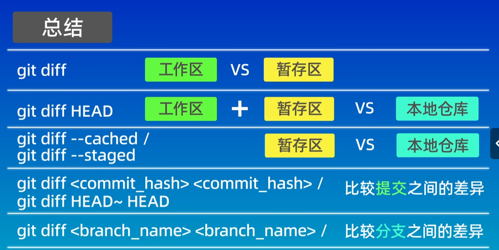

下面pdf速记版本中有以下错误：

###### git reset --参数 \<commit-id\>

1. git reset命令用于回退到的之前某一个提交版本，具体版本为对应的commit-id。根据参数不同有以下的区别。
	* --soft：会保留当前工作区和暂存区的所有修改内容。应用场景：多个提交版本可以合并为一个版本的时候就可以通过该命令。
	* --mix：只会保留工作区的内容。应用场景：与--soft相同，只不过再合并时还需要再执行一下git add来将变动的内容重新添加到暂存区。
	* --hard：会将工作区和暂存区都会丢弃。应用场景：放弃目前本地的所有修改内容。比较危险。
2. 查看暂存区内容命令：git ls-files
3. 命令参数为--mixed
4. commit id如果时一个版本，也可以使用head^来替代，表示上一个历史提交版本
5. **git中所有操作都可以回溯，如果误操作可以使用git reflog查看提交的历史记录（commitid），然后在使用git reset命令回退到当前版本即可**

###### git diff查看差异

* 不加任何参数默认比较工作区和暂存区之间的差异
* **git diff head表示比较工作区与最近一次提交版本的差异**。
* git diff --cached，比较暂存区和最近一次提交版本的差异
* git diff commit_id commit_id 比较不同提交版本的差异
* git diff commit_id commit_id 1.txt：表示值比较特定文件在不同提交版本的差异

差异内容：  

* 第一行：发生变更的文件
* 第二行解释：Git 会将文件的内容使用哈希算法生成一个 40 位的哈希值，这里只显示了部分，后面为文件的权限
* 后面为添加的内容，红色表示删除的内容，绿色表示添加的内容
* 如果不想删除本地，只想删除版本库的中的话，就可以使用git rm --cached，代表只删除暂存区的内容，之后提交即可。

###### git rm file.txt
**普通的linux命令只能将工作区中的内容进行删除，删除暂存区的的内容还需要进行git add；而git rm可以一个命令就可以同时删除工作区和暂存区**

###### .gitignore文件——忽略掉不应该被加入到版本库中的文件

###### 

