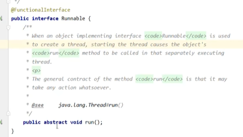
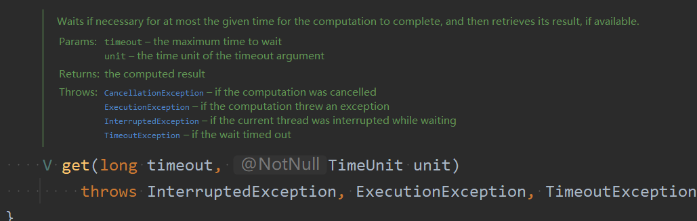

* 线程的创建和启动是两个概念，两个部分

### 1.创建方法

* 创建：使用thread对象，利用匿名内部类，相当于创建的是一个子类，并且重写thread类的run()。
* 启动：使用start()方法来启动线程
* 推荐在创建线程的时候给线程起指定的名字

* 创建：使用Runnable接口new的对象，利用匿名内部类来重写run()方法来写要执行的代码
* 启动：新建thread对象，构造函数传重写了run()的Runnable的匿名内部类对象，调用start()启动线程
* Runnable接口对应的源码如下图所示

* **推荐使用第二种方式来创建线程**
* Runnable接口来创建线程，还支持使用lambda表达式来精简代码，
* 将匿名内部类转换成lambda表达式步骤：直接将参数变换为重写的方法的参数，重写的方法的方法体写在{}里

	
	
	
	进一步可以简便成如下图所示  
	

注：带有`@FunctionalInterface`注解的接口可以可以被lambda表达式简化

##### 两种方法的原理
方法2的源码如下图所示：

* 不论是方法一还是方法2，走的都是线程对象thread的run方法
* 只不过方法一时直接重写了Thread的run方法()，而方法二种是将Runnable接口赋给target，然后再Thread的run方法中调用target的run方法

* FutureTask类的继承关系如下，继承了Runnable接口

	
	

* FutureTask类比Runnable接口多了一个Future接口，该接口可以通过get()是用来返回任务的执行结果。
* Runnable本身的run()方法是没有返回值的，所以光是Runnable接口，它并不能在两个线程之间将一个线程的执行结果传递给另一个线程。而FutureTask由于继承了Future接口，所以它可以使用get()方法来获取线程任务的执行结果

	

注意上图说了：**FutureTask类可以配合Callable类型的参数，来处理有返回结果的情况，可以把结果传递给其他的线程**

* Callable接口的代码如下图所示，和Runnable有点像，但是run方法变成了call方法，方法多了一个返回值，并且可以抛出异常，而Runnable接口的run方法是没有办法抛出异常的。
	

使用例子如下图所示。当然了由于Callable接口有@FunctionalIntegerface，所以也可以用lambda表达式来写

### 2.线程运行原理
首先看线程运行的现象，以下面代码为例子

* 使用runnable接口作为任务对象来启动两个一直执行的线程t1和t2
* 现象就是cpu交替执行的两个线程

	

###### 查看进程线程的方法

* linux查看进程的命令：ps或者是top命令

#### 线程运行的原理
###### 栈与栈帧

* **一个线程对应一个栈，一个方法对应一个栈帧**，每个线程启动后会会分配一个栈内存，而每个方法调用时会分配一个栈帧

栈帧具体的图解如下图所示，下图为执行到`return n`时的栈帧图解

###### 线程上下文切换

上下文切换流程的图解如下图所示

* 切换前

* 切换后