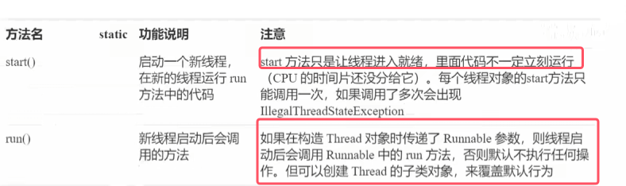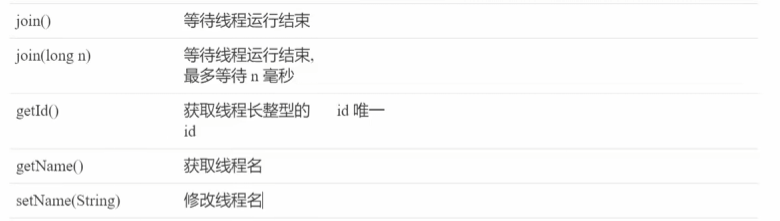
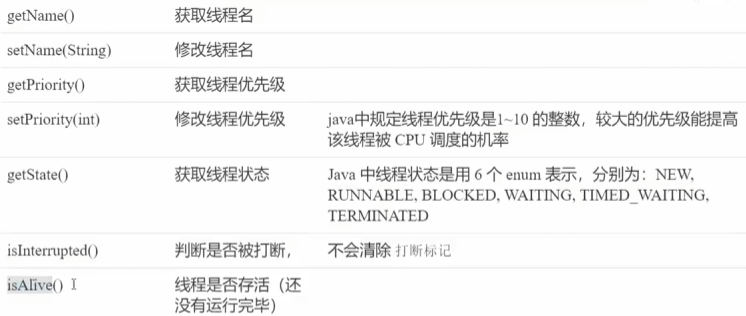
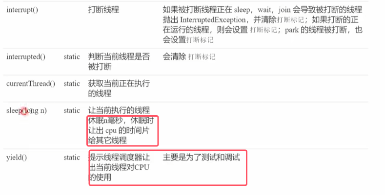

#### 1.start()和run()

* 启动一个线程必须用start()，再由start()启动的新线程去调用run()，而不是直接调用run()
* 每个线程对象的start()方法只能够被调用一次，如果调用多次会抛出异常 

### 2.sleep()、yield()和线程优先级

##### 综述
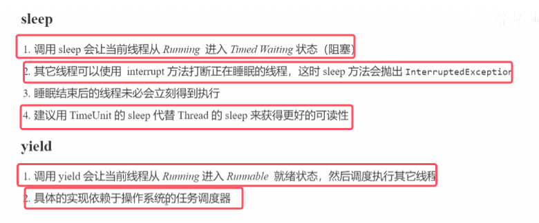

##### sleep()基本使用和状态切换
* **sleep()是一个静态方法，参数传入的是休眠的毫秒数。在哪个线程调用sleep()，就会让哪个线程休眠**，可以直接调用
* **执行sleep()的线程会放弃对cpu时间片使用，cpu会执行其他线程的代码**
* **调用sleep会让当前线程从Running状态进入到Timed Waiting(限时等待)状态**

使用实例：

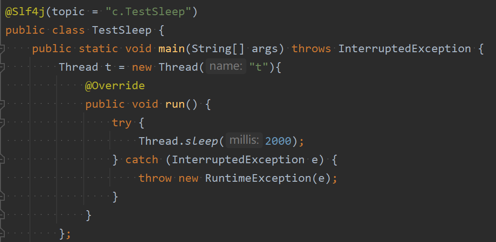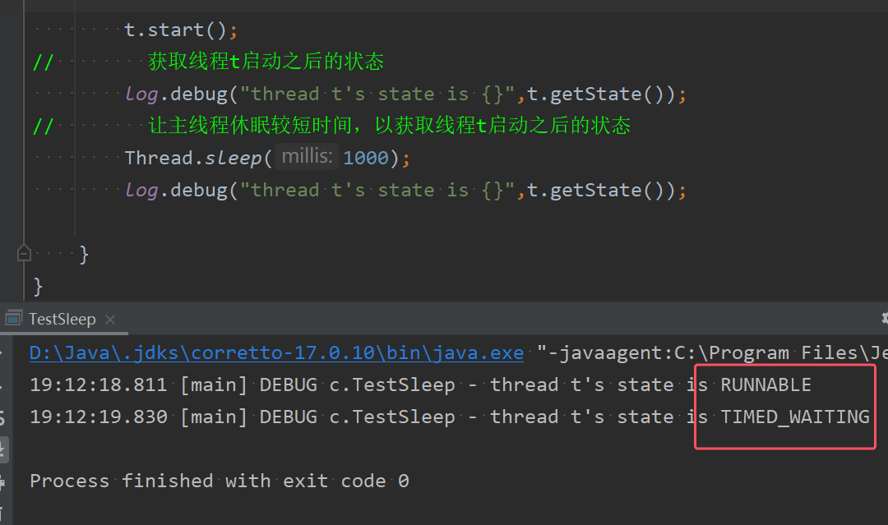

##### interrupt()打断正在睡眠的线程

* 其他线程可以使用interrupt()方法打断正在休眠的线程，这时sleep()方法会抛出`InterruptedException`

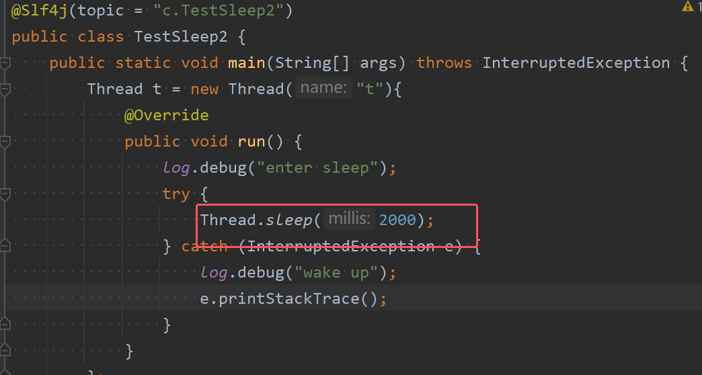
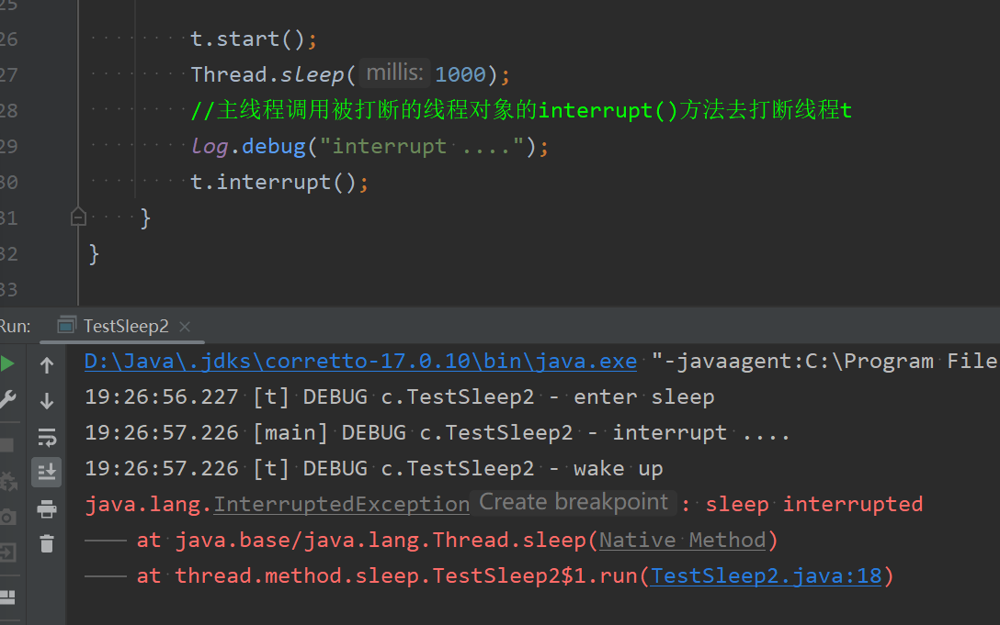

##### sleep()的可读性

* 建议使用TimeUnit类的sleep()代替Thread的sleep()，因为前者具有更好的可读性。效果都是一样的
* TimeUnit类的sleep()其内部也是调用的Thread的sleep()，只是进行了单位的换算，代码可读性更好

	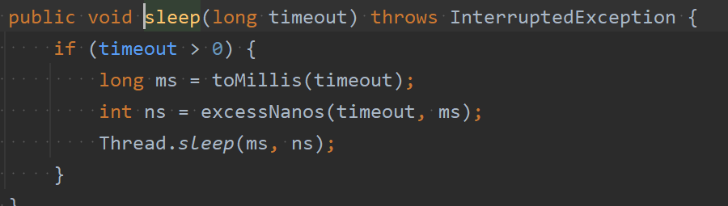

TimeUnit类直译就是时间单位，其属性如下图所示

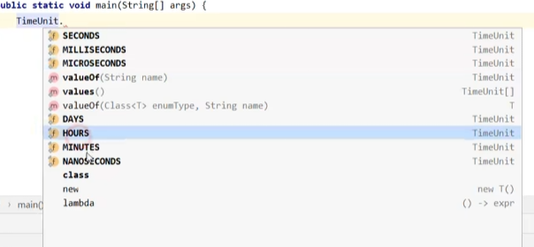
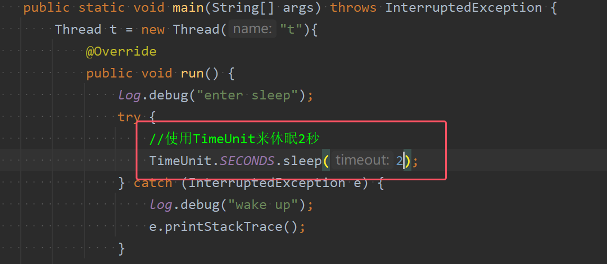

##### sleep()的应用

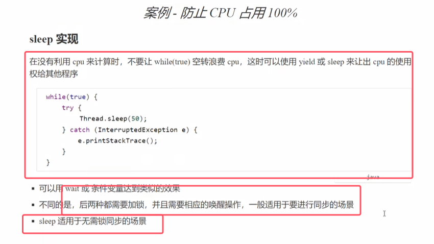

##### yield()（不重要）

* yield()用于提示调度器让出当前线程对cpu的使用
* 调用yield会让当前线程从Running(运行)进入到Running（就绪态）
* **注意：并不是调用了yield，该线程就会立马从运行态变为就绪态，具体的实现需要取决于操作系统的任务调度器**
* 主要适用于测试和调试

##### 线程的优先级（不重要）
* 线程的优先级范围为1-10，10的优先级最高，1的优先级最低。默认优先级为5

	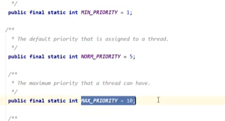

* 在java中，线程优先级的作用效果并不明显，具体的调度顺序还是由调度器来决定

### 3.  join()和interrupt()  （重要）

#### join()的用法

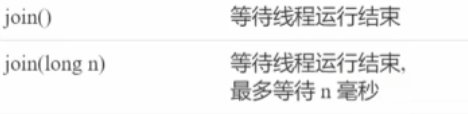
* **哪个线程对象调用了join()，就等待该线程运行结束**。比如下面例子是等待t1线程运行结束  
	
* **join还可以传入一个参数代表最多等待的毫秒数。如果线程提前运行结束，那么join会立即结束等待，而不是等待够设置的毫秒数；如果等待了设置的毫秒数，线程还没有运行结束，那么就会停止阻塞，继续向下运行。**

#### join的应用——线程同步
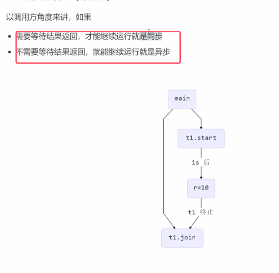
* 上图中的例子为：主线程main同步等待t1线程运行结束

应用实例1：主线程等待多个线程运行的运行结果。  
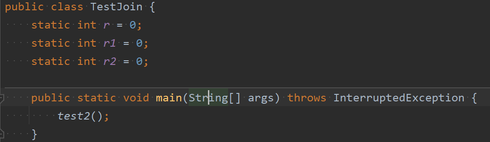
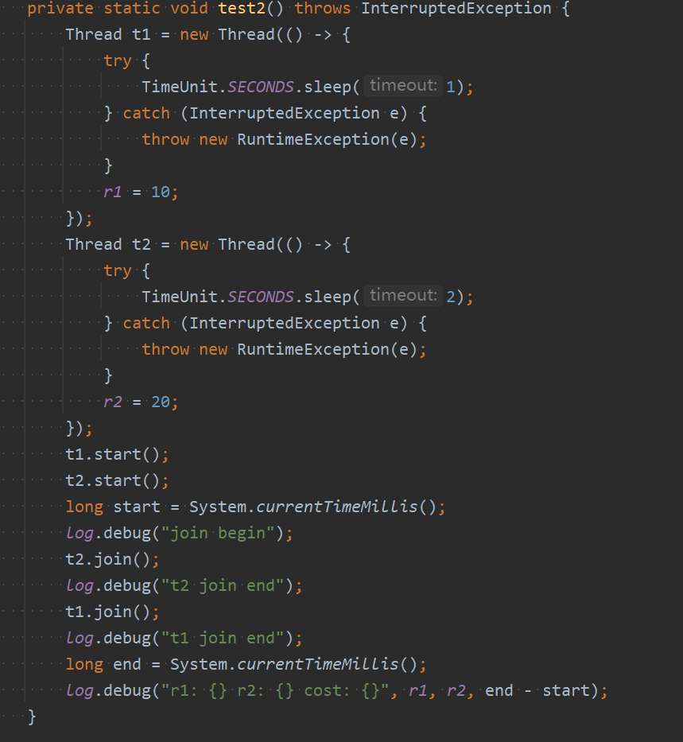
* 为达到目的，需要调用多个线程的join()。
* 上图中主线程同步等待t1和t2线程完成后，显示静态变量r1、r2的值和运行时间，结果如下图所示。  
	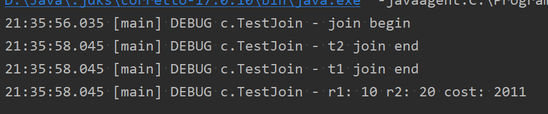
* 流程分析图如下图所示。左图为先等待t1，再等待t2；右图为先等待t2，再等待t1  
	

应用实例2：主线程设置一个等待时限来等待对等线程。  
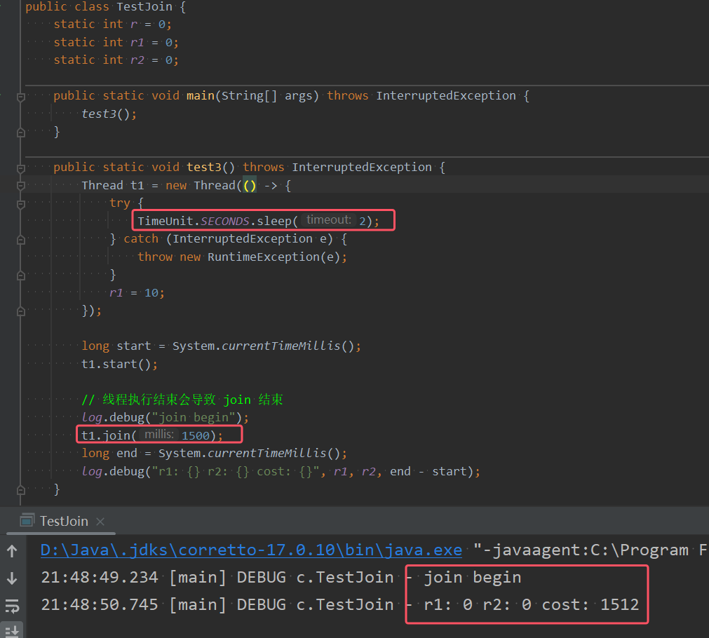
* 时限小于对等线程设置的睡眠秒数，主线程会继续向下执行，此时对等线程还在睡眠为完成赋值，所以打印结果全为0

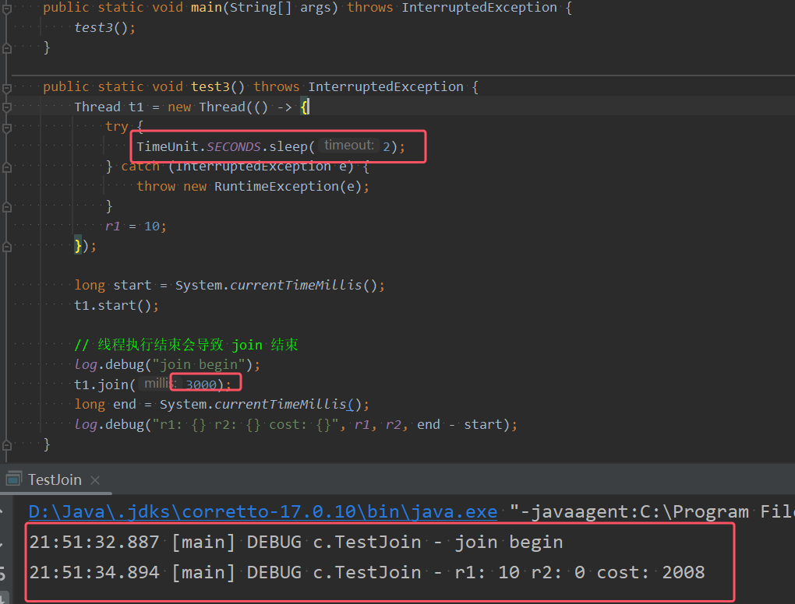
* 时限大于对等线程设置的睡眠秒数，对等线程提前运行结束，那么join会立即结束等待，而不是等待够设置的毫秒数。所以运行时间为2s，r1也完成了赋值。
#### interrupt()

* 可以打断处于阻塞状态的线程，也可以打断正在运行的线程
* 注意上图中`isInterrupted()`和`interrupted()`的区别。

对于正处于阻塞状态的线程：  
* **阻塞状态：操作系统的任务调度器不会考虑这些线程，所以并不会把时间片给他们用。处于阻塞状态的线程一般调用了`sleep() wait() join()`。（join()的底层原理就是wait）**
* 打断标记：表示该线程是不是被其他的线程所打断的，该标记是一个boolean值，如果打断过取值就是真；如果没打断过取值就是假。

###### 打断阻塞状态的线程
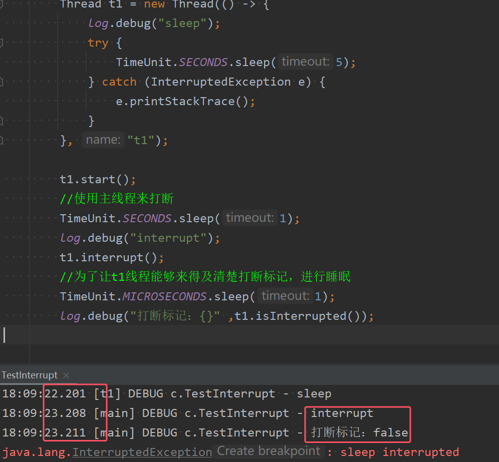
* `sleep() wait() join()`**在被打断后会抛出异常，并会把打断标记清空，即将该boolean值重置为假。**所以图中输出为假

###### 打断正常运行的线程
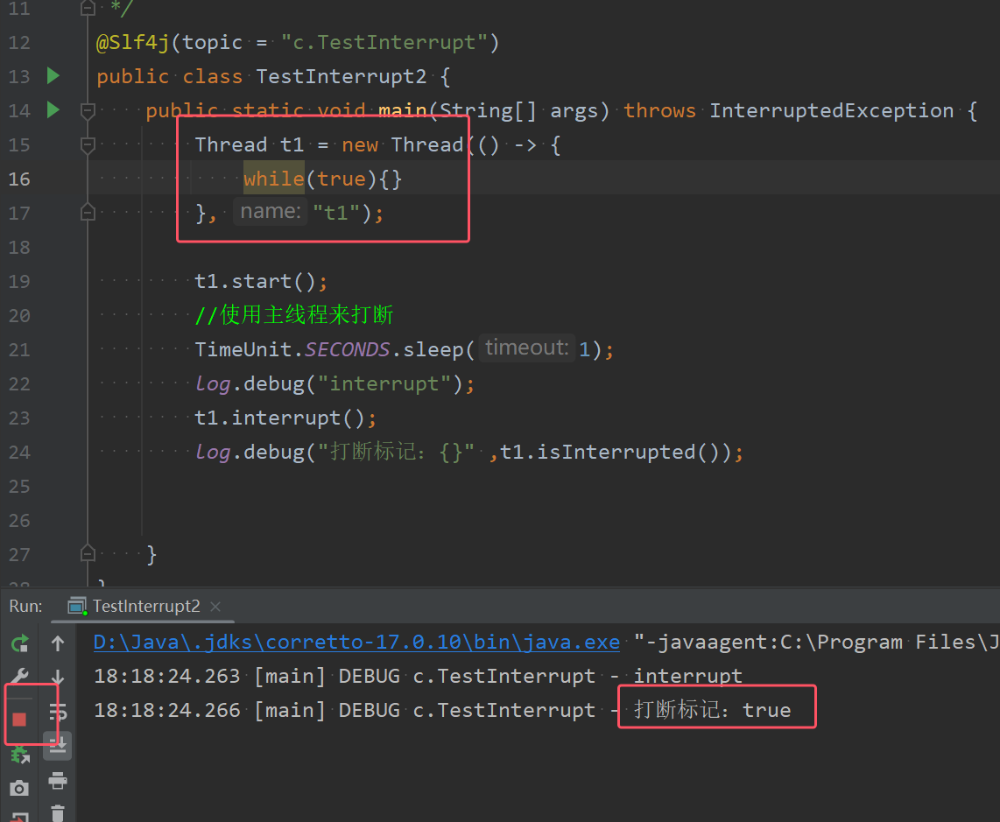
* **打断正在运行的线程，则会设置打断标记，即该boolean值为true**
* **当执行了`interrupt()`方法后，并不会影响t1线程的正常运行，他只是知道了有其他线程在打断我**。所以该线程会一直运行。
* **如果想让该线程停下来，就需要利用该打断标记来停止循环。** **`Thread.currentThread()`用于获取当前正在运行的线程，写在哪个线程里面，就指的是哪个线程**。具体代码如下图所示    
	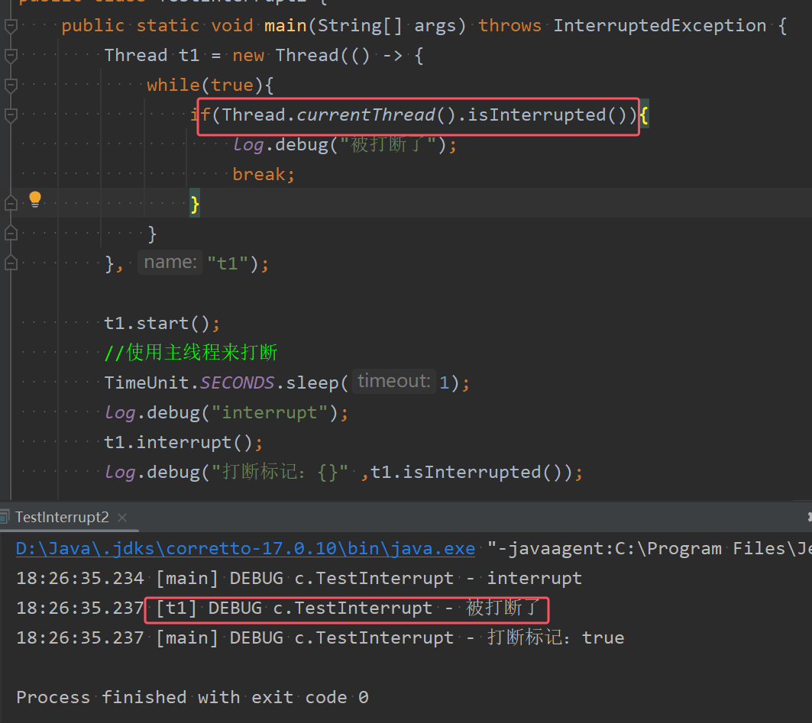
* 总结：**主线程调用`interrupt()`相当于只是告诉t1线程我要打断你，并设置打断标记为true；而t1线程的打断是需要他自己利用打断标记来自行打断**

==主要作用：可以用来比较优雅的终止线程==

###### interrupt()的应用案例1——两阶段终止模式

两阶段终止模式是一种并发编程模式，主要用于优雅地终止线程，并不属于gof23种设计模式。优雅指的是给予被终止线程一个料理后事的机会

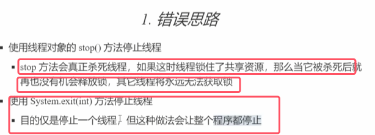
* 在 Java 中，`Thread.stop()` 方法用于强制**强制终止线程**，但该方法已被标记为**过时（@Deprecated）**，且**强烈不建议使用**

示例代码如下图所示  
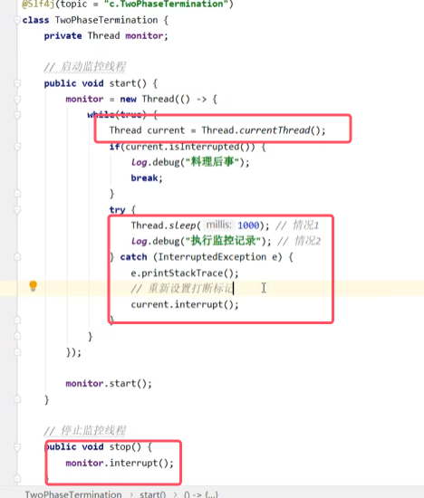
* catch块中重新设指打断标记，是因为interrupt()打断sleep()会清除打断标记

###### interrupt()的应用案例2——打断park线程

**park线程：并不是Thread类的方法，而是另外一个工具类`LockSupport`(锁的支持类)。其中有一个park()的静态方法，其作用也是让当前线程停下来，同样会将打断标记设置为true**

首先演示一下park()的使用  
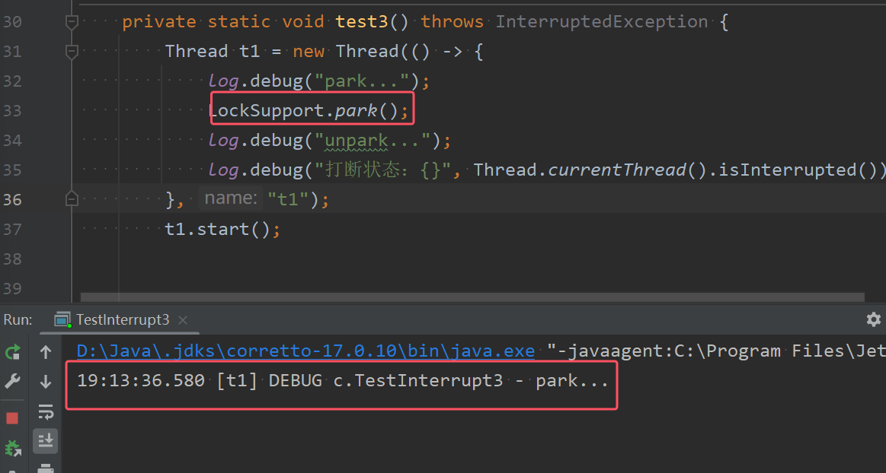
* 由于调用了`LockSupport.park()`,所以后面的代码没有执行。线程就在这行代码上停下来停止运行。但是并没有终止。
* **interrupt()可以打断这种park状态的线程，打断后让该线程继续向下运行。**
	
* 一旦一个线程被park了，然后又被interrupt打断后，如果此时再次调用park，是无法再使得该线程停止的。**（相当于打断标记为真的情况下，park()方法就会失效）**  
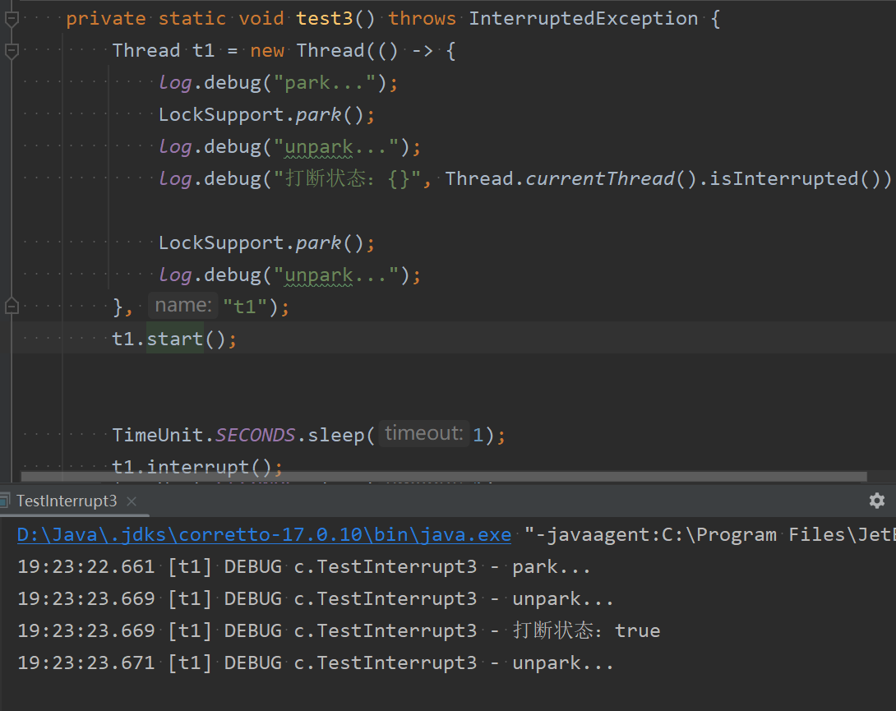
* 可以调用interrupted()来消除打断标记，这样就可以是第二个park也生效  
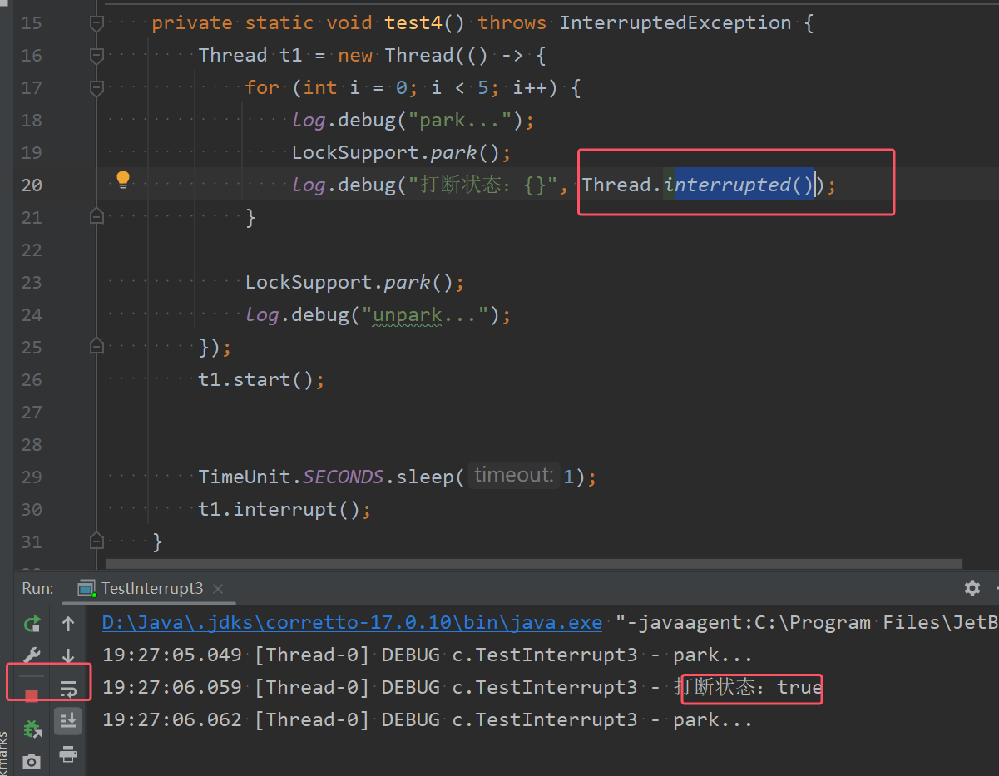