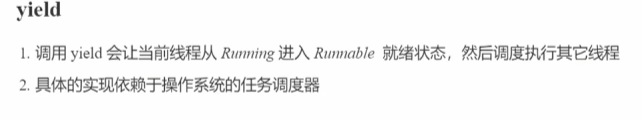
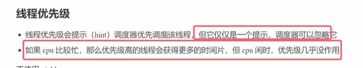
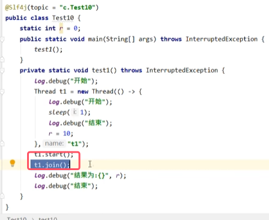
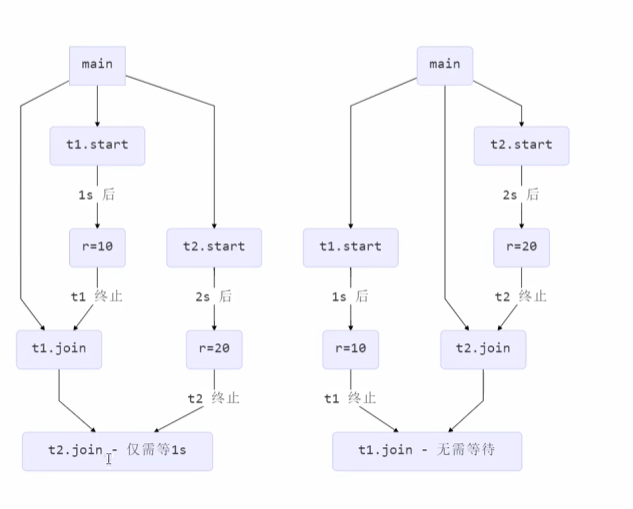

#### 1.start()和run()

* 启动一个线程必须用start()，再由start()启动的新线程去调用run()，而不是直接调用run()
* 每个线程对象的start()方法只能够被调用一次，如果调用多次会抛出异常 

### 2.sleep()、yield()和线程优先级

##### 综述

##### sleep()基本使用和状态切换
* **sleep()是一个静态方法，参数传入的是休眠的毫秒数。在哪个线程调用sleep()，就会让哪个线程休眠**，可以直接调用
* **执行sleep()的线程会放弃对cpu时间片使用，cpu会执行其他线程的代码**
* **调用sleep会让当前线程从Running状态进入到Timed Waiting(限时等待)状态**

使用实例：

##### interrupt()打断正在睡眠的线程

* 其他线程可以使用interrupt()方法打断正在休眠的线程，这时sleep()方法会抛出`InterruptedException`

##### sleep()的可读性

* 建议使用TimeUnit类的sleep()代替Thread的sleep()，因为前者具有更好的可读性。效果都是一样的
* TimeUnit类的sleep()其内部也是调用的Thread的sleep()，只是进行了单位的换算，代码可读性更好

	

TimeUnit类直译就是时间单位，其属性如下图所示

##### sleep()的应用

##### yield()（不重要）

* yield()用于提示调度器让出当前线程对cpu的使用
* 调用yield会让当前线程从Running(运行)进入到Running（就绪态）
* **注意：并不是调用了yield，该线程就会立马从运行态变为就绪态，具体的实现需要取决于操作系统的任务调度器**
* 主要适用于测试和调试

##### 线程的优先级（不重要）
* 线程的优先级范围为1-10，10的优先级最高，1的优先级最低。默认优先级为5

	

* 在java中，线程优先级的作用效果并不明显，具体的调度顺序还是由调度器来决定

### 3.  join()和interrupt()  （重要）

#### join()的用法

* **哪个线程对象调用了join()，就等待该线程运行结束**。比如下面例子是等待t1线程运行结束  
	
* **join还可以传入一个参数代表最多等待的毫秒数。如果线程提前运行结束，那么join会立即结束等待，而不是等待够设置的毫秒数；如果等待了设置的毫秒数，线程还没有运行结束，那么就会停止阻塞，继续向下运行。**

#### join的应用——线程同步

* 上图中的例子为：主线程main同步等待t1线程运行结束

应用实例1：主线程等待多个线程运行的运行结果。  

* 为达到目的，需要调用多个线程的join()。
* 上图中主线程同步等待t1和t2线程完成后，显示静态变量r1、r2的值和运行时间，结果如下图所示。  
	
* 流程分析图如下图所示。左图为先等待t1，再等待t2；右图为先等待t2，再等待t1  
	

应用实例2：主线程设置一个等待时限来等待对等线程。  

* 时限小于对等线程设置的睡眠秒数，主线程会继续向下执行，此时对等线程还在睡眠为完成赋值，所以打印结果全为0

* 时限大于对等线程设置的睡眠秒数，对等线程提前运行结束，那么join会立即结束等待，而不是等待够设置的毫秒数。所以运行时间为2s，r1也完成了赋值。
#### interrupt()

