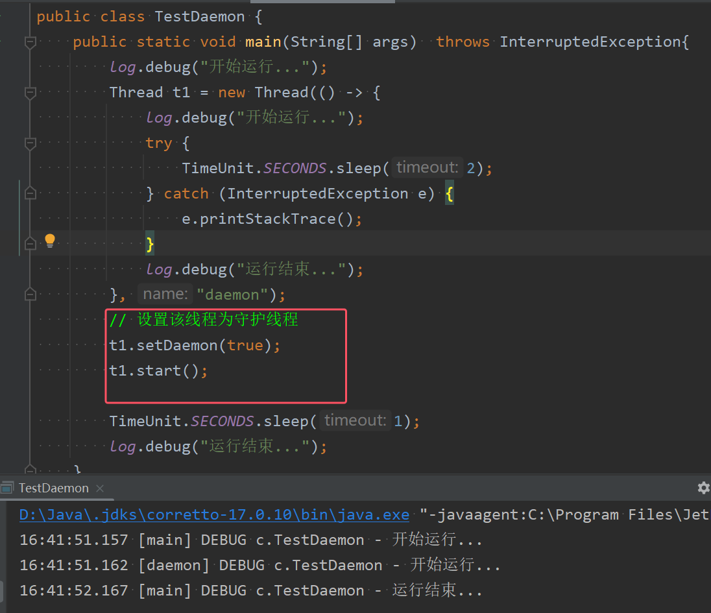

* **默认情况下，Java进程需要等待所有线程运行结束，才会运行结束**
* 守护线程：主要用于为用户线程提供后台支持服务（如垃圾回收线程、日志记录线程等），**只要其他非守护线程运行结束了，即使守护线程的代码没有执行完，也会强制结束**

* setDaemon(true)用于设置线程为守护线程
* 由于设置Daemon线程为守护线程，所以该线程的运行结束没有带有拿出来，就被强制结束了

