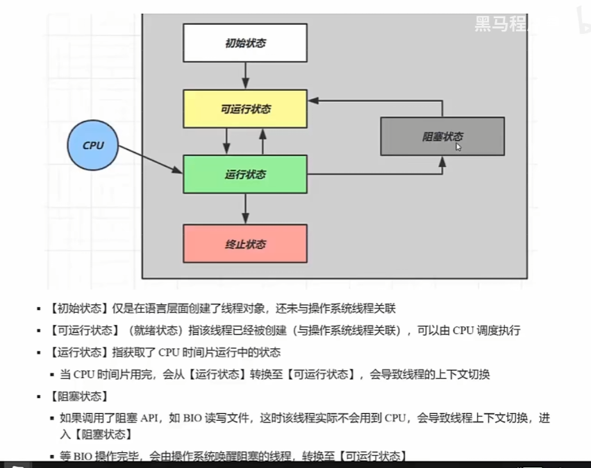
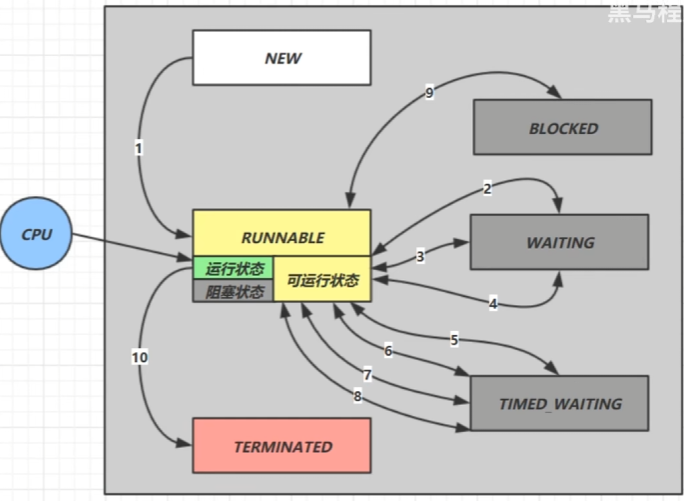
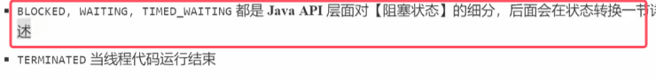

### 1.线程状态——5种

* **线程的5种状态是从操作系统层面描述的**
* 可运行状态也就是就绪状态
* Java中调用了start()线程才进入就绪态，没调用之前只能是初始状态。

### 3.线程状态——6种

* **线程了6种状态是从Java API层面进行描述的**

* 是Runnable状态，在idea中debug时显示的是Running
* **图示Runnable状态中的阻塞状态指的是操作系统层面的那个阻塞状态，也就是正在进行IO操作。此时也是处于Runnable状态**
* **关于java API层面的三个阻塞状态，都不会收到任务调度器的时间片**，会在后面状态转换一节详细讲述。现在提前说明：**执行sleep(time)的线程处于timed waiting状态；执行join()的线程处于waiting状态；因拿不到锁资源而处于阻塞的线程，处于blocked状态**

