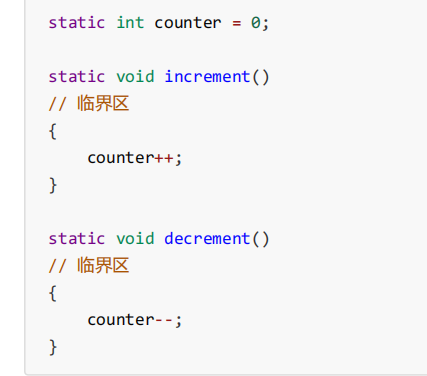

### 1.多个线程访问共享资源带来的问题

临界资源：一次仅允许一个进程使用的资源成为临界资源

临界区：访问临界资源的代码块

竞态条件：多个线程在临界区内执行，由于代码的执行序列不同而导致结果无法预测，称之为发生了竞态条件

一个程序运行多个线程本身是没有问题的，问题出在多个线程访问共享资源，多个线程读共享资源其实也没有问题，在多个线程对共享资源读写操作时发生指令交错，就会出现问题。**一段代码块内如果存在对共享资源的多线程读写操作，称这段代码块为临界区**

为了避免临界区的竞态条件发生（解决线程安全问题）：

* 阻塞式的解决方案：synchronized，lock
* 非阻塞式的解决方案：原子变量