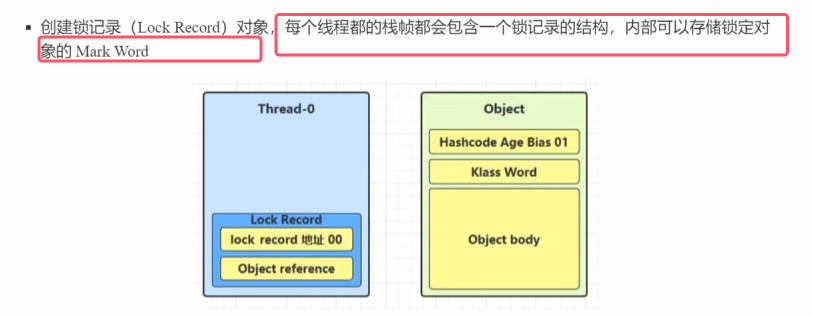
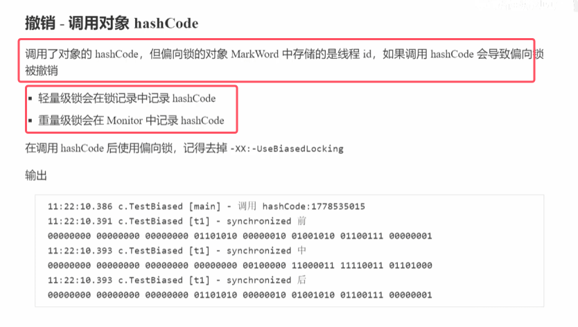

背景：java6开始对该关键字做了优化，不是一开始就加monitor锁，而是做了一系列优化措施。JVM 对 `synchronized` 的优化核心是 “**尽量用更低成本的锁机制**”
### 1.轻量级锁

* 轻量级锁对使用者透明：他只是加了synchronized关键字，具体内部时轻量级锁、偏向锁还是重量级锁由其内部自动转换。
* 当底层使用轻量级锁时，此时是多线程访问，只是多线程访问时间错开（即没有竞争）

以上图代码为例来进行图解  

* 注：一个栈中有多个栈帧，活动栈帧就指的时当前运行的方法
* 当加锁时，锁对象中的mark word的数据会与锁记录地址进行一个交换。其中锁记录地址就指向的拥有锁的线程对应的锁记录
* **栈帧中锁记录的是对象未加锁前mark word中保存的内容。当释放锁时该对象会从锁记录中再把这些内容读取回来**
* **默认先使用轻量级锁，所以当使用synchronized关键字时，底层用cas来作为轻量级锁**
* **锁重入是指**一个已经持有某个锁的线程，再次请求获取该锁时不会被阻塞，而是可以直接成功获取**的机制。简单说就是 “线程可以重复获取同一把锁”，避免了线程在递归调用或多层同步场景下的自我阻塞（死锁）问题。

### 2.锁膨胀（重量级锁）

### 3.自旋优化

* 在多核cpu的情况下，自旋带来的性能开销要比直接阻塞来得更低

### 4.偏向锁

  
  
* 图中第一次m1调用时，偏向锁是偏向m1的，后面m2去获取该所时，由于检查m2的线程id不是m1，所以此时从偏向锁升级为轻量级锁，第三次m2再次获取该锁时此时已经进入了
#### 4.1偏向状态

* 偏向锁默认是延迟的，不会再程序启动时立即生效，等到程序启动2-3s后才会出现。
* 加锁的时候thread、epoch、age等才会有值。所以此时加synchronized时，底层的变换流程如下图所示  
	

注：  

#### 4.2撤销偏向锁

* 当其他线程使用时是轻量级锁，使用完解锁后偏向状态已经被撤销    
	

* wait，notify()方法只有重量级锁的情况有，所以肯定会撤销偏向锁变为重量级锁

#### 批量重偏向（不重要）

* 阈值就是20，他会重偏向。相当于与轻量级锁又变为了偏向锁

#### 批量撤销（不重要）

* 即新建的对象出来的markword最后3位不是101，而是001

### 5.锁消除
  