**保护性暂停模式是并发编程中用于 “在一个线程等待另一个线程的执行结果” 的同步设计技巧；**

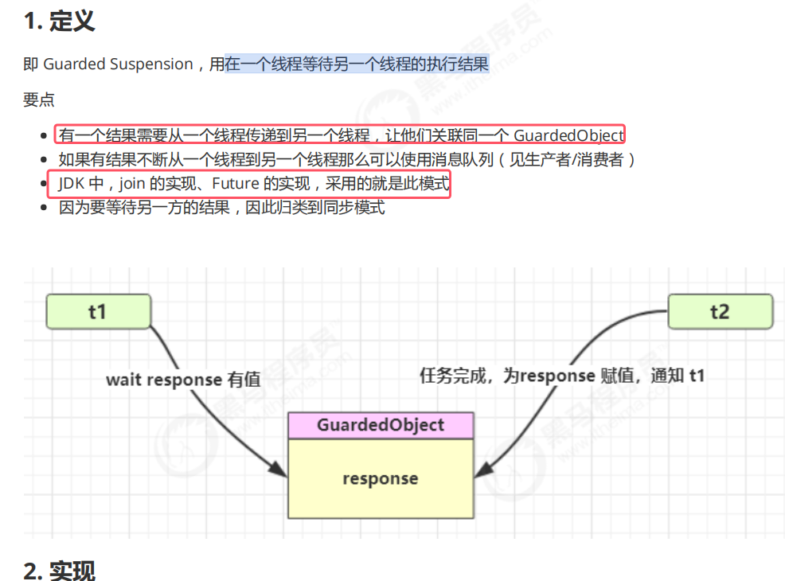
* join底层是如何运用该原理的下面会讲

###### 普通版GuardObject

设计该GuardedObject类的代码如下图所示  
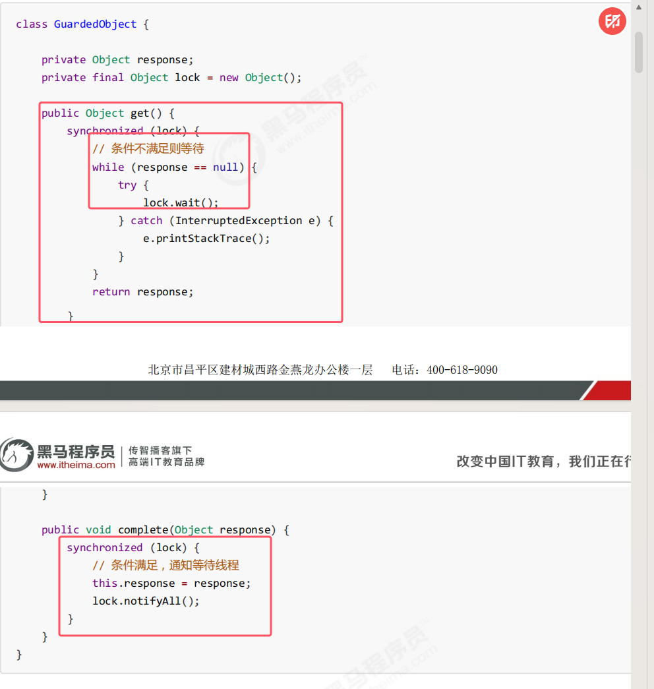

实际使用如下

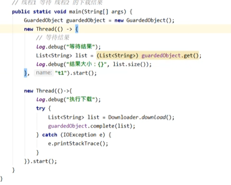
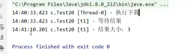

###### 带超时版 GuardedObject

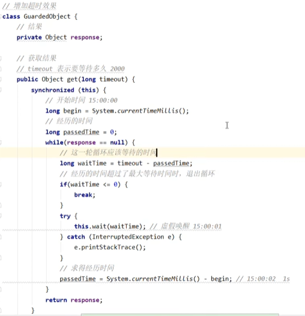
* complete方法不变

不超时：  
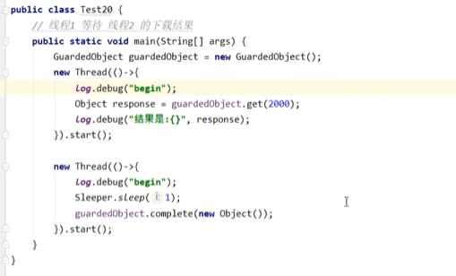
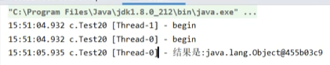

超时：   
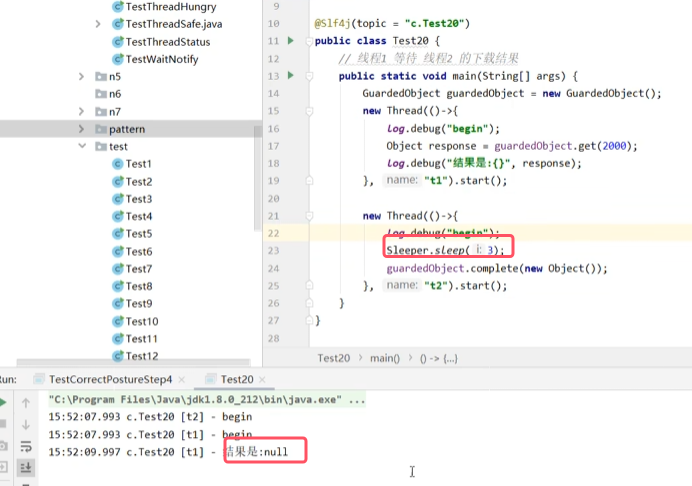

虚假唤醒： 
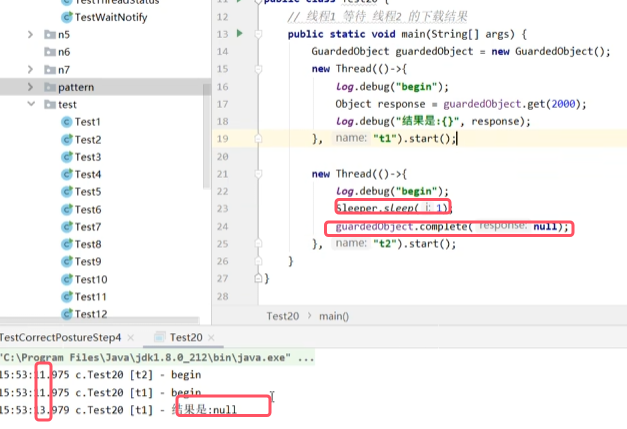

###### join原理
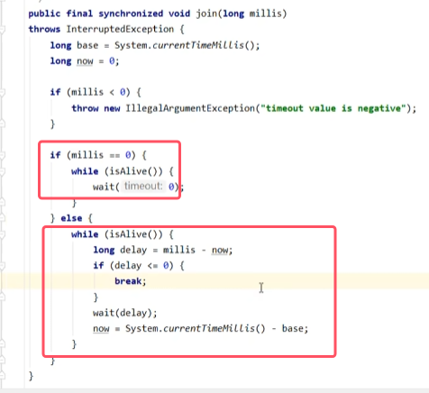
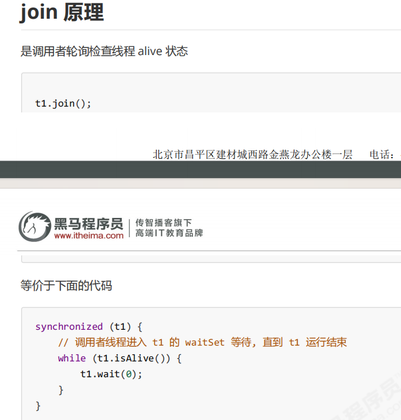
* 调用的线程一直等待。wait(0)就相当于无参的wwait()。  
	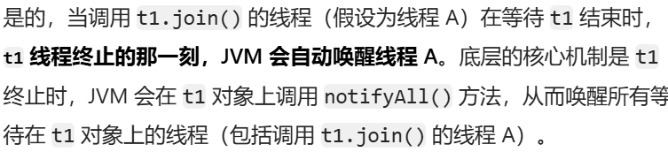

###### 多任务版 GuardObject
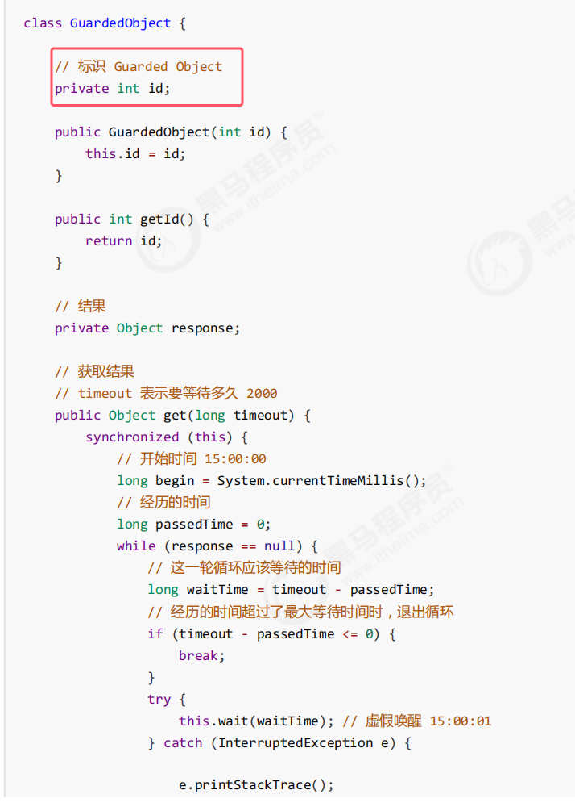
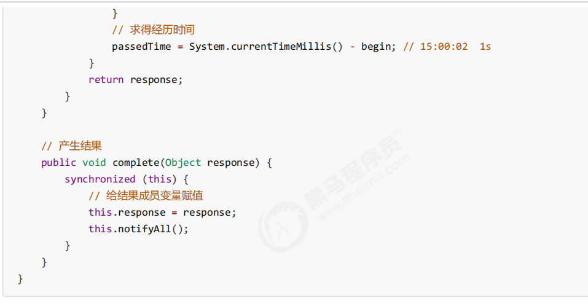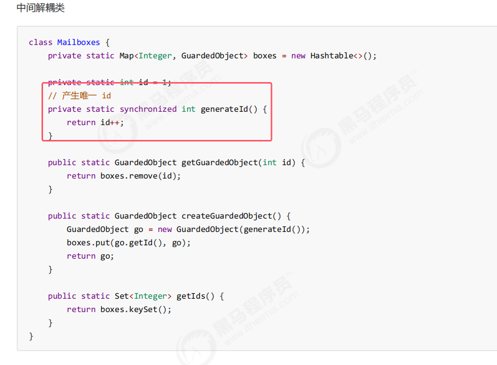
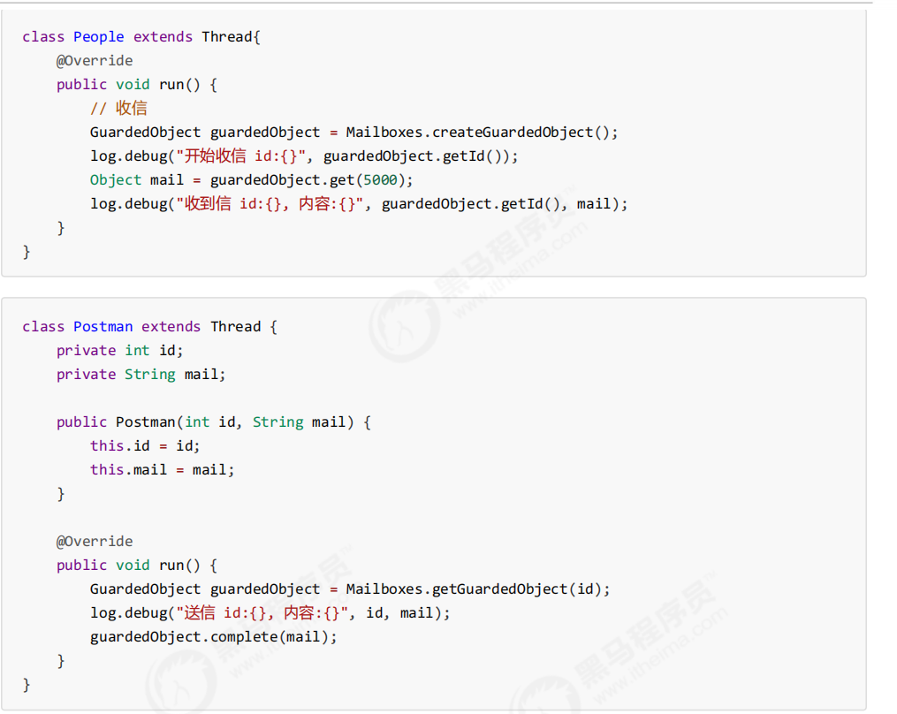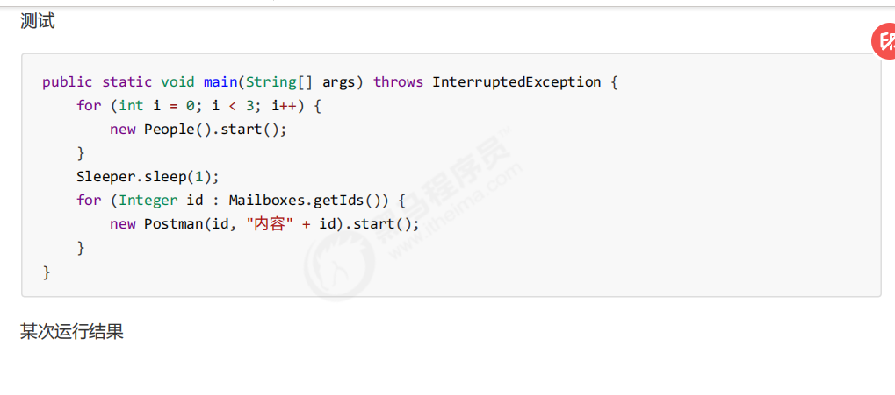
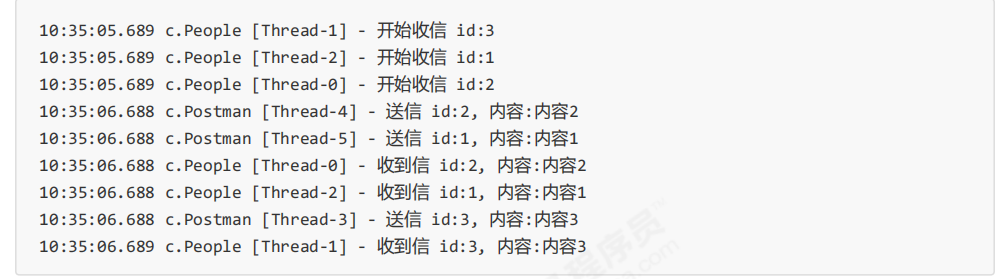