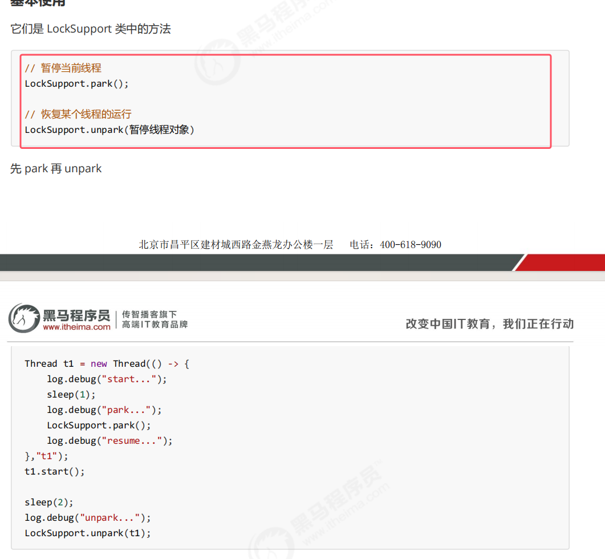
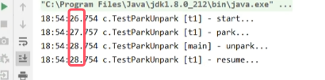
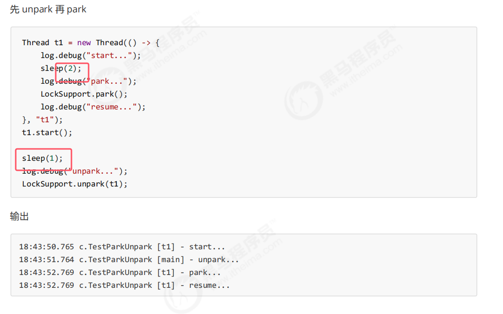
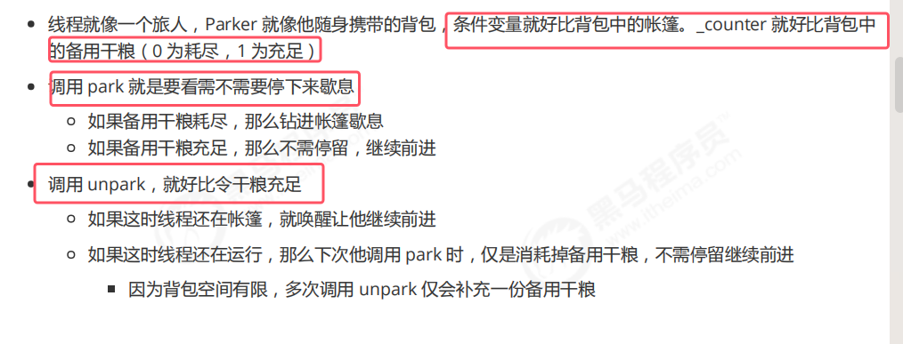
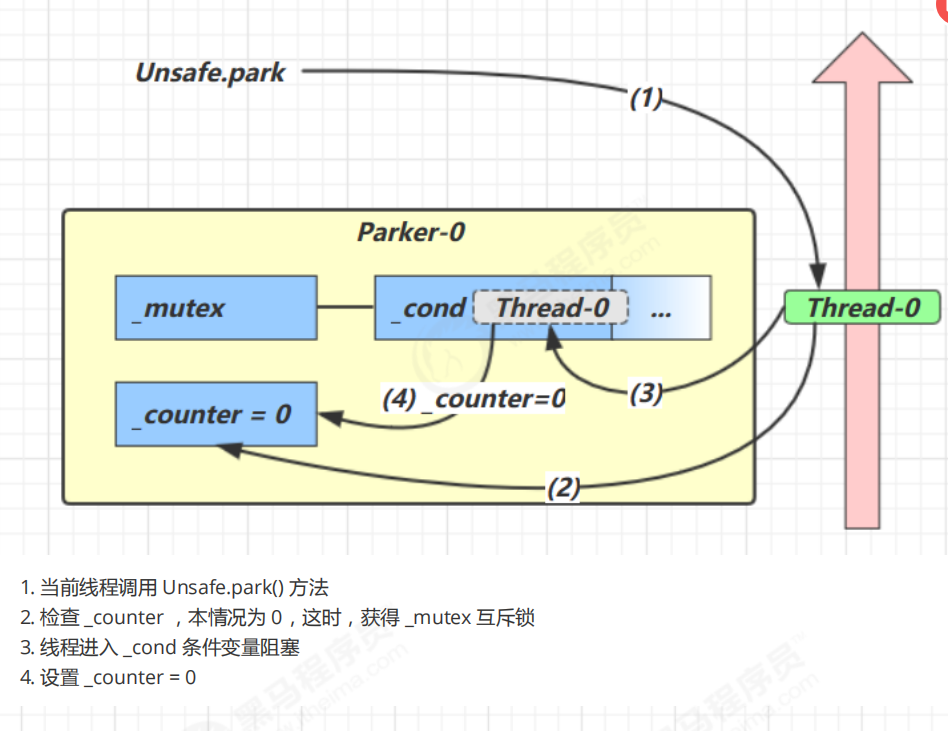
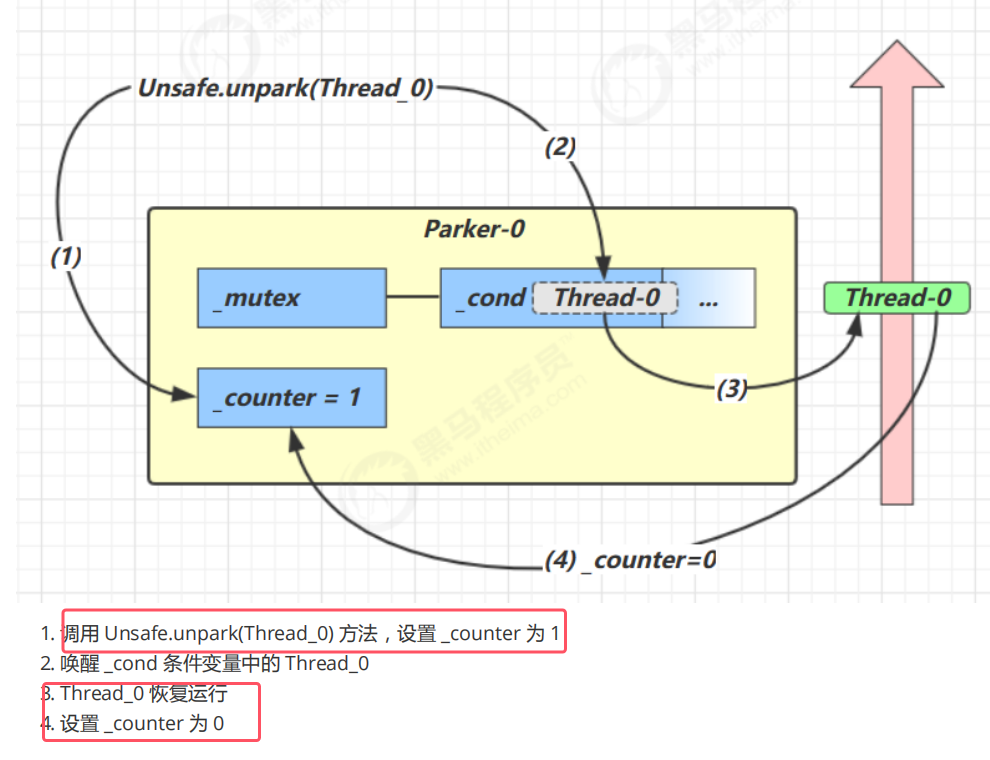

## 1.基本使用

* 与 Object 的 wait & notify 相比
	1. **wait，notify 和 notifyAll 必须配合 Object Monitor 一起使用**，而 park，unpark 不必
	2. **park & unpark 是以线程为单位来【阻塞】和【唤醒】线程，而 notify 只能随机唤醒一个等待线程，notifyAll是唤醒所有等待线程，就不那么【精确】**
	3. p**ark & unpark 可以先 unpark，而 wait & notify 不能先 notify**

## 2.底层原理

* 每个线程都会关联自己的Parker对象，底层是c实现，java中不可见
* 上图为park和unpark的形象示例

具体场景的底层原理如下图所示  

