线程活跃性：线程内的代码是有限的，但是线程的代码一直执行不完

线程活跃性问题包括死锁、活锁和饥饿三种情况
## 1.死锁
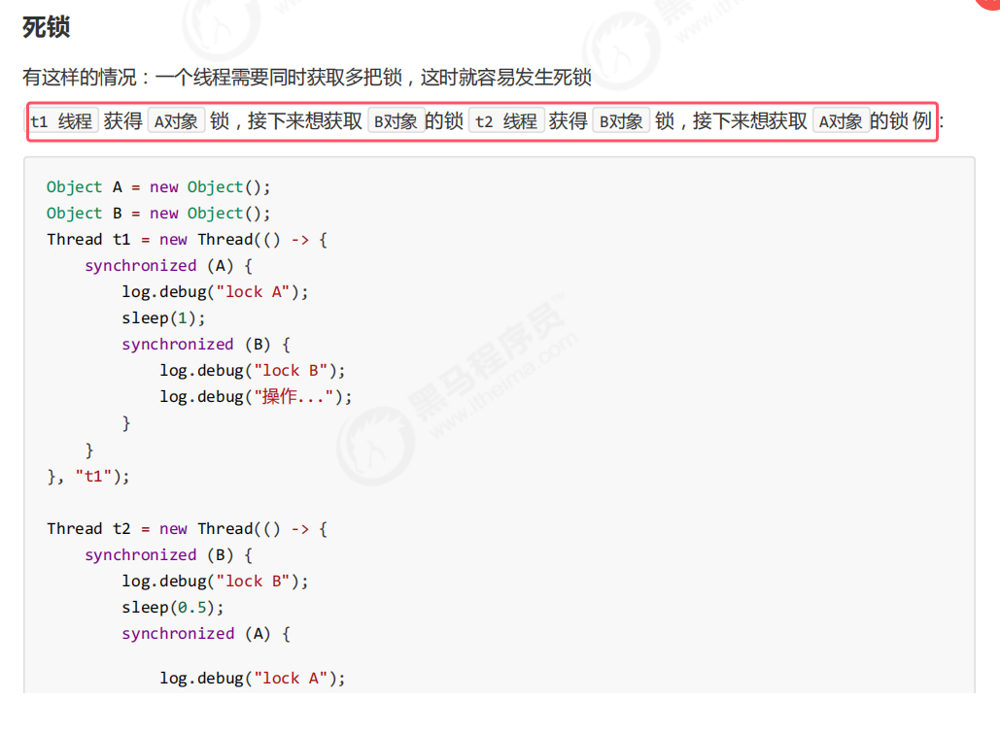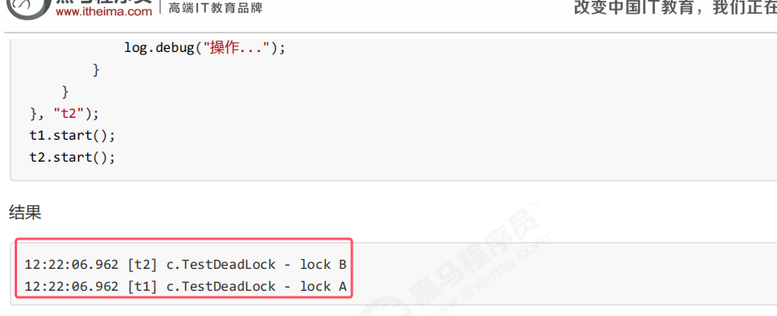

### .12定位死锁

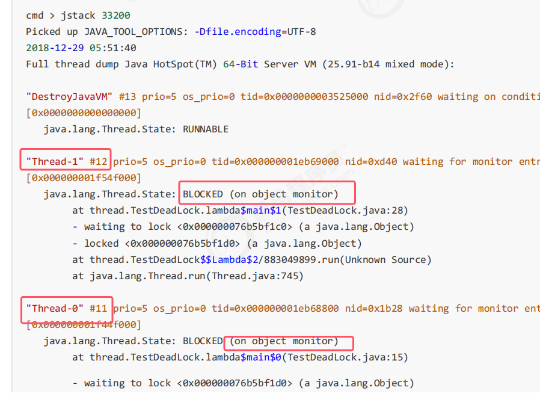
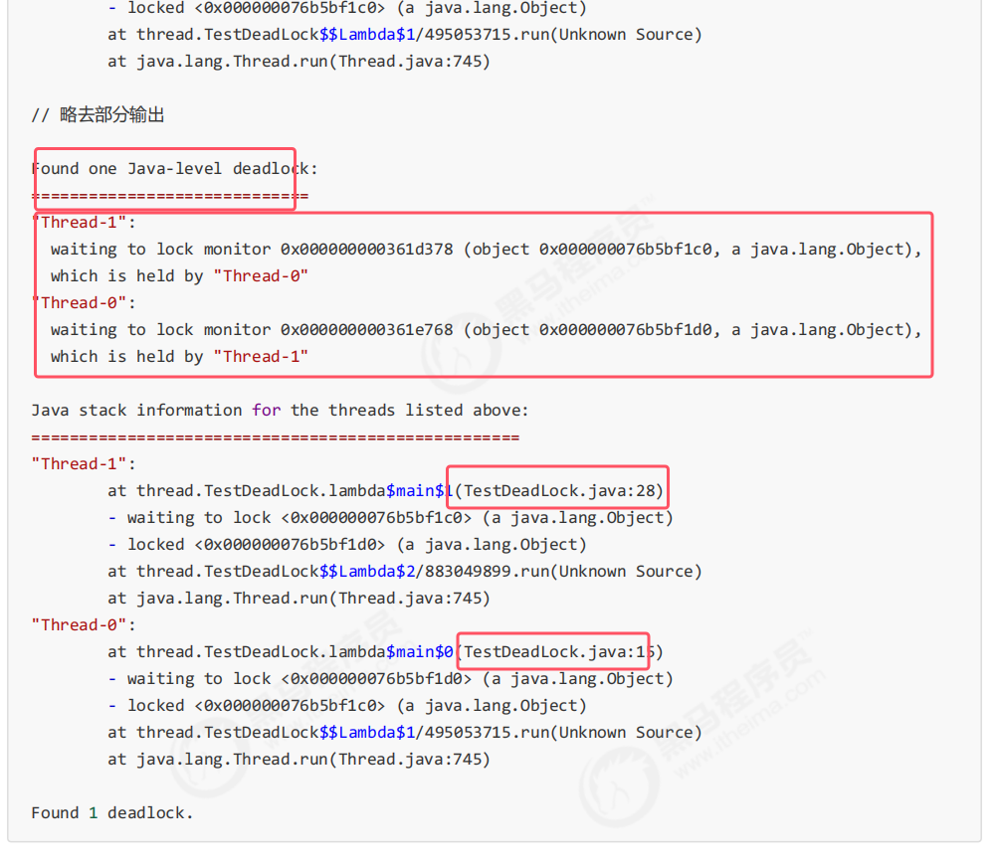

### 1.3哲学家就餐问题
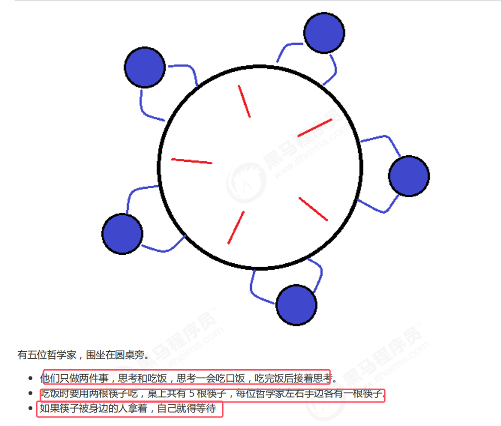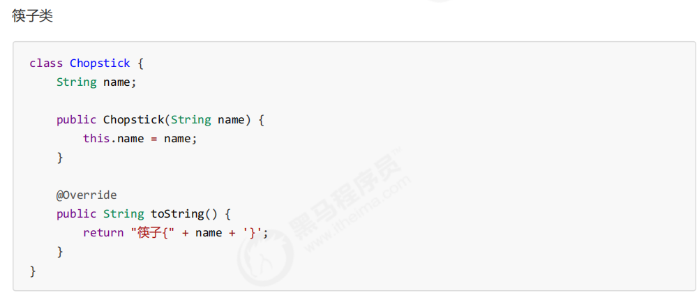
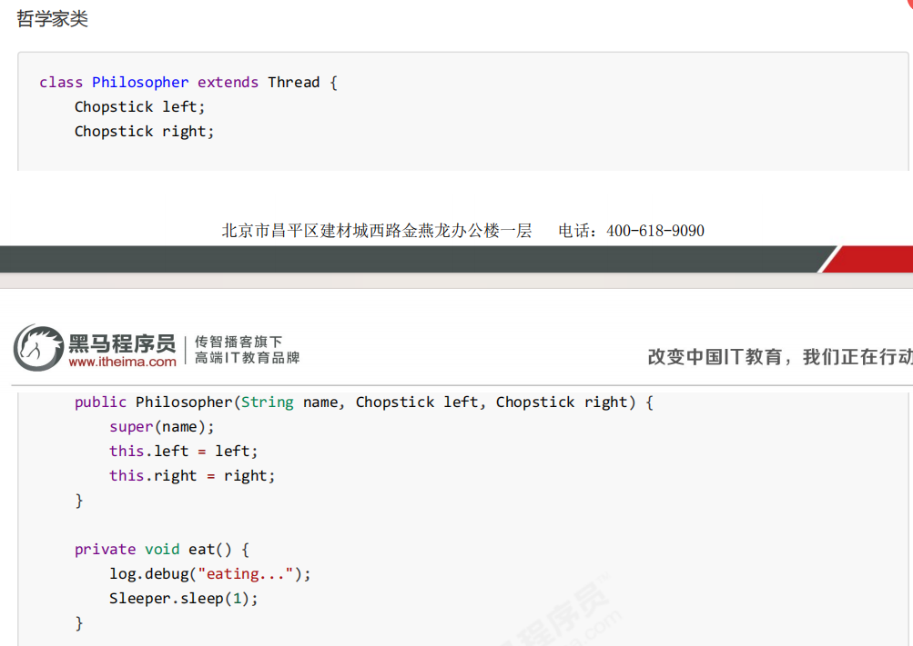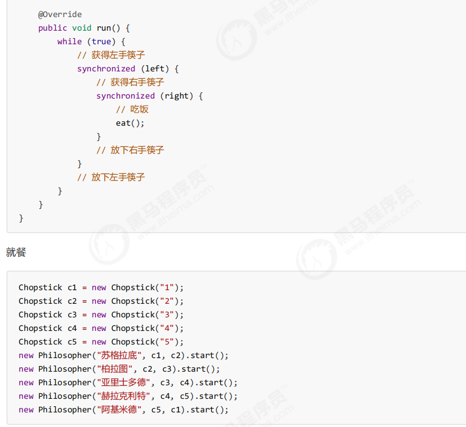
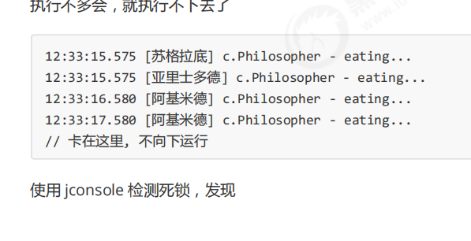
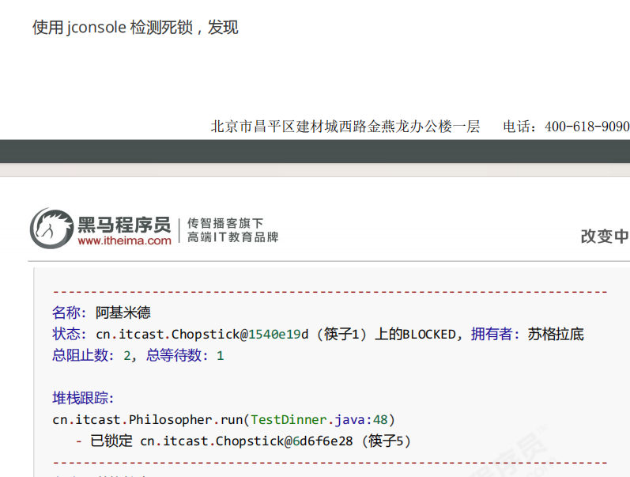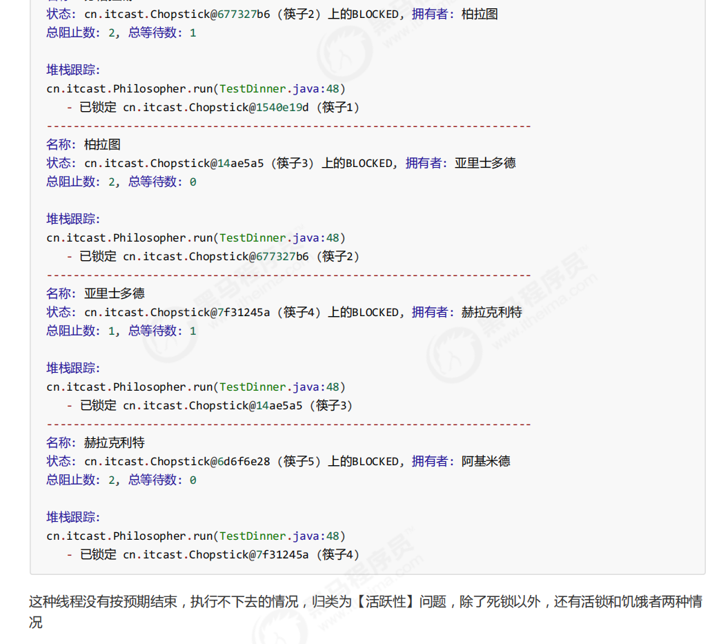

## 2.活锁
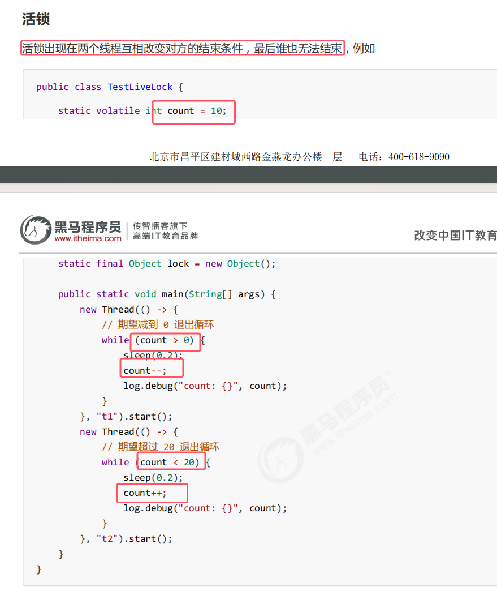

## 3.饥饿问题
饥饿定义为，一个线程由于优先级太低，始终得不到 CPU 调度执行，也不能够结束，饥饿的情况不易演示，讲读写锁时会涉及饥饿问题

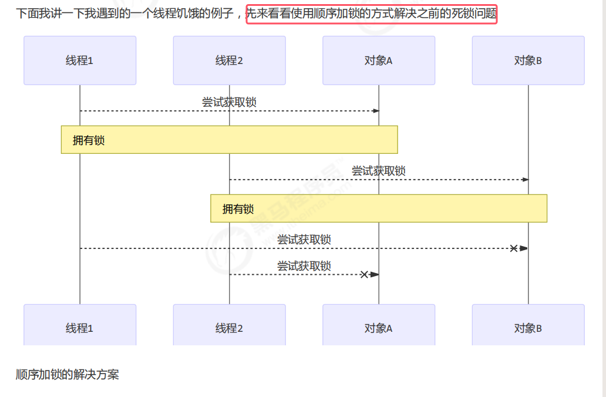

死锁的问题：顺序加锁
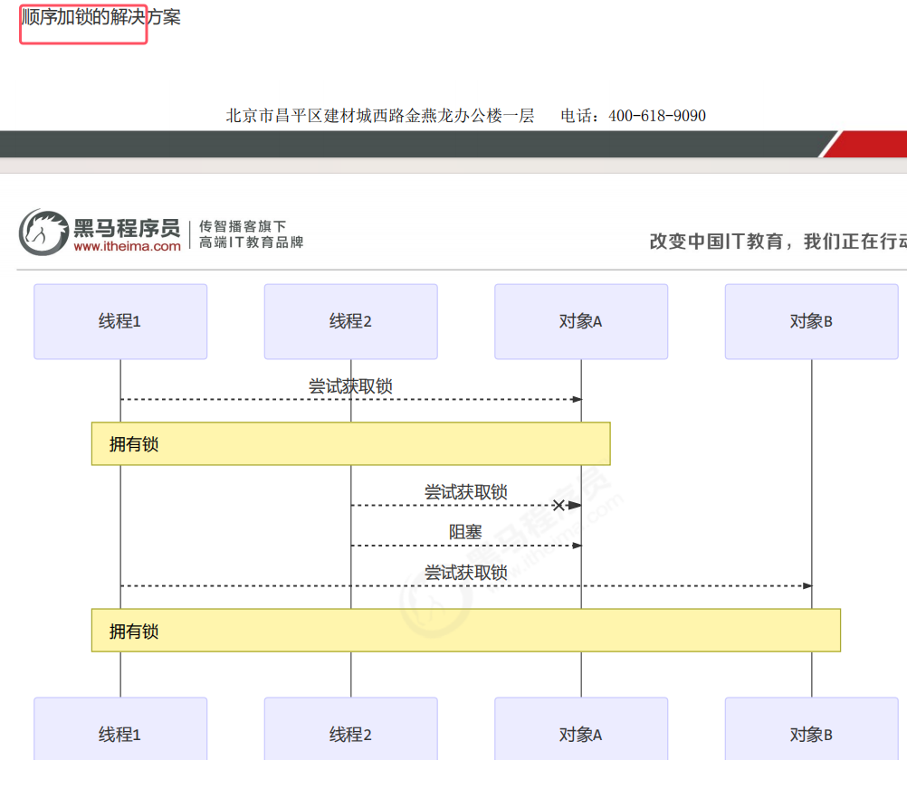

但是顺序加锁容易产生饥饿问题。如果线程1一直能竞争到线程对象a的锁