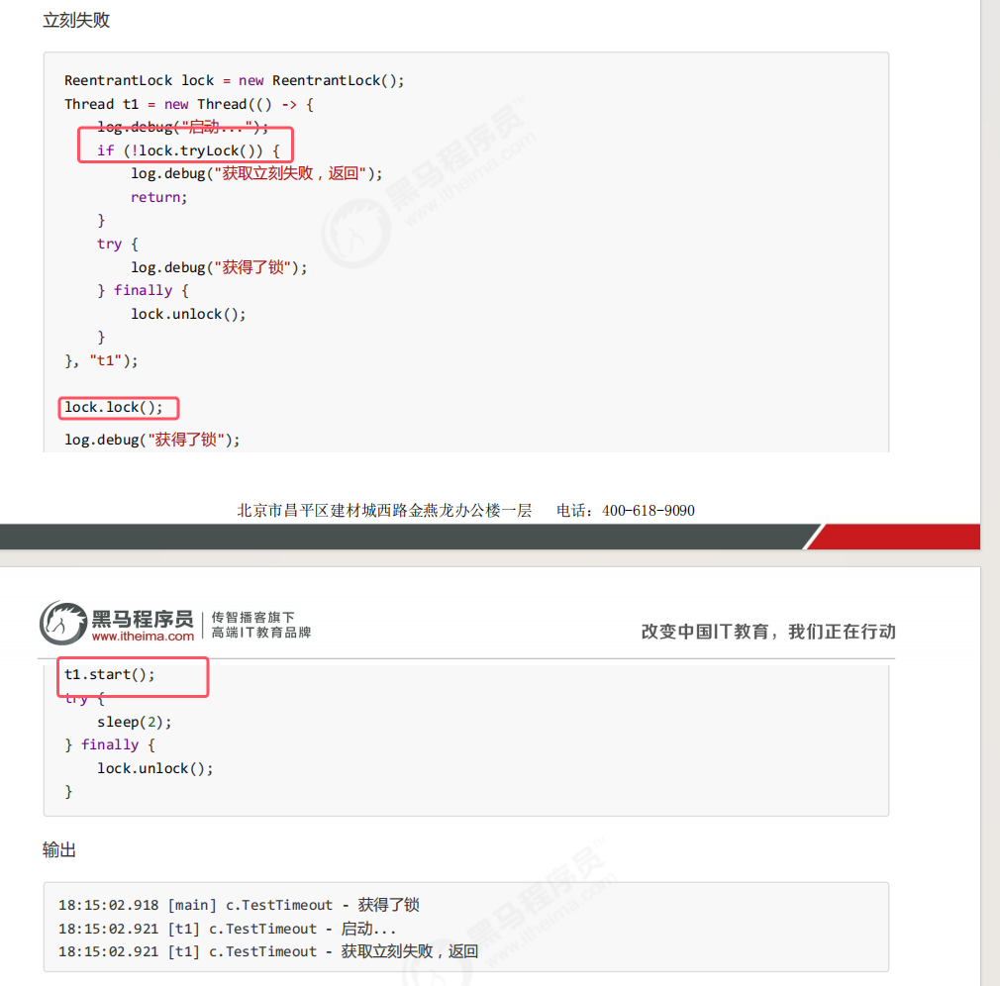
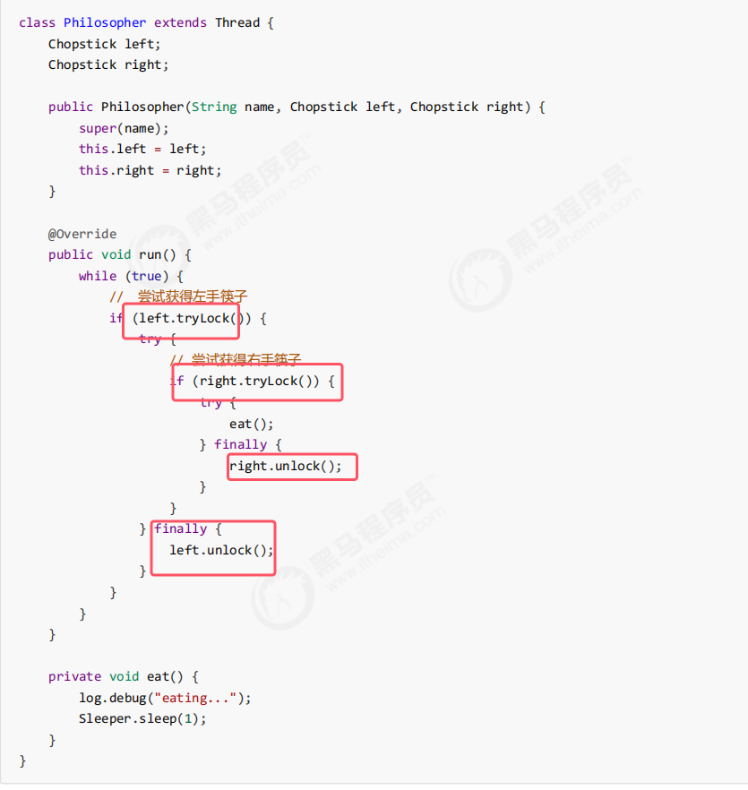

### 11.1ReentrantLock简介

* 可中断的体现：**等待获取锁的线程，可以被其他线程打断来终止该线程的等待。** 具体见下文
* 设置超时时间：synchronized如果竞争锁失败那么会直接进入entrylist一直去等待；而ReentrantLock可以设置超时时间，规定时间内有获取锁就放弃对锁的竞争。
* 设置为公平锁：公平锁是一种防止线程饥饿的情况发生的锁，即让想要获取锁的线程排队等(队列)，而不是去随机争抢。synchronized的锁是不公平锁
* 支持多个条件变量：条件变量就相当于synchronized中重量级锁的monitor的waitset，当不满足条件时会进入waitset进行等待。即ReentrantLock支持多个waitset，不满足条件1的进入waitset1去等；不满足条件2的进入waitset2去等

**使用：需要先创建一个ReentrantLock对象；调用该对象的lock()方法来获取锁，一般临界区的代码要用try-finally块包裹，在finally块中使用unlock()释放锁**

### 11.2可重入

* **synchronized和ReentrantLock的锁都是可重入锁**

* 创建后的lock就是锁对象，具体的原理会在后面讲到

### 11.3可中断（可打断）

* **即lock.lockInterruptibly()他也是正常加锁，如果未竞争到锁同样是进入到阻塞队列当中等待。只不过该等待可以被interrupt()方法打断**

###  11.4锁超时

* **锁超时使用tryLock()方法，即尝试获得锁。如果获得了锁就返回true；如果没获得锁，会返回false，并且不会进入阻塞队列等待，继续执行下面的代码**
* **带超时版本：`boolean tryLock(long time, TimeUnit unit)` —— 在指定时间内尝试获取锁：
    - 若在**超时前**获取到锁，返回 `true`；
    - 若**超时仍未获取**到锁，返回 **`false`**；
    - 若**等待期间被中断**，会抛出 `InterruptedException`。**即tryLock(time)也是可打断的**

立刻失败：  

超时失败：  

###### 使用tryLock()解决哲学家就餐问题

### 11.5公平锁

* **ReentrantLock 默认是不公平的**
* **可以根据构造方法来设置是否公平。传false就是不公平锁；传true就是公平锁**
* 公平锁一般没有必要，会降低并发度，后面分析原理时会讲解

这里只需要知道这些即可，后面讲解底层源码时会细细讲解

### 11.6条件变量
* synchronized 中也有**条件变量，就是我们讲原理时那个 waitSet 休息室**，当条件不满足时进入 waitSet 等待
* **ReentrantLock 的条件变量比 synchronized 强大之处在于，它是支持多个条件变量的**，这就好比synchronized 是那些不满足条件的线程都在一间休息室等消息；而 ReentrantLock 支持多间休息室，有专门等烟的休息室、专门等早餐的休息室、**唤醒时也是按休息室来唤醒**
* 使用步骤
	1. **创建条件变量：`lock.newCondition()`,返回的就是条件变量对象。**
	2. **必须先获得锁**
	3. **调用`条件变量.await()`时，当前线程就会进入到对应的条件变量休息室进行等待**
	4. **将来唤醒休息室中的线程，使用`条件变量.signal()`随机唤休息室中的任意一个线程；signalAll()唤醒休息室里的全线程（与wait和notify类似）**
* 使用要点：
	* **await 前需要获得锁（跟synchronized的wait一样，只能在代码块中使用）**
	* **await 执行后，会释放锁，进入 conditionObject 等待**
	* **await 的线程被唤醒（或打断、或超时）去重新竞争 lock 锁**
	* **竞争 lock 锁成功后，从 await 后继续执行**
	* await()有多种方法的重载，支持限时等待和不可打断等待  
		

使用例子：

