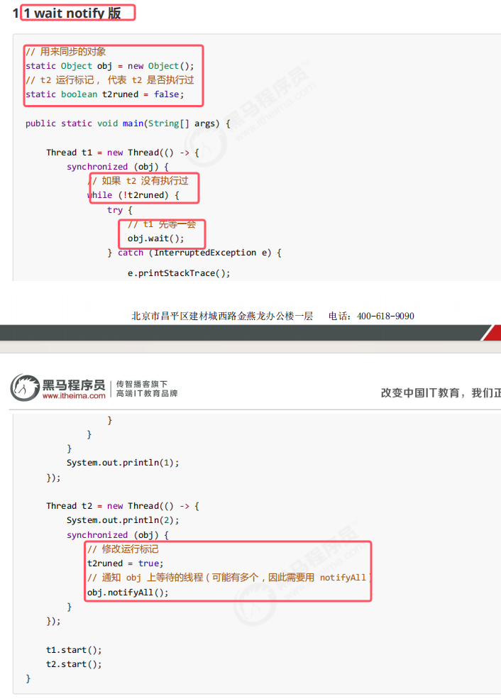
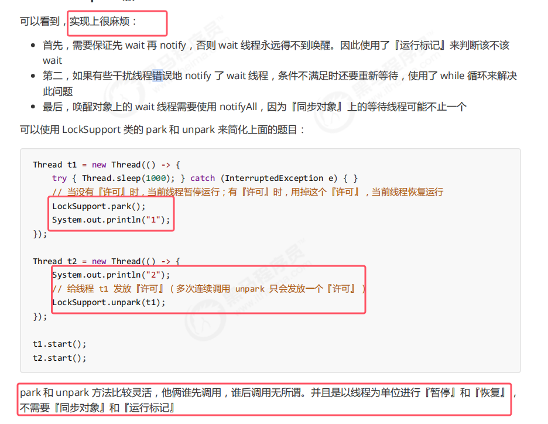
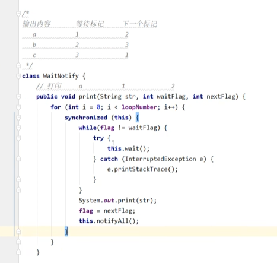
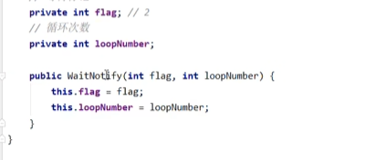
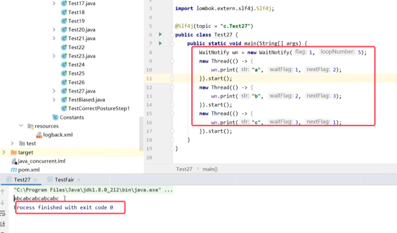
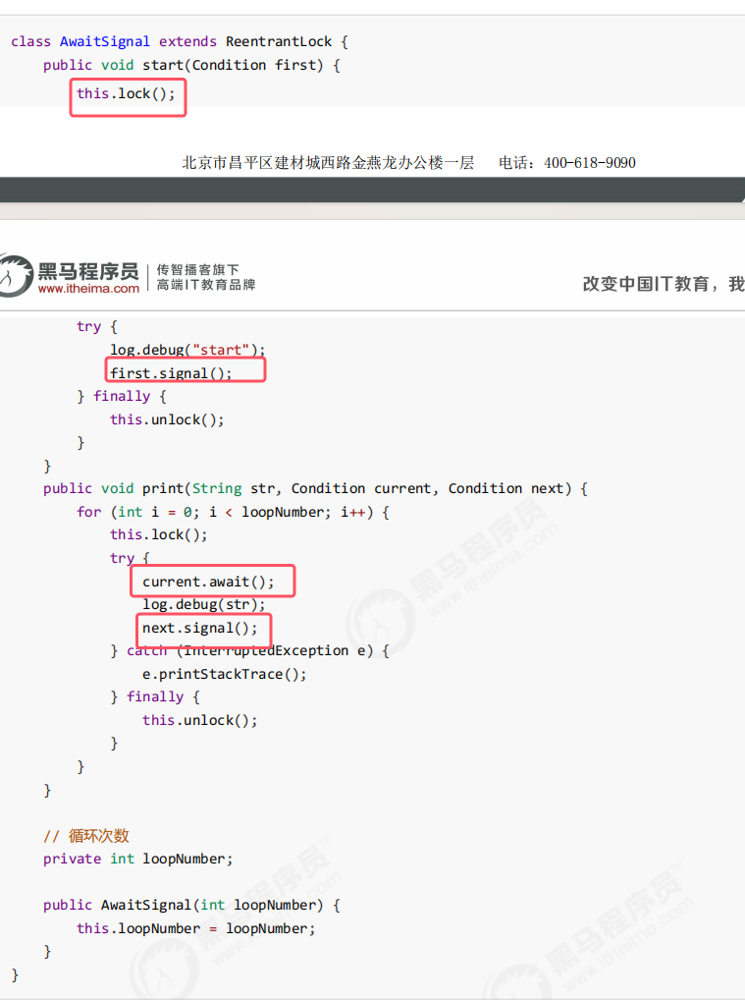
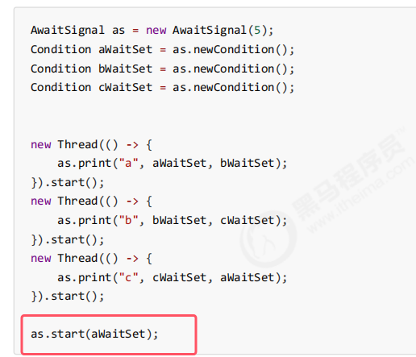
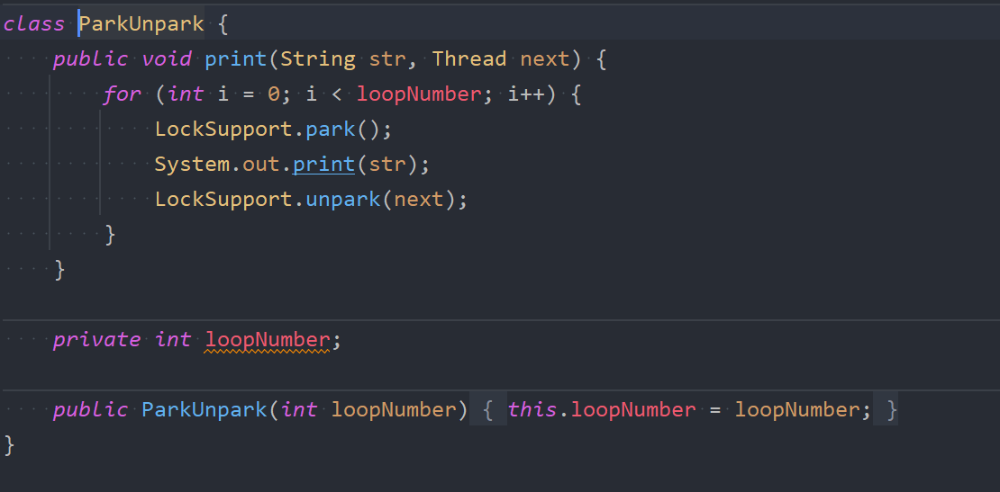
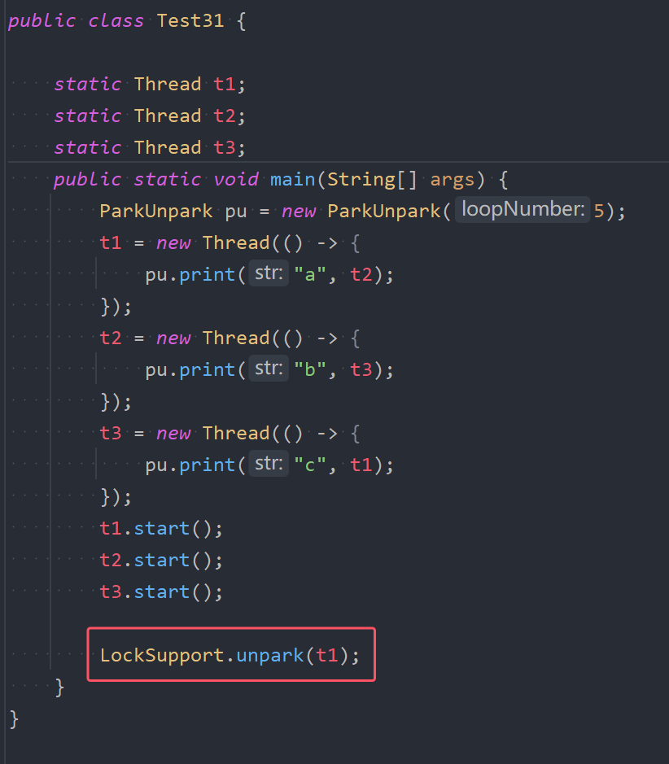

## 1.固定运行顺序
这种情况一般都是使用哪个while-wait-notify套路，使用一个锁，一个变量来做判断条件

假设必须要先打印2，再打印1

###### wait和notify版本  

* 使用reentrantlock也可以来做，与wait-notify特别相似，此处不过多赘述

###### park和unpark版本  

## 2.交替输出
线程 1 输出 a 5 次，线程 2 输出 b 5 次，线程 3 输出 c 5 次。**现在要求输出 abcabcabcabcabc** 怎么实现

###### wait-notify版本

三个变量的话使用boolean去做判断条件就不太合适。所以使用一个flag值，为1的时打印a，为2时打印b，为3时打印c

###### await和signal的条件变量版本

###### pork和unpark版本

