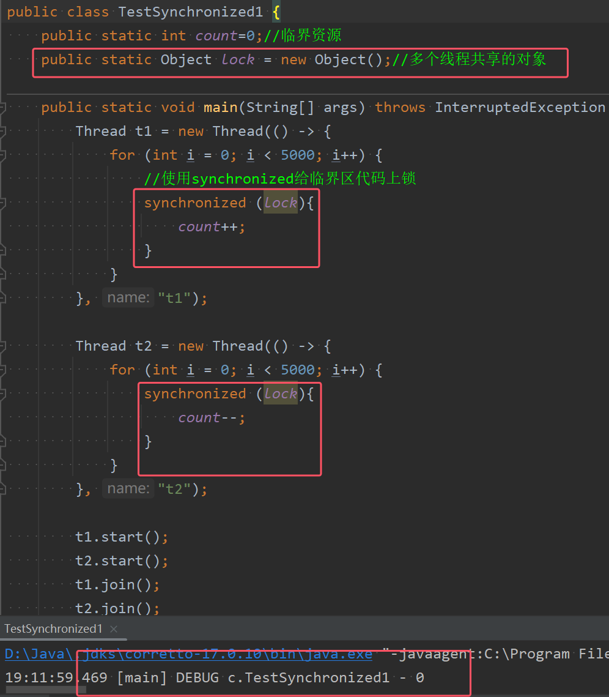

**synchronized，即俗称的【对象锁】，它采用互斥的方式让同一时刻至多只有一个线程能持有【对象锁】，其它线程再想获取这个【对象锁】时就会阻塞住**。这样就能保证拥有锁的线程可以安全的执行临界区内的代码，不用担心线程上下文切换

### 1.synchronized的语法和基本使用

```java
synchronized(对象) // 线程1， 线程2(blocked)
{
	临界区
}
```
* **synchronized，即俗称的【对象锁】，它采用互斥的方式让同一时刻至多只有一个线程能持有【对象锁】，其它线程再想获取这个【对象锁】时就会阻塞住**
* **当该线程执行完后，会释放掉对象锁，然后唤醒一个正处于阻塞状态中的其他线程，然后由线程二获得该锁并执行临界区中的代码**
* **synchronized进行加锁都是配合一个多个线程共享的对象来完成的**

使用该关键字来访问共享资源的代码如下图所示  


* 可以看到结果从之前的不定值，变为现在的一直为理想的结果0。**两个线程必须争抢的是同一个锁，也就是同一个对象**
* 其理解如下图所示  
	

* 理解：**synchronized 实际是用对象锁保证了临界区内代码的原子性，即临界区内的代码对外是不可分割的，不会被线程切换所打断。**
* **并且多个线程争夺统一资源时，这些线程对应的临界区必须都加锁。**
* 实际使用中，常常使用的是`synchronized(this)`。


### 2.synchronized加在方法上


