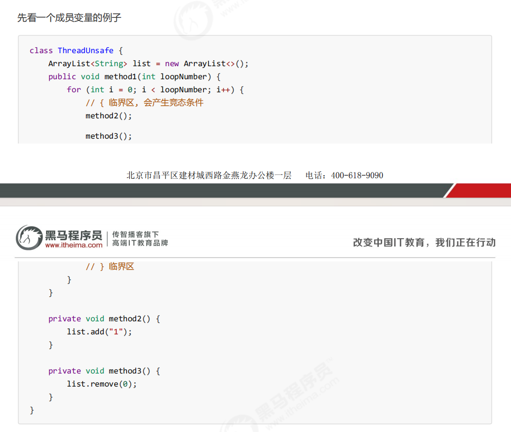
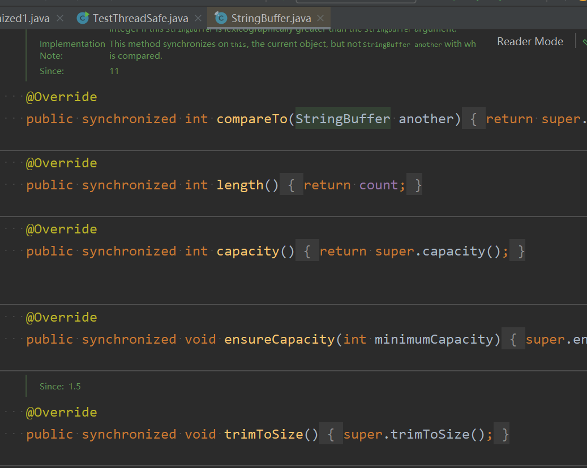
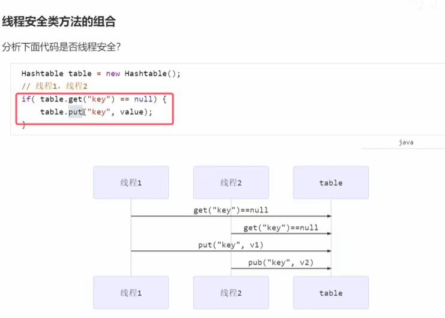
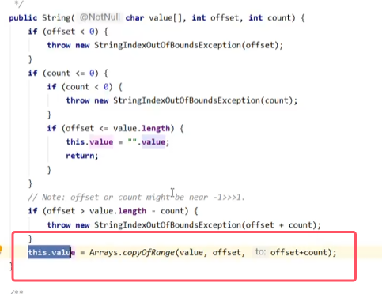

1. 成员变量和静态变量是否线程安全？  
* **如果它们没有共享，则线程安全；如果它们被共享了，根据它们的状态是否能够改变，又分两种情况**
	* **如果只有读操作，则线程安全**
	* **如果有读写操作，则这段代码是临界区，需要考虑线程安全**

2. 局部变量是否线程安全？
* **局部变量是线程安全的，但局部变量引用的对象则未必。**
	* **如果该对象没有逃离方法的作用访问，它是线程安全的。**
	* **如果该对象逃离方法的作用范围，需要考虑线程安全**

### 2.局部变量线程安全分析

###### 例1：局部变量是基本数据类型

* i是局部变量，每个线程的test()方法对应的栈帧中都会有一个int i=10,所以每次i++的变量i的都不是同一份，或者换一种方法内存地址都不一样，所以不存在共享

###### 例2：共享成员变量被修改

###### 例3：将局部变量引用对象
将上例子中的list改为局部变量后，具体的代码如下图所示。

* 此时是线程安全的，**因为局部变量的引用没有暴露给外部**。具体分析如下

###### 例4：将局部变量暴引用对象暴露给外部
在例子3的基础上，再添加一个子类。具体代码如下图所示

* method3()当中新线程和原来的线程共享list这个变量，此时就会有线程安全问题

### 3.常见线程安全类

* **图中的Integer代表的是整个包装类都线程安全**
* **这些类中的每个方法都是原子的**。比如下图  
	
* **但需要注意他们多个方法的组合不是原子性的。**
	
	* **图中的代码只能保证put()和get()内部的代码时一致的，但无法保证起来时一致的，所以线程不安全**

###### 不可变线程安全性

* 以String为例看源码，看看String的这些方法如何保证线程安全  
	
	
	* 可以发现subString()根本没有改变源字符串底层的value数组的值，而是创建了一个新的新字符串，将原来字符串中字串的内容赋值给了新字符串的value数组
	* **所以相当于使用新的字符串来返回结果。而没有改变原有字符串的值，所以没有线程安全问题**