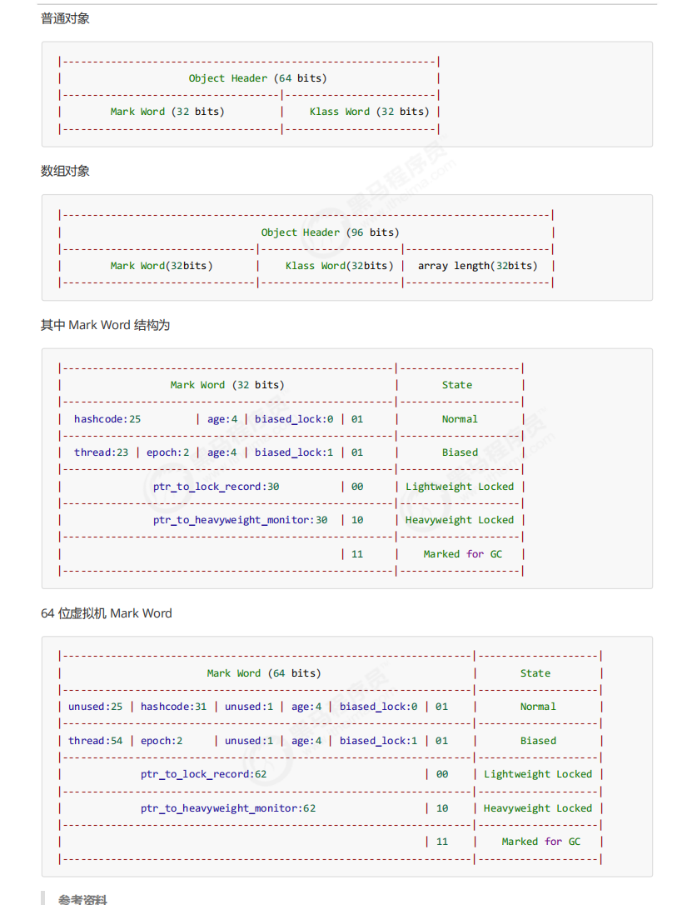
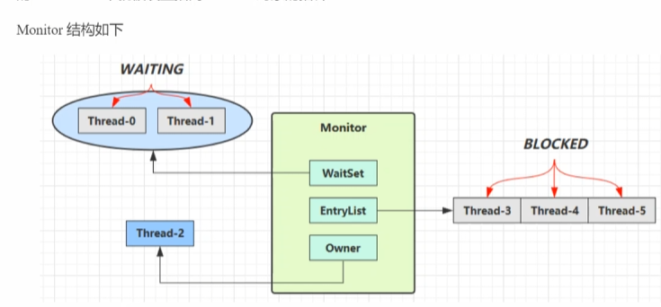

## 1.Java对象头
* **Java的对象在内存种都是由两部分组成。一部分是对象头，一部分就是对象中的成员变量**

下面介绍java对象头  

1. 普通对象的虚拟头占64位。其中class word占4个字节，是一个指针，指向的就是对应的类的类对象；mark word的内容如图中所示，包含普通状态和其他状态存储的一些信息。
2. 数组对象的虚拟头占96位，还多了个32位用于存储数组的长度。

## 2. Moniter(锁)的工作原理
* **Moniter的意思是监视器或者管程，是操作系统提供的Moniter，在Java中看不到它表示**
* **如果使用synchronized给对象上锁（重量级）之后，该Java对象都会关联一个Moniter对象，该对象的mark word中就会设置指向Moniter对象的指针**

