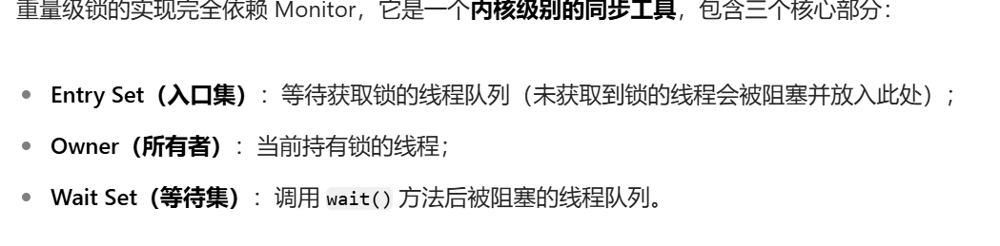
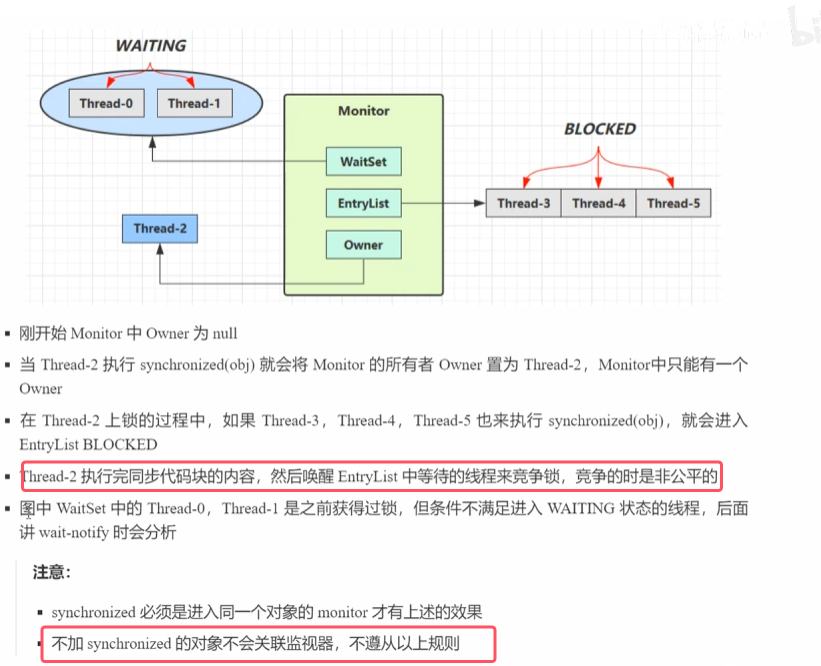

## 1.Java对象头
* **Java的对象在内存种都是由两部分组成。一部分是对象头，一部分就是对象中的成员变量**

下面介绍java对象头，图中以32位虚拟机进行介绍    

1. - **32 位 JVM**：Mark Word 固定为 **4 字节**（32 位）。**64 位 JVM**：Mark Word 固定为 **8 字节**（64 位）。
2. **普通对象的对象头占64位。其中class word占4个字节，是一个指针，指向的就是对应的类的类对象**；**mark word的内容如图中所示，包含普通状态和其他状态存储的一些信息。**
3.** 数组对象的虚拟头占96位，还多了个32位用于存储数组的长度**。

## 2. Moniter(锁)的工作原理
* **Moniter的意思是监视器或者管程，是操作系统提供的Moniter，在Java中看不到它表示**
* **如果使用synchronized给对象上锁（重量级）之后，该Java对象都会关联一个Moniter对象，该对象的mark word中就会设置指向Moniter对象的指针**

* 当给该对象加重量级锁时，会将该对象得markword中的锁状态改为10，代表此时加的是重量级锁；之后剩下的位数都用来存放一个用于指向monitor得一个指针；原本里面的内容都会存放放到Monitor对象之中，等到释放锁的时候会重置成没拿到锁的样子。具体如上面mark word结构所示。
* 当thread2释放锁后，owner就空出来，会通知monitor中entryset中的所有线程，将其全部唤醒，让他们再去竞争锁。

具体流程如下图所示

