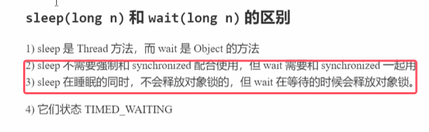

### 1.工作原理

### 2.API介绍

* notify()是随机挑一个来唤醒

* **它们都是线程之间进行协作的手段，都属于 Object 对象的方法。使用时是`锁对象.wait()`，执行该命令的线程进入waitset等待。只要锁对象一样，
* **必须获得此对象的锁，才能调用这几个方法。通俗的讲只能再synchronized块中才能执行这两个方法**

### 3.wait()和sleep()的区别

* **sleep()可以工作在同步块内也可以不在同步块中，而wait()必须在同步块中使用**
* **sleep()在同步块中使用时虽然阻塞了，但不会释放锁；而wait在等待的时候会释放锁**

### 4.wait和notify使用的正确姿势

问题北京：模拟一些线程使用一个共享的room来达到共享安全，下面分成五步来讲解正确使用

###### 第一步

* 其它干活的线程，都要一直阻塞，效率太低。小南线程必须睡足 2s 后才能醒来，就算烟提前送到，也无法立刻醒来
* 加了 synchronized (room) 后，就好比小南在里面反锁了门睡觉，烟根本没法送进门，main 没加。synchronized 就好像 main 线程是翻窗户进来的
* **解决方法，使用 wait - notify 机制**

###### 第二步

* 解决了其它干活的线程阻塞的问题
* 但如果有其它线程也在等待条件呢？

###### 第三步

* **notify 只能随机唤醒一个 WaitSet 中的线程，这时如果有其它线程也在等待，那么就可能唤醒不了正确的线程**，称之为【虚假唤醒】
* 解决方法，改为 notifyAll

###### 第四步

* 用 notifyAll 仅解决某个线程的唤醒问题，但使用 if + wait 判断仅有一次机会，一旦条件不成立，就没有重新判断的机会了
* **解决方法，用 while + wait，当条件不成立，再次 wait。这样就可以达到指定唤醒某个线程的问题**

###### 第五步

###### 总结
**使用while-wait、notifyAll的方式来解决唤醒指定线程的方式**

