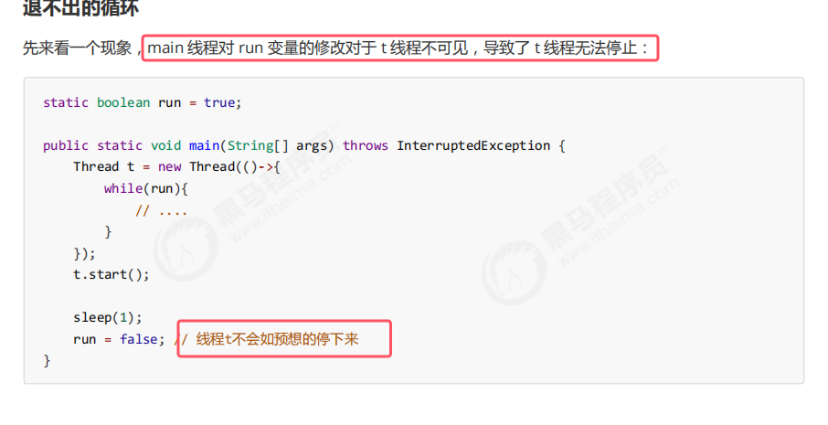

停不下来的原因如下：  

1. 初始状态， t 线程刚开始从主内存读取了 run 的值到工作内存   
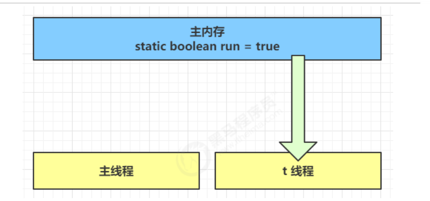

2. 因为**t 线程要频繁从主内存中读取 run 的值，JIT 编译器会将 run 的值缓存至自己工作内存中的高速缓存中，减少对主存中 run 的访问，提高效率**   
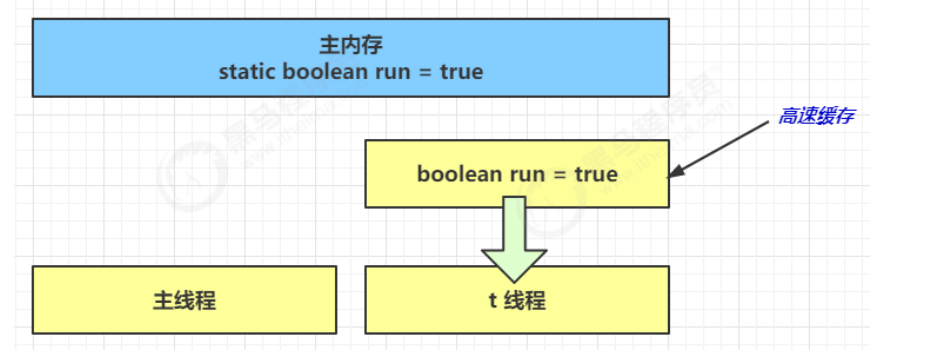

3.   
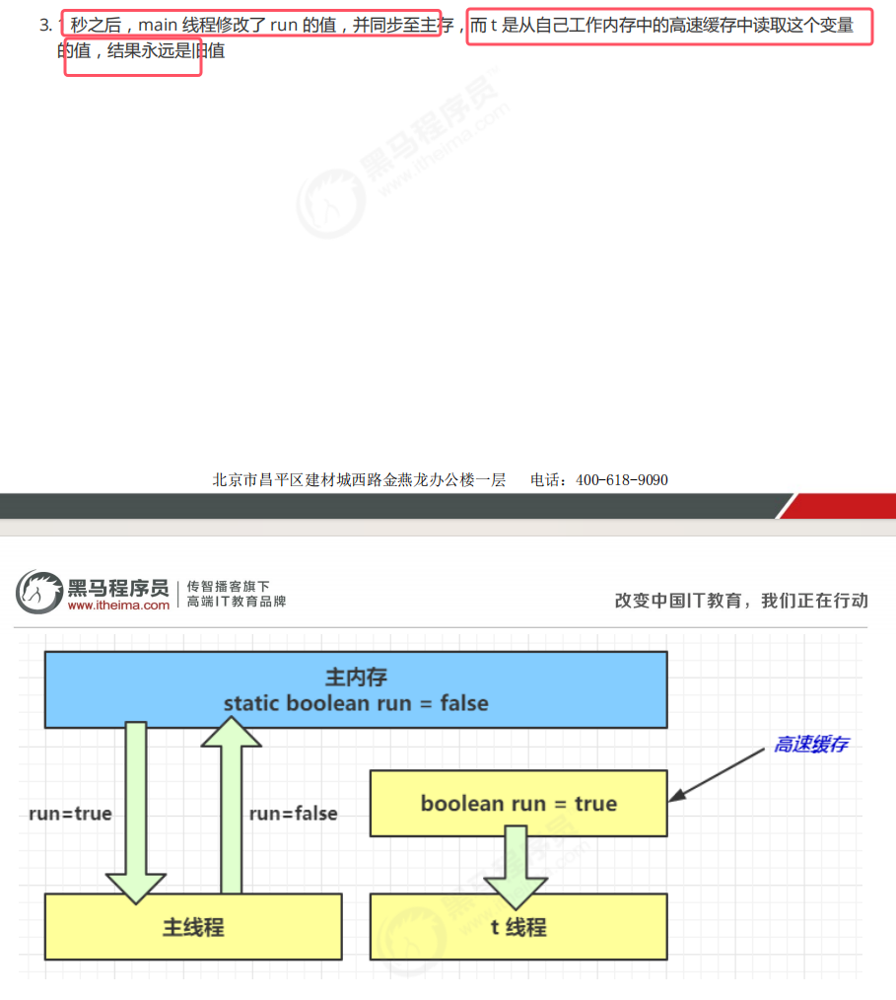

###### 解决方法：volatile
**volatile它可以用来修饰成员变量和静态成员变量，他可以避免线程从自己的工作缓存中查找变量的值，必须到主存中获取它的值，线程操作 volatile 变量都是直接操作主存**

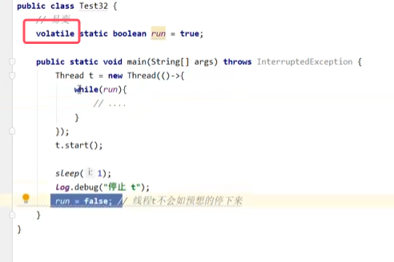

注意点：
1. **前面例子体现的实际就是可见性，它保证的是在多个线程之间，一个线程对 volatile 变量的修改对另一个线程可见， 不能保证原子性，仅用在一个写线程，多个读线程的情况**   
	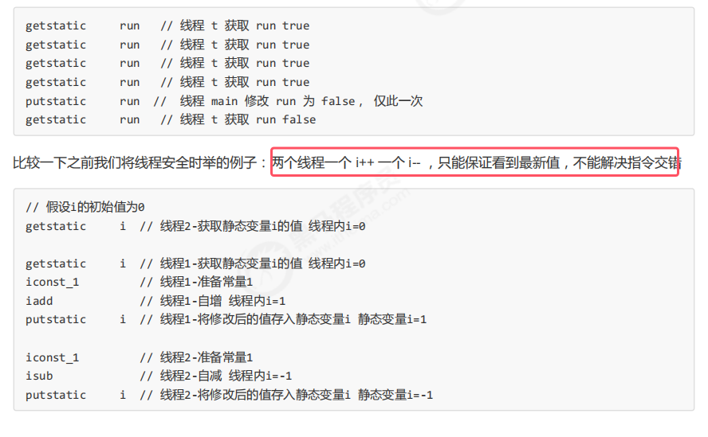
2. **注意 synchronized 语句块既可以保证代码块的原子性，也同时保证代码块内变量的可见性。** 但缺点是synchronized 是属于重量级操作，性能相对更低
3. 如果在前面示例的死循环中加入 System.out.println() 会发现即使不加 volatile 修饰符，线程 t 也能正确看到对 run 变量的修改了。因为sout底层调用了synchronized。

### 2.2两阶段终止模式（volatile实现）

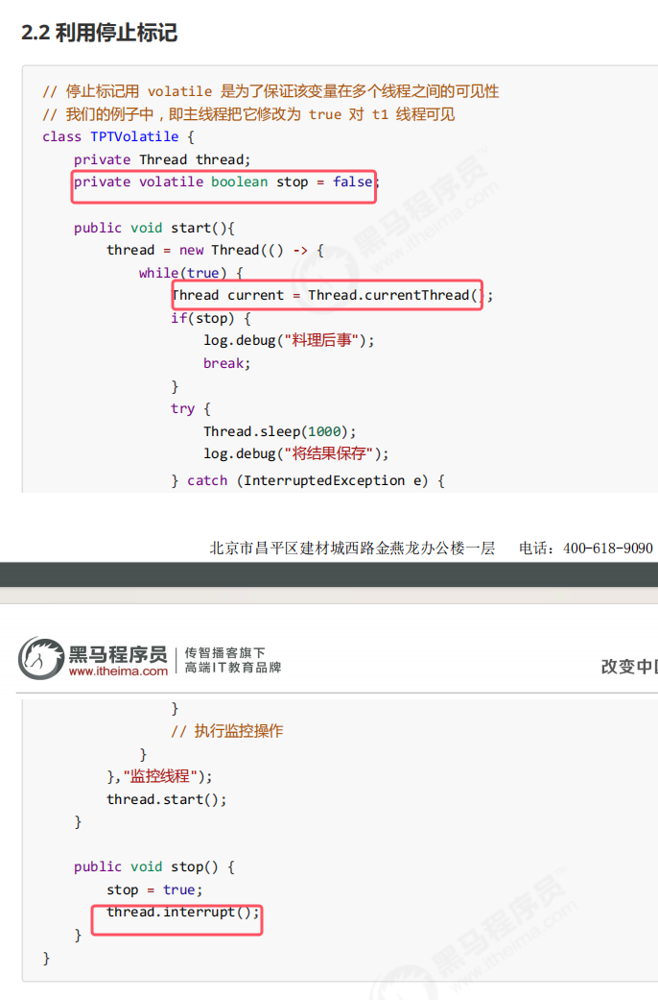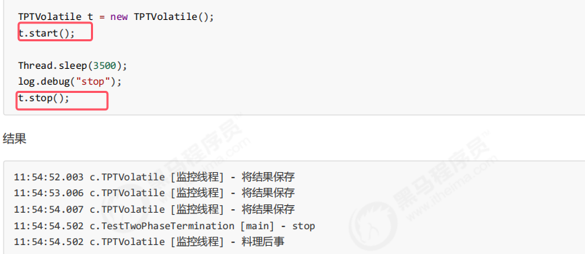

### 2.3同步模式之balking
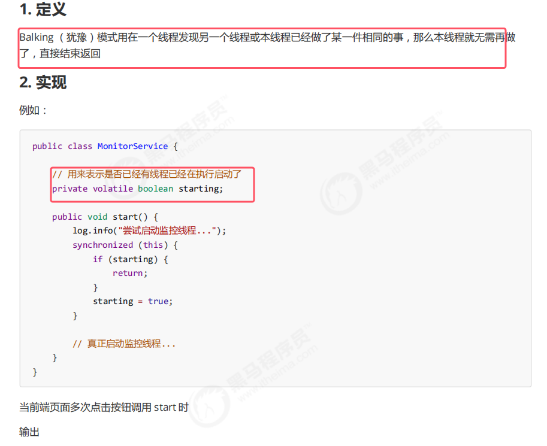
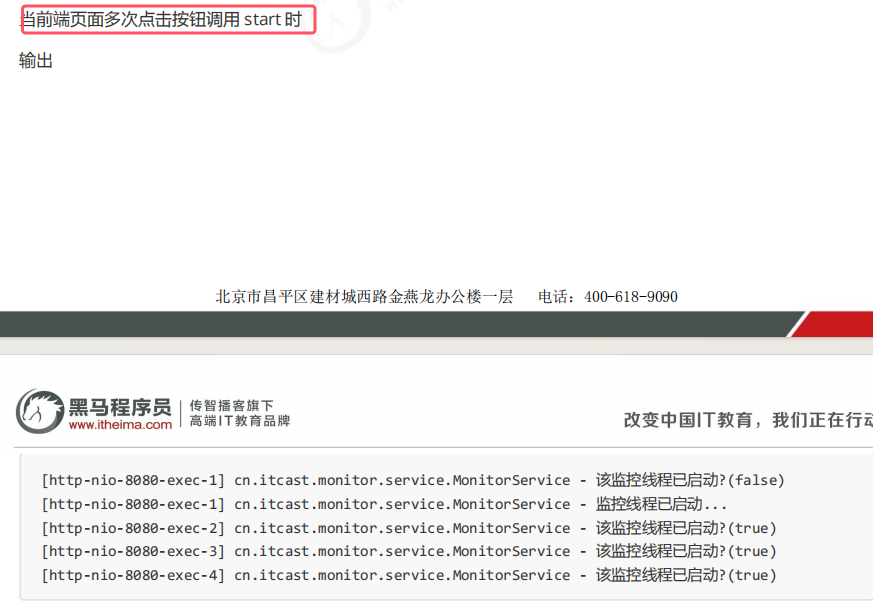
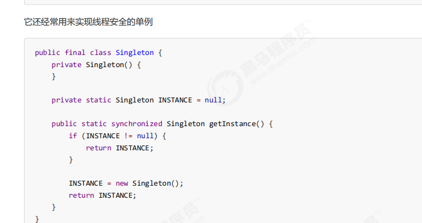
* 这种单例模式的锁粒度太大，并发性太差，具体的好的措施在[01单例模式](../../设计模式/01单例模式.md)
