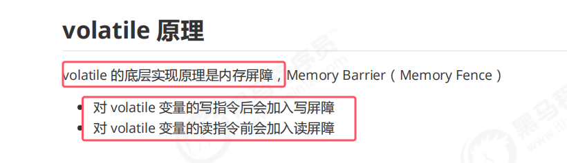
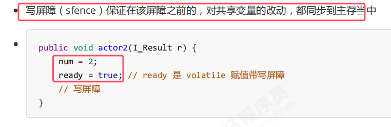
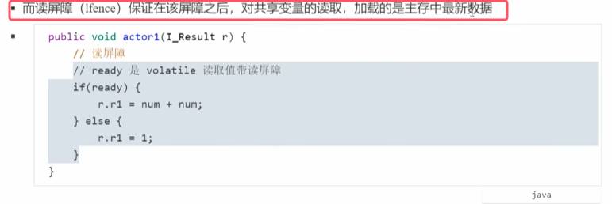
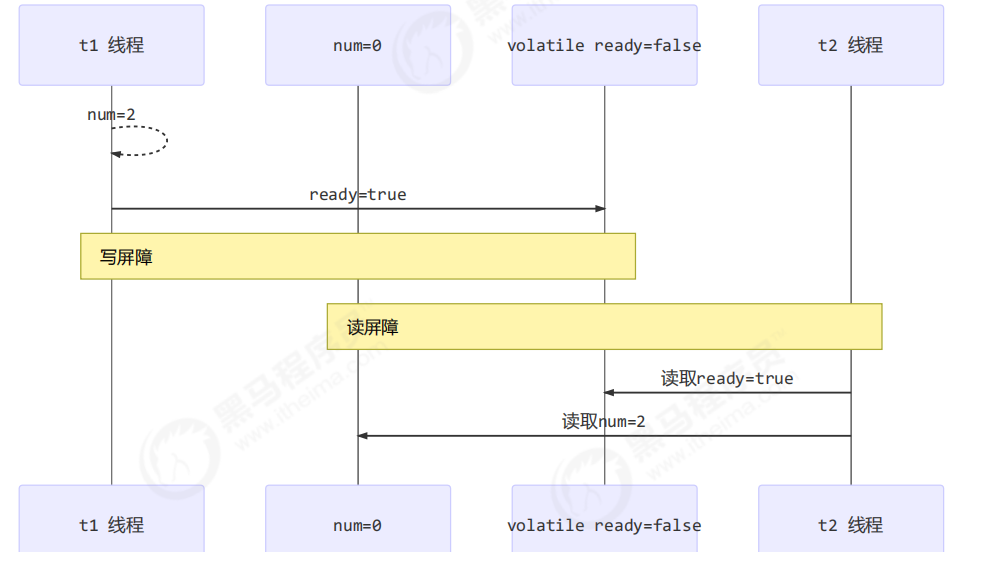
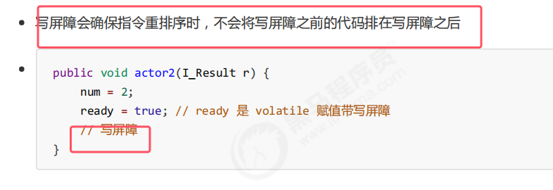
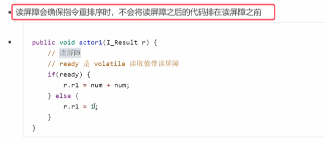
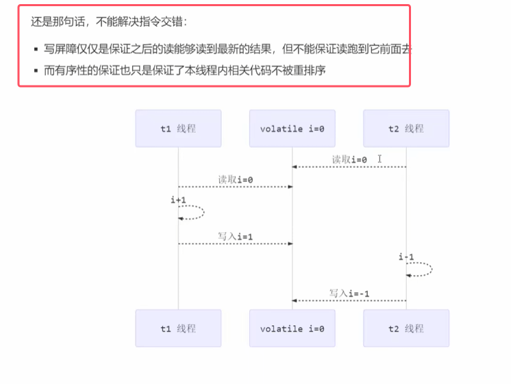

### 1.保证可见性

* 对volatile变量进行写操作，后会加写屏障，这样会使得该屏障之前的对变量的改动都同步到主存。（不只是被volatile修饰的变量，其他变量也会被同步到主存当中）

* 对volatile变量进行读操作会在读操作之前加读屏障。读屏障之后的代码，只要时对共享变量的读取，加载的都是主存中最新数据

### 2.保证有序性

* 即volatile只能保证可见性和有序性，不能保证原子性
* 而synchronized可以同时保证原子、可见