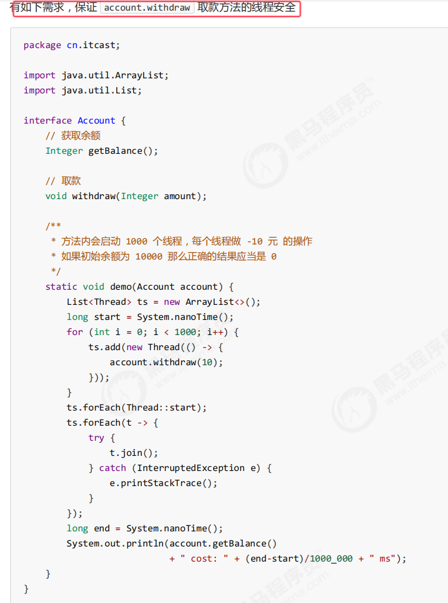
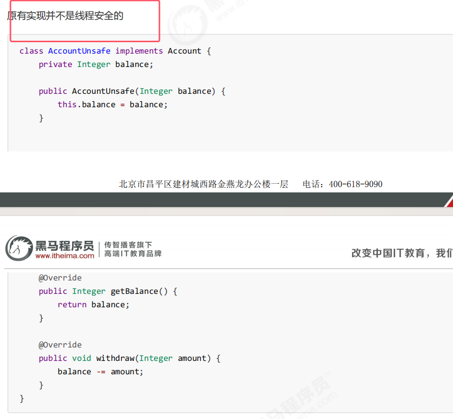
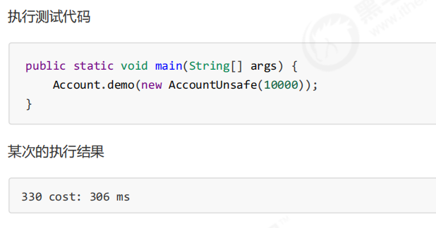
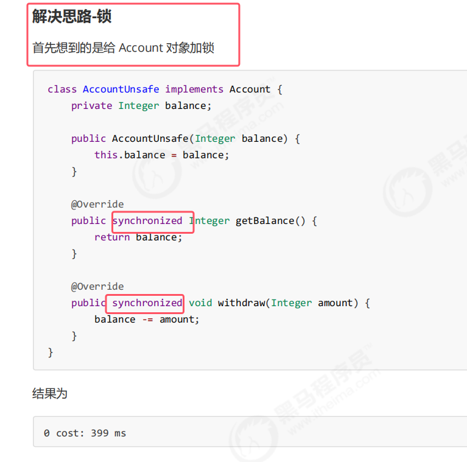
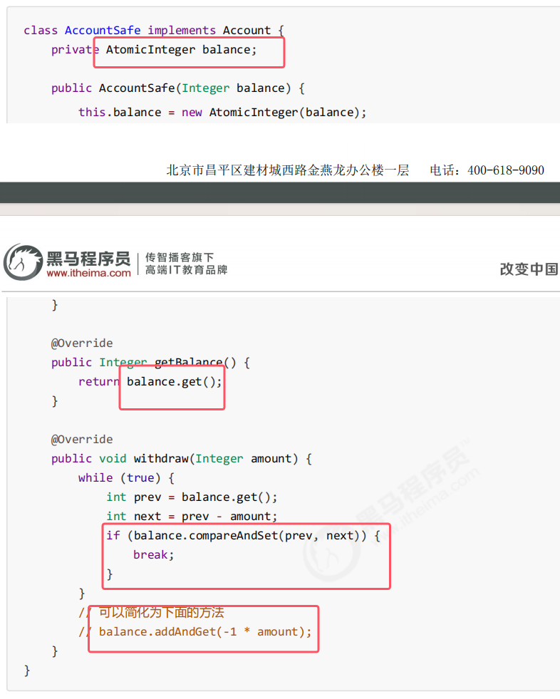
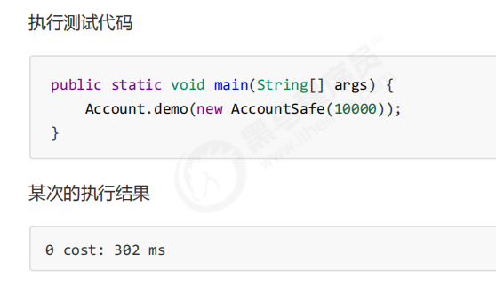
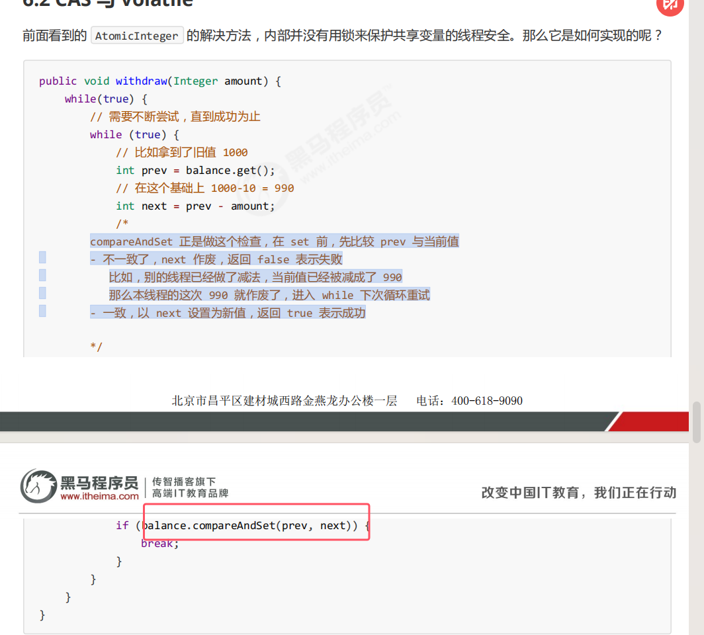
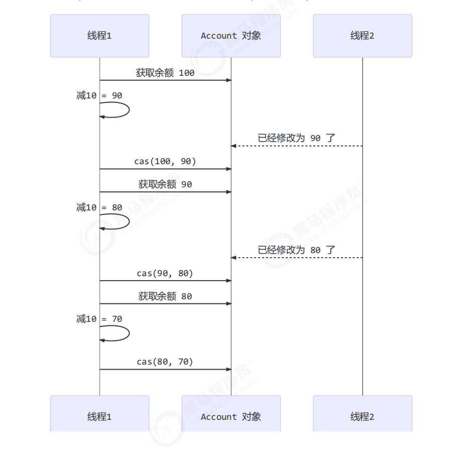
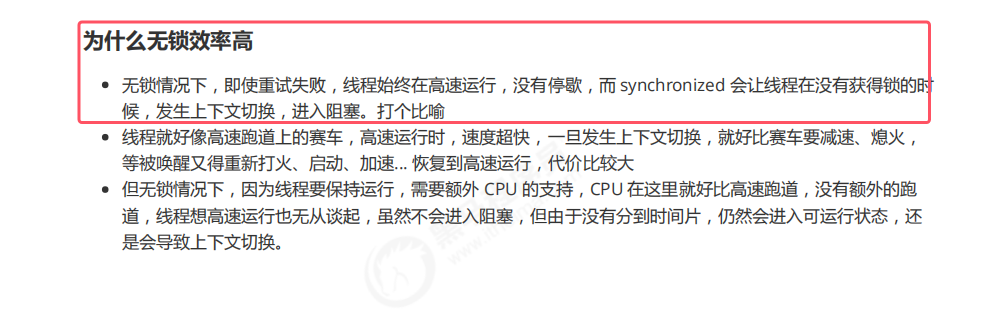
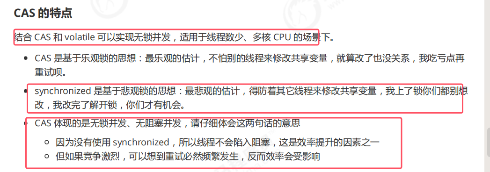

## 1.引出CAS

* 上面的肯定线程不安全，没有使用控制原子性的代码

解决思路2：无锁解决控制原子性   

## 2.CAS的原理
###### 工作流程

* compareAndSet()，它的简称就是 CAS （也有 Compare And Swap 的说法），**它必须是原子操作。意思就是比较并设置。只有满足了一定的条件他才会设置成功**
* compareAndSet()的原子操作实底层是 lock cmpxchg 指令（X86 架构），在单核 CPU 和多核 CPU 下都能够保证【比较-交换】的原子性。底层并不是通过锁来进行实现的。
* compareAndSet()方法的作用：**在 set 前，先比较 prev 与当前变量的最新结果（即当前值）。如果不一致了，next 作废，返回 false 表示失败。比如，别的线程已经做了减法，当前值已经被减成了 990，那么本线程的这次 990 就作废了，进入 while 下次循环重试；一致，以 next 设置为新值，返回 true 表示成功**。上面代码具体的原理可看下面图解。  
	

###### cas和volatile
* **获取共享变量时，为了保证该变量的可见性，需要使用 volatile 修饰。它可以用来修饰成员变量和静态成员变量，他可以避免线程从自己的工作缓存中查找变量的值，必须到主存中获取它的值，线程操作 volatile 变量都是直接操作主存。即一个线程对 volatile 变量的修改，对另一个线程可见。
* **CAS 必须借助 volatile 才能读取到共享变量的最新值来实现【比较并交换】的效果**

##### cas效率分析

* cas是一种乐观锁，适用于并发度没有那么多的情况
* cas在多核cpu的情况下效率才会较高

###### cas特点

