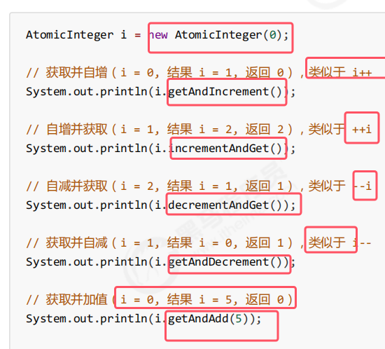
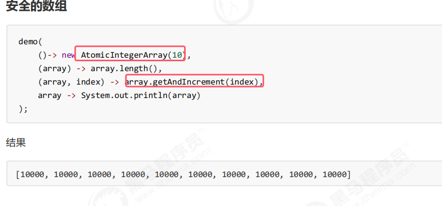
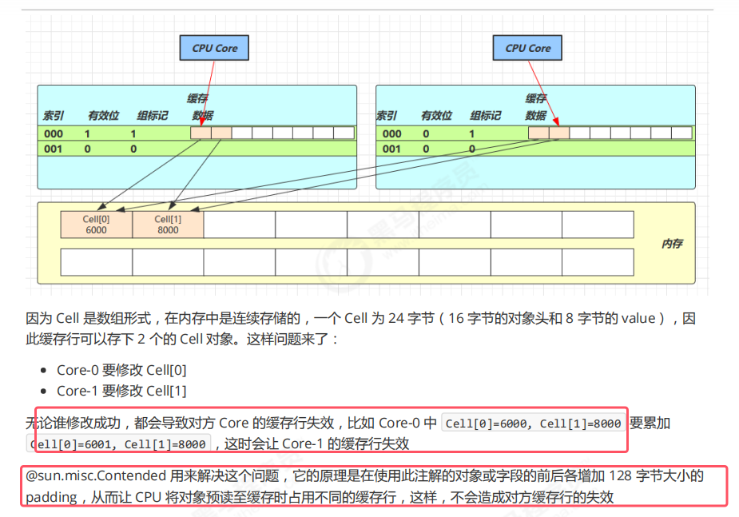
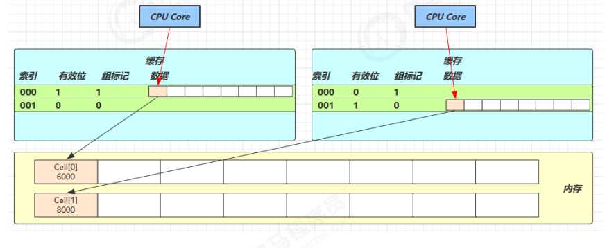

### 1.原子整数

* **介绍的所有方法都是原子的，底层使用cas乐观锁机制来进行实现的**
###### 简单的自增自减

* **最基础的获取最新值的方法：get()**

###### 更加复杂的运算

* getAndUpdate()是先获取i的value值再进行更新,updateAndGet()则相反。
* **这两个方法中传的是lambda表达式，其中传入里面方法的参数就是原子整数的value，方法体就是对该值的更新逻辑,即运算结果就是设置的值**

模拟其底层的代码如下图所示：    

底层源码如下图所示：  

### 2.原子引用类型
主要分为三种，使用上大差不差，后面会将他们的区别。
* AtomicReference
* AtomicMarkableReference
* AtomicStampedReference

###### AtomicReference
以下图例子为例来讲解：  

* **AtomicReference中泛型指的是要使用cas进行保护的类型。其构造器中传入的是需要配被保护的对象**

###### ABA问题

* ABA问题：在主线线程将A改为c之前，另一个线程先将A改成B又该回A，这样的话主线程将A修改为c时照样能成功。
* **ABA问题实质：主线程仅能判断出共享变量的值与最初值 A 是否相同，不能感知到这种从 A 改为 B 又 改回 A 的情况，如果主线程希望：只要有其它线程【动过了】共享变量，那么自己的 cas 就算失败。这时，仅比较值是不够的，需要再加一个==版本号==**。这就需要使用AtomicStampedReference

###### AtomicStampedReference

* **AtomicStampedReference的构造方法的第二个参数还需要传入初始的版本号。获取最新值得方法不是get()而是getReference()。获取版本号得方法为getStamp()。**
* **该AtomicStampedReference的compareAndSet()方法不仅会比对值，而且还会比对版本号。所以第三个和第四个参数需要传更新前和如果比对成功那么更新之后的版本号**。该方法内部会去使用更新前的版本号与该共享变量的最新版本号进行对比。具体的处理策略与之前虚的compareAndSet()一样。

###### AtomicMarkableReference

* **AtomicMarkableReference相当于使用一个bool变量来记录是否变化过。所以构造方法会传一个初始化的bool变量的值**
* 剩下的都与AtomicStampedReference一样使用

### 3.原子数组
* AtomicIntegerArray
* AtomicLongArray
* AtomicReferenceArray

###### 不安全的数组

* 图中的例子使用了函数式接口，具体的试图用如图中的注释。
* 不安全的自增了10000次，但是没有到1w。

###### 安全的数组

### 4.原子字段更新器
 
 

以AtomicReferenceFieldUpdater为例子  

* **即保证某一个对象的被volatile修饰的成员变量的线程安全性，属性必须是volatile的**
* **AtomicReferenceFieldUpdater的构造器参数的意思是为哪个类的哪个类型的哪个属性名来保证线程安全性**
* **具体来说就是保证对该属性值的更新是原子的。`fieldUpdater.compareAndSet(test5, 0, 10);`中第一个参数表示修改的对象，参数2是原始值，参数3是修改后的值**。原理照样是cas那一套逻辑

### 5.原子累加器

背景：jdk8以后专门提供了几个做累加的类，这几个类比AtomicInteger这些类做累加的效率要高很多     

* Supplier是一个函数式接口，是一个用于提供无参数有返回的结果函数的接口，即()->结果。该接口在上图中就是提供累加器对象的
* Consumer也是函数式接口是要给用于提供有参数无返回结果的函数接口，即(参数)->。该接口再上图中式用于执行累加操作的
* LongAddr性能提升的原因很简单，**就是在有竞争时，设置多个累加单元（即不是在同一个共享变量上累加了）**，Therad-0 累加 Cell[0]，而 Thread-1 累加。Cell[1]... **最后将结果汇总**。**这样它们在累加时操作的不同的 Cell 变量，因此减少了 CAS 重试失败，从而提高性能**。（后面会细讲）

#### 5.1LongAddr源码

###### cas实现锁——被阻塞的线程一直占用cpu空转

###### 缓存行伪共享

* **LongAdder源码中的cellsBusy就类似于上面的cas锁，用于作为一个加锁的标记。来保证cells创建或者扩容时的线程安全，即此时给cells单元数组上锁**
* **Contended注解是用于防止缓存行的伪共享。即防止一个缓存行容纳多个cell对象**。具体内容看图中标红所示。伪共享指的就是一个缓存行加入了多个cell对象

###### 累加increment()的底层原理

###### longAccumulate实现

1. cells未创建的情况   

2. cells创建了但线程对应的cell未创建    

3. cell已创建的情况  

整体的longAccumulate的源码如下图所示：  

###### 将结果汇总的sum函数

### 6.Unsafe对象

* 从上图中可以看出：**Unsafe 对象提供了非常底层的，操作内存、线程的方法，Unsafe 对象不能直接调用，只能通过反射获得**

获取方法如下图所示：  

* 用于**获取当前类中 “自己声明” 的方法**（不管访问修饰符是 `private`、`protected` 还是 `public`），但**不包括从父类继承的方法**
* `etAccessible(true)` 的核心作用是**关闭 Java 语言层面的访问权限检查**，允许反射代码突破类成员的访问修饰符限制（如 `private`、`protected`），直接操作原本不可访问的成员（方法、字段等）

#### 3.2Unsafe的CAS操作

### 3.3Unsafe模拟实现原子整数

、
