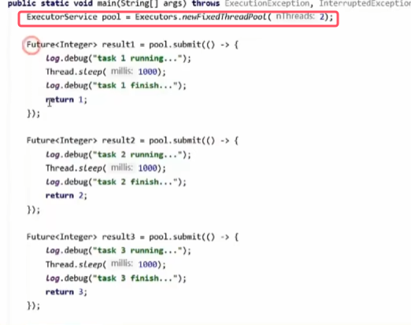
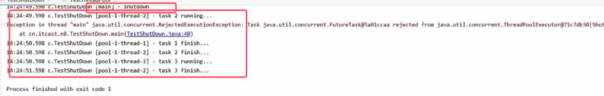

### 1.线程池状态

* stop相当于比较暴力的停止，而shutdown相对温和
* 注意：**running状态从数字上比较是最小的。因为是高三位代表线程池状态，最高位位1代表负数，所以他最小**
* **用一个整数的不同位来存储线程池状态和线程数量两个信息的原因为：保证对线程池状态和线程数量赋值时的一个原子性，一次cas操作就可以进行赋值。** 保证赋值正确

### 2.构造方法

注：线程池有很多构造方法，我们讲解最全的构造方法

* 阻塞队列：线程池里的线程都在运行，新的线程任务会加入到阻塞队列中排队等待
* 线程工厂：用于创建线程对象，并能够起一个好的名字（起好的名字时未来能够很容易将线程池中的线程和其他线程区分开来）
* * **jdk线程池种线程被分为两种：核心线程和救急线程，都是懒惰创建（在一开始都没有被创建,用到时才创建）**。构造方法中的前四个参数都是来控制这两种线程的行为的
* **核心线程即使处于空闲状态（没有任务可执行）也不会被销毁，而是长期驻留在线程池中，等待新任务。**
* **生存时间：当救急线程处理完任务后，若空闲时间超过 `keepAliveTime`，unit就是时间单位，会被线程池主动销毁，释放资源。**
* 最大线程数目：核心线程数+救急线程数的最大阈值
* 救急线程用于应对任务量激增的情况。

这些参数的具体作用和使用过程看下面的图解

注：下图中设核心线程数目为2，最大线程数目为3，阻塞队列的大小为2。虚线代表该线程未被创建  

* 线程池中刚开始没有线程，当一个任务提交给线程池后，线程池会创建一个新线程来执行任务

* 当线程数达到 corePoolSize 并没有线程空闲，这时再加入任务队列，新加的任务会被加入workQueue 队列排队，直到有空闲的线程。

* **如果队列选择了有界队列，那么任务超过了队列大小时，会创建 maximumPoolSize - corePoolSize 数目的线程来救急**。
* 综上可以总结出**救急线程的创建条件：阻塞队列使用有界队列，并且仅当核心线程全忙且任务队列已满时**

* 如果线程到达 maximumPoolSize且任务队列已经满， 仍然有新任务这时会执行拒绝策略。拒绝策略 jdk 提供了 4 种实现（具体为上图），
	* **AbortPolicy 让调用者抛出 RejectedExecutionException 异常，这是默认策略**
	* **CallerRunsPolicy 让调用者运行任务**
	* **DiscardPolicy 放弃本次任务**
	* **DiscardOldestPolicy 放弃队列中最早的任务，本任务取而代之**。抛弃的是最早放入队列的任务

* 除此之外，其它著名框架也提供了其他实现，对这4种做了增强
	* Dubbo （一个rpc框架）的实现，在抛出 RejectedExecutionException 异常之前会记录日志，并 dump 线程栈信息，方便定位问题
	* Netty 的实现，是创建一个新线程来执行任务
	* ActiveMQ 的实现，带超时等待（60s）尝试放入队列，类似我们之前自定义的拒绝策略
	* PinPoint（一个链路追踪的框架） 的实现，它使用了一个拒绝策略链，会逐一尝试策略链中每种拒绝策略

* 根据这个构造方法，JDK**Executors 类中提供了众多工厂方法来创建各种用途的线程池**。
* Executors 类一个工具类，提供很多工厂方法来创建各种用途的线程池

### 3.newFixedThreadPool——固定大小线程池

* **固定大小指的是固定核心线程大小，没有救急线程**
* **有两种构造器，一种指传入核心线程数，一种还会传入线程工厂**。下面都会演示

使用例子如下：

* **使用的方法依旧是execute()，并且其中传入的是Runnable接口，可以使用lambda表达式**
* 给线程起名时默认是从thread-1开始
* **注意：由于该线程池的核心线程在空闲时也不会被销毁，所以java程序在执行完代码后还在持续运行。** 需要手动进行关闭。后面会讲方法

可以自己定义一个线程工厂，用于起一个更好的名字进行区分    

 

### 4.newCachedThreadPool——带缓冲线程池

* **核心线程数是 0， 最大线程数是 Integer.MAX_VALUE，救急线程的空闲生存时间是 60s，意味着全部都是救急线程（线程空闲60s 后可以回收），并且救急线程可以无限创建**
* **队列采用了 SynchronousQueue（同步队列）。实现特点是，它没有容量（相当于容量为0），没有线程来取是放不进去的，即放入任务的线程会被阻塞住知道有线程空闲来取任务**
* 该缓冲池相当于，只要有任务就创建新的线程，那么适合任务数比较密集，但每个任务执行时间较短的情况

首先来演示一下同步队列SynchronousQueue的使用   

* 阻塞队列的put()是把内容放入队尾，take是从对头取

### 5.newSingleThreadExecutor——单线程线程池

* FinalizableDelegatedExecutorService后续会讲

上图中区别的第一点的提醒出现如下图所示：  

### 6.提交任务相关方法

###### execute(Runnable)

###### submit(Callable/<T/>)

* 其中泛型指的是返回值的类型
* **将来线程返回的结果封装在Future接口的实现类对象中，只需要调用get()方法即可阻塞等待获得结果**
* **execute()只能Runnable，而submit()即可传入Runnable，又可以传入Callable对象**

* Callable接口有@FunctionalInterface注解，所以可以使用lambda表达式  
	

###### invokeALL()

* **带超时时间版本的invokeAll()指的是如果在一定时间内不能把集合的这些任务执行完的话，就会把后续的任务取消掉**

使用例子如下图所示：

* 这里的get()会等所有线程都执行完毕，才会结束阻塞。

###### invokeAny()

### 7.关闭线程池相关方法

###### shutdown()

* **该方法不会阻塞线程的运行：主线程调用了shuntdown()后，并不会去则色等待线程池的所有线程运行完，还会运行剩下的的代码**。
* 该方法**会将已经在阻塞队列和核心线程中的线程都执行完毕再关闭**

###### shutdownNow()

* **该方法会阻塞队列中的任务作为返回结果返回。并且用inteerupt的方法打断正在运行的线程**。

###### 例子

接下来演示上述的两个例子      

当将上述内容方法从shutdown()换成shutdownNow()时    

### 8.其他方法

* 最后一个方法是由于shutdown()方法不会去阻塞等待，所以可以用该方法来做有时限的等待