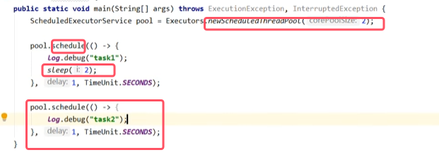
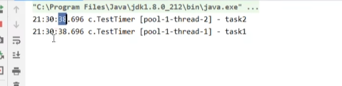
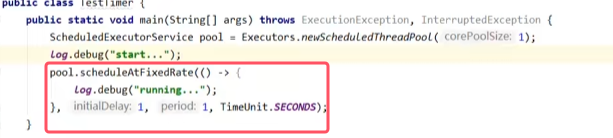
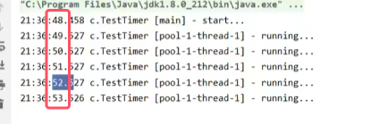
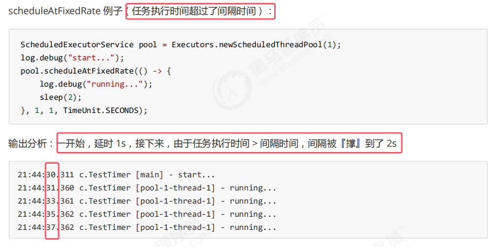
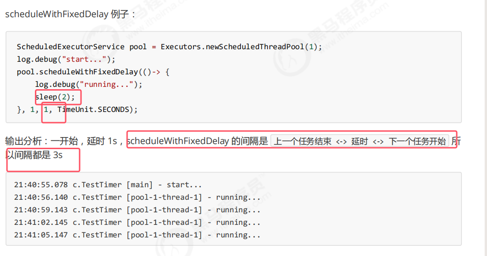

### 1.实现延时执行——schedule()

将[05Timer(了解即可)](05Timer(了解即可).md)中的例子改为使用任务调度线程池来做，具体如下。

* 可以看出都是同时执行，并不是串行执行

注意点：  
* **该任务调度线程池就可以实现定时的进行任务的运行。并且所有任务是由线程池中的所有线程来并发执行**
* **创建任务调度线程池的方法是Executors.newScheduledThreadPool()。其中构造方法里面传的参数是核心线程数。**
* **整个任务调度线程池表现为：线程数固定，任务数多于线程数时，会放入无界队列排队。任务执行完毕，这些线程也不会被释放。用来执行延迟或反复执行的任务**
* **用于实现延时执行的方法是schedule()。该方法可以接收三个参数。分别是任务Runnable或者Callable对象、第二个参数是延时的时间，第三个参数是延时的单位**

### 2.实现定时执行任务——scheduleAtFixedRate()和scheduleWithFixedDelay()

现在有要求：每隔一定时间去执行同样的一个任务。实现如下：  

* **用于实现延时执行的是scheduleAtFixedRate()。该参数接四个参数：任务对象Runnable、第一次执行时延时的时间、每次执行的间隔和时间单位**

* **上图的任务执行时间会包含在执行的间隔时间内**

* **上图的delay（第三个参数）是从上一次执行结束才开始计算的**。
