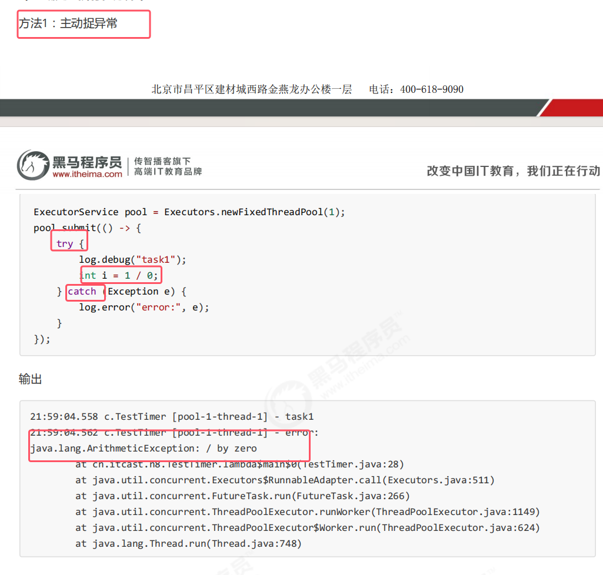
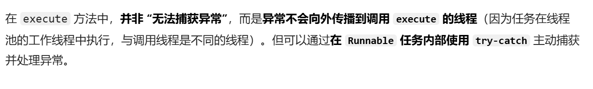
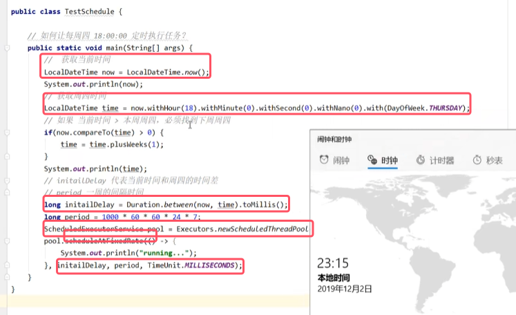

### 1.线程池异常

线程池在执行任务期间如果出现了异常，默认情况下即没有被抛出来也没有被显示。

如果要正确处理线程池执行任务期间处理异常，那么做法具体如下：  

* Future类的get()：如果该任务执行过程中没有任何问题，那么该方法就会获得返回结果；如果方法执行过程中出现了异常，则会返回异常信息

总结：所以线程池默认情况下就是不会将异常打印在控制台。只能自己处理异常，或者通过get()才会接收道异常信息

### 2.线程池应用
如何让每周四 18:00:00 定时执行任务？

