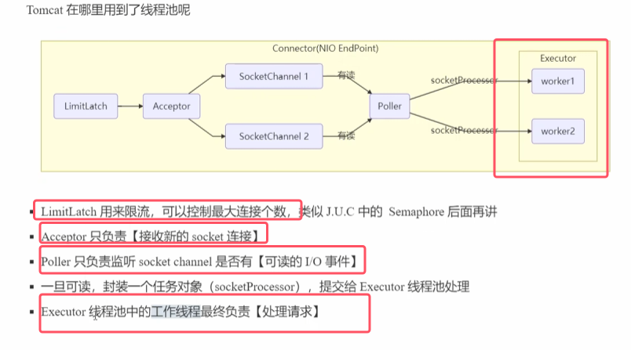
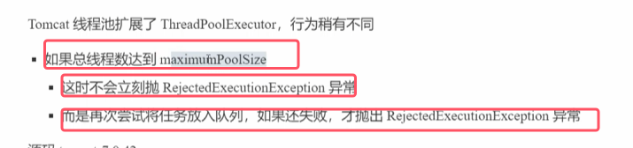
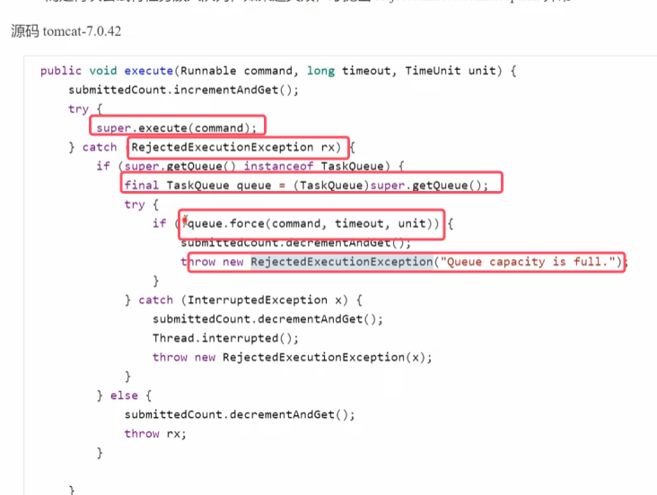
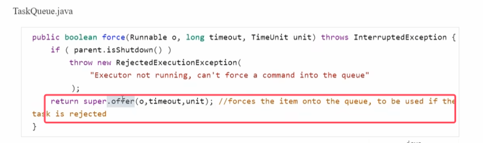
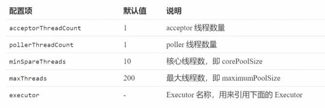
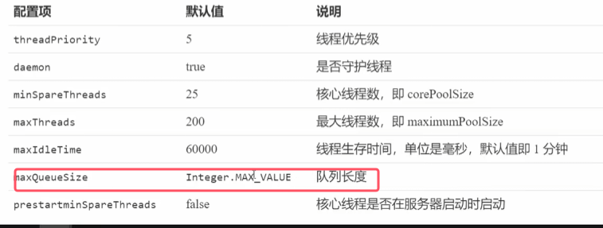
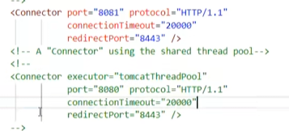
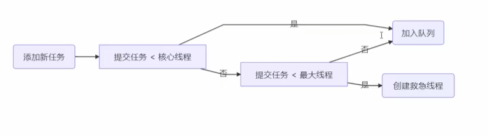

* tomcat分为两大组件：连接器和容器部分。连接器connector用于用于对外交流对外沟通，哦让其部分负责实现servlet规范运行servlet组件
* 其中连接器部分就用到了线程池。图中的Executor就是线程池

###### tomcat线程池配置

* 上述配置对应于tomcat中server.xml中的connector和executor的标签  
	
* tomcat对任务队列也做了一定的升级，命名为taskQueue，具体流程如下  
	

