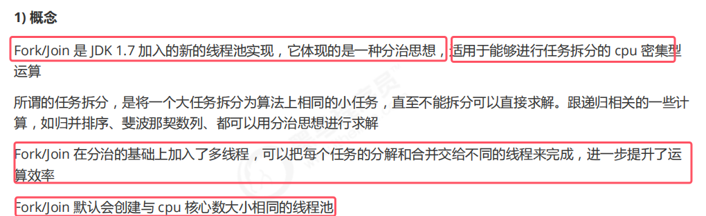

* 即该线程池拆分以后，每个小任务使用不同线程来完成

### 2.使用

* **使用分为两步第一步创建任务对象，第二步使用fork/join线程池执行该任务对象**
* **该任务对象并不是之前的Runnable、Callable，而是自己定义的一个类，继承 RecursiveTask/<返回值类型/>（有返回值）或 RecursiveAction（没有返回值）**
* **重写的compute()方法用于实现任务的处理逻辑，需要利用分治思想递归去写。**

### 3.改进
、

* 让每个子任务并行的去执行，而不是每个子任务依赖另一个任务执行完毕