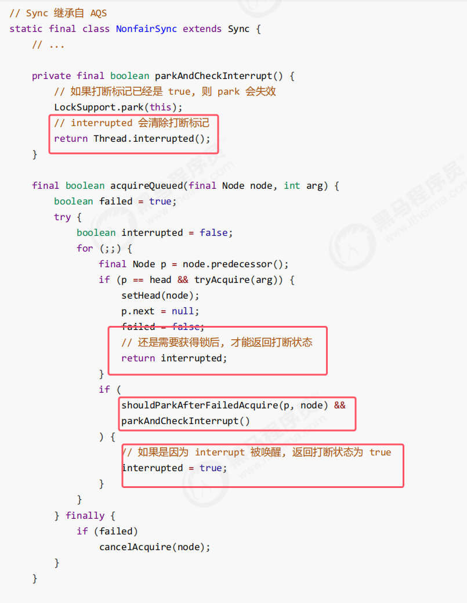

### 1.综述

* ReentrantLock支持公平和非公平锁两种，所以有两种同步器，分别是非公平同步器和公平同步器

### 2.非公平锁实现原理

###### 加锁流程

* **先从构造器开始看，默认为非公平锁实现**。NonfairSync 继承自 AQS

当进行加锁时，该源码如图所示：    

* 加锁成功流程：**使用cas机制修改state状态。成功修改为1则设置owner线程该为当前线程。返回true**
* 加锁失败流程：**首先使用cas机制修改state状态失败，之后进入acquire(1)。会再次尝试加锁，但是会失败，之后会创建一个node节点对象，并将其加入到等待队列里去。之后完成自身的当前线程的阻塞**

图解如下：  

* 其中head和tail就是等待队列（是一个双向链表）的两个指针。第一个Node为哑元，起到占位的作用（首次创建等待队列中的node的时候，会创建2个，其最终dummy只起到占位的作用，此时队列长度位2，head指向dummy）
* `addWaiter` 函数的返回值是**新创建的 `Node` 实例**（封装了当前线程的节点）

* waitStatus状态为-1代表该节点有责任唤醒其后继节点

###### 解锁竞争失败和成功流程

接着上面多个线程加锁竞争后的图解继续进行 。

相关源码如下图所示：  

图解如下图所示：  

注：其恢复之后的代码在下图所示的位置  

* 在该块代码一被唤醒，就会进入下一次循环。去执行tryAcquire()竞争锁。此时Thread1如果竞争成功了，设置thread1为owner线程，并且将state设置为1。
* 此时第一个if块为真，使用setHead()将该节点设置位头节点，将原来的dummy节点断开连接，将其中关联的线程设置为空（相当于一个新的dummy，最后的结果具体如上图所示）

如果竞争失败（非公平锁）：  

* 不公平指的时上图中的thread4并不在等待队列中。而是在锁开的一刹那，直接于thread1进行竞争。
* 如果该线程被唤醒后，就会进入下一次循环。去执行tryAcquire()竞争锁。此时Thread1如果竞争没有竞争成功，就会继续到parkAndCheckInterrupt()进行阻塞

###### 锁可重入原理

* 锁重入加锁时源代码如上图所示：**如果判断owner线程当前线程，就讲state++（如果一次锁重入，那么state就为2）**

* 锁可重入原理的结果部分，讲state减去1判断是否为0，只有为0才会释放成功

###### 可打断原理

1. 不可打断模式：即lock()

* 进入park的线程，可以被其他线程调用interrupt()进行唤醒，并设置打断标记
* 在此模式下，即使它被打断，仍会驻留在 AQS 队列中，一直要等到获得锁后方能得知自己被打断（是继续运行，只是打断标记被设置为了true）

2. 可打断模式：调用lockInterruptably()

### 3.公平锁实现原理

首先放一下非公平锁的tryAcquire()内部逻辑    

* 当有线程尝试获得锁调用tryAcquire()时，直接使用cas去获得而不检查等待队列

那么公平锁对应的tryAcquire()实现如下：  

* **当使用后公平锁争抢时，会先去检查队列中是否有除dummy节点外的等待的节点并且不是当前线程，如果有则返回false，没有的话才会去竞争**
* 返回到外层后就会将其加入到等待队列中阻塞

### 4.条件变量实现原理

**每个条件变量其实就对应着一个等待队列，其实现类是 ConditionObject。他也是维护了一个双向链表，来存放那些不满足条件阻塞的线程**。（类似于cynchronized中waitset的作用）
###### await()原理

图解如下图所示：     

* 有可能该线程发生了锁重入，state>1.所以此处使用fullRelease(state)。底层直接release(state)，将节点对应线程上所有的锁都是释放掉

###### signal()原理

* 首先会判断当前线程是否是owner线程。因为只有持有锁的线程才可以唤醒或者阻塞线程。
* 有可能转移到竞争锁的等待队列时会转移失败，因为有可能在等待的线程会被打断或者是超时等待
* transferForSignal用于将该节点加入到等待队列当中。
* enq(node)方法就是把该节点加入到等待队列的尾部。如果成功的话返回的是该节点的前驱节点

图解如下图所示：  

