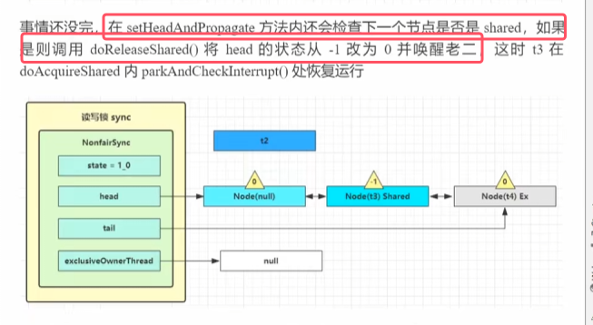

### 1.ReentrantReadWriteLock的使用

* **当读操作远远高于写操作时，这时候使用 读写锁 让 读-读 可以并发，提高性能**。 类似于数据库中的 select ...from ... lock in share mode

* 使用流程：**首先创建该读写锁对象。之后还需要rw.readLock()和rw.writeLock()来分别获取读锁和写锁，之后才能使用。**
* **读锁于读锁之间可以并发，但是读锁于写锁、写锁于写锁之间相互排斥。**

1. 测试两个现成的读操作是否互斥（假设读操作和写操作中需要sleep 1s）  

2. 一读一写

3. 两个线程写操作  

### 2.注意事项

* **重入时升级不支持指的是同一个线程在获取读锁的情况下，在获取写锁的话是会阻塞住的。重入时降级支持：即持有写锁的情况下去获取读锁是支持的，此时是读锁和写锁都持有，而不是只持有读锁**
* 但是读锁与读锁可重入，写锁与写锁可重入。

下面是例子：    

* 上图中使用cacgheValid变量的双检加锁策略来保证了只更新一次。**双检加锁是解决数据库双写一致性（主要用于防止高并发场景下读操作缓存击穿和数据不一致）的策略。解决数据库和缓存一致性的策略是先更新数据库再删除缓存（针对于更新操作）**

### 3.读写锁原理

 **读写锁用的是同一个Sycn 同步器，因此等待队列、state 等也是同一个**

以t1线程加写锁，t2线程加读锁为例子来讲解其原理

###### t1 w.lock()

* 前几步和ReentrantLock的步骤是一样的，因为同步器用的同一个。再尝试获取锁的tryAcquire()的实现会有之有别。
* **不同是写锁状态占了 state 的低 16 位，而读锁使用的是 state 的高 16 位**
* writerShouldBlock()如果是非公平锁，恒返回false。默认情况下非公平锁。
* 当state=0时，就会尝试修改状态，改为1相当于是低16位为1。
* 当stae不为0，即当前可能加了读锁也可能加了写锁，也可以读锁写锁都加了。exclusiveCount()是state中获取写锁部分。

图解如下图所示：  

###### t2. r.lock
 

 * **tryAcquireShared(arg)的返回值是一个整数，返回-1表示获取读锁失败，返回0或者正数表示都表示成功，为0后续节点不会继续唤醒，而为正数的数值代表还有几个后续节点需要唤醒。**
 * **但tryAcquireShared(arg)在读写锁情况下就两种情况：失败返回-1，成功返回1，剩下的情况会在后面的信号量用到**。即该方法内部主要执行的代码就如上图红框所示
 * **doAcquireShared(arg)中做得事情与ReentrantLock中做的事情几乎相同，创建等待队列，并1将该节点加入到等待队列当中，只不过节点类型是shared，之后便阻塞等待。**

图解如下图所示：  

###### t3 r.lock，t4 w.lock

* 前面t2 t3都加得是读锁所以节点类型是读锁，而t4加得是写锁，所以节点类型是写锁

###### t1 w.unlock

* tryRelease()的内部逻辑：首先现在原来state的基础上减一，之后判断写锁是否为0，如果为0则将锁的owner线程置为null，并返回true；如果不为0则表示是一次锁的重入，并返回标记false
* unparkSuccessor(h)用于唤醒头节点的后续节点。
* 这时 t2 在 doAcquireShared 内parkAndCheckInterrupt() 处恢复运行

图解如下图所示：   

此时t2阻塞的位置如下图所示：  

* 之后t2线程会继续进入for循环区tryAcquireShared区获取锁，这次肯定就成功了，具体入下图所示

* setHeadAndPropagate(node, r)会将原来的空节点去掉，把t2所在的节点改为头节点，t2相当于获得了锁可以继续运行了。

###### t2 r.unlock

图解如下图所示：  

