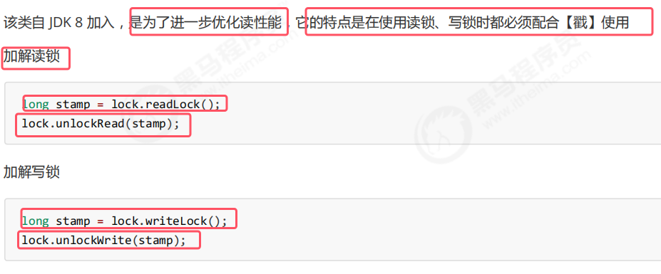
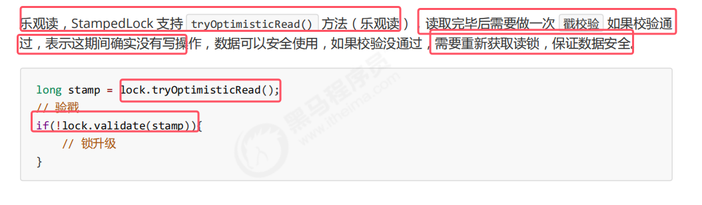
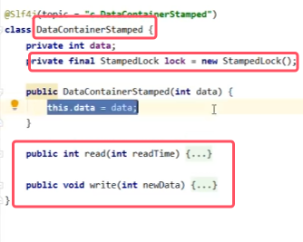
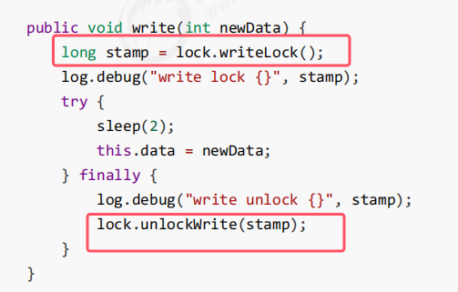
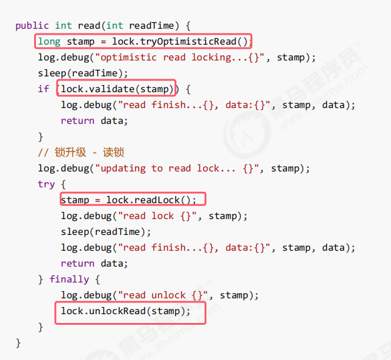
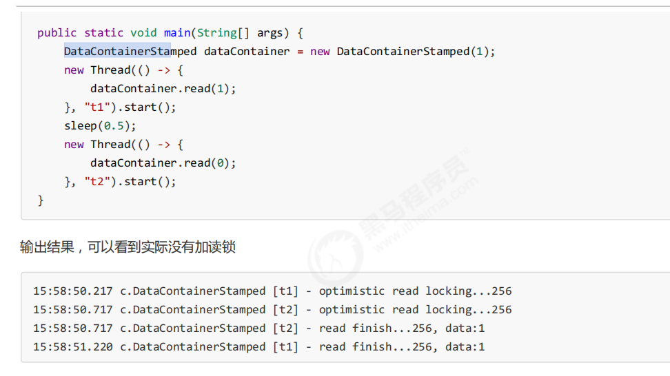
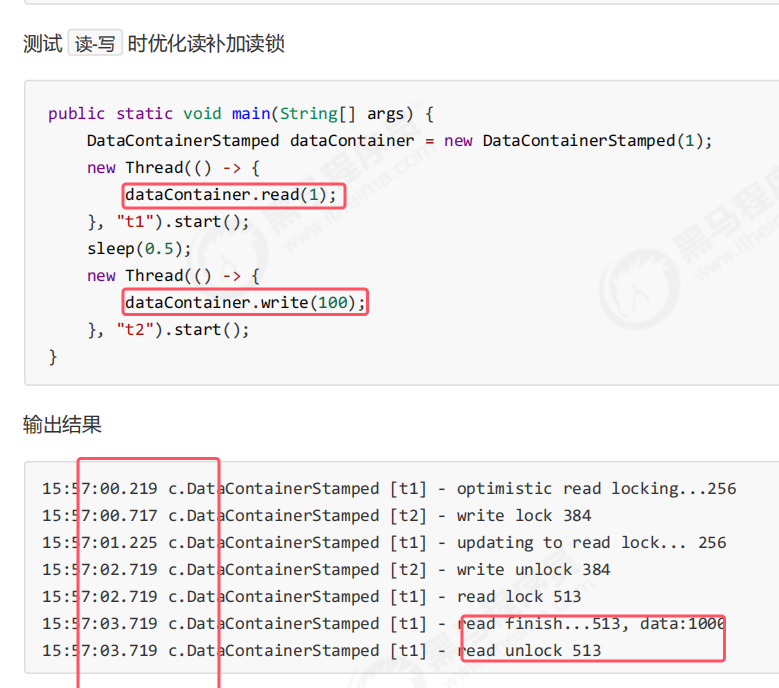

**StampedLock是对ReentrantReadWriteLock读读并发的优化**。因为ReentrantReadWriteLock底层读读并发时，还是使用aqs同步器以及cas来修改waitStatus状态，性能上还是比不上不加锁的性能。所以出现了StampedLock。

真正提高性能的时下面的方法

* tryOptimisticRead()是根本没有加锁的。只有在读取中有写线程去改动了数据，才会进行锁升级为之前说的读锁。

例子：

整体的代码结构如下图所示：是一个数据容器来保护共享数据data  

* read()中的参数是模拟读取的时间

测试：读读并发   

* **注意：StampedLock 不支持条件变量**
* **StampedLock 不支持可重入**