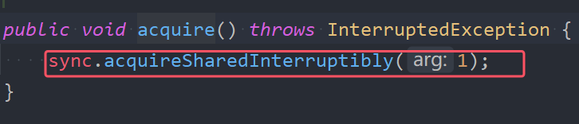
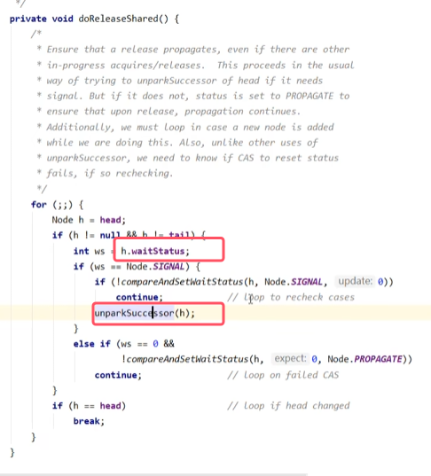

### 1.作用
作用：**信号量，用来限制能同时访问共享资源的线程上限。** 具体入下图所示  

* **获得信号量的线程会运行，当信号量被三个线程分配完后其他线程再来访问时会阻塞在acquire()。只有当有线程释放信号量后才可以被唤醒继续执行**

### 2.原理
###### acquire()

* **tryAcquireShared(arg)由子类来实现的结果如果是负数则为获取失败，如果是大于等于0代表获取成功，并且返回值代表的是剩余的资源数**

图解如下图所示：    

###### release()

图解如下图所示：  
