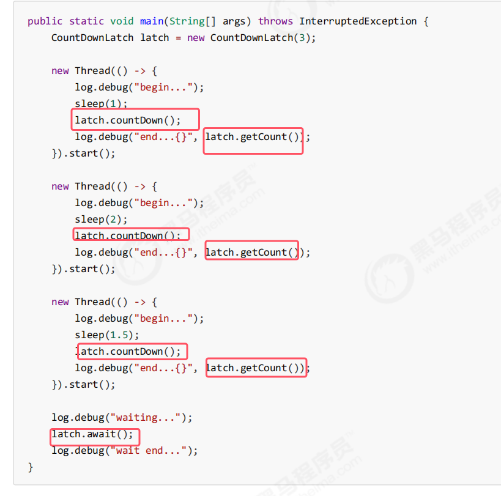
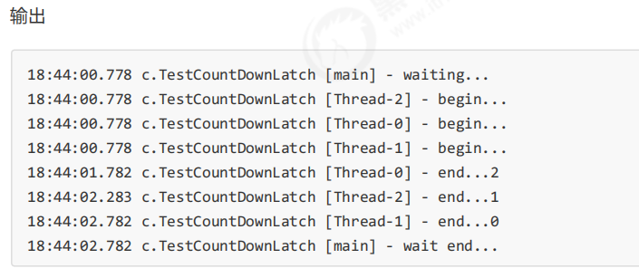
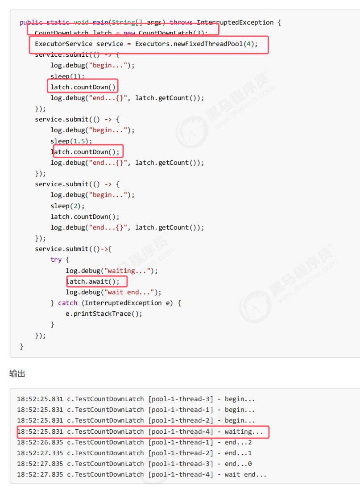

* 用来进行线程同步协作，等待所有线程完成倒计时。
* **其中构造参数用来初始化等待计数值**
* **await()方法是需要阻塞的线程使用，当倒计时大于0时阻塞，归0才可以继续运行**
* **countDown时任务线程，每调用一次计数减一**

* join也可以实现同步，但是必须要等到上一个线程结束才会继续执行。但是实际我们都不会主动创建线程，都是使用线程池来创建线程，核心线程在执行完任务后是不会停止的，所以使用join无法达到同步的目的。此时使用CountDownLatch是更为妥当的

使用线程池进行改进如下：    
