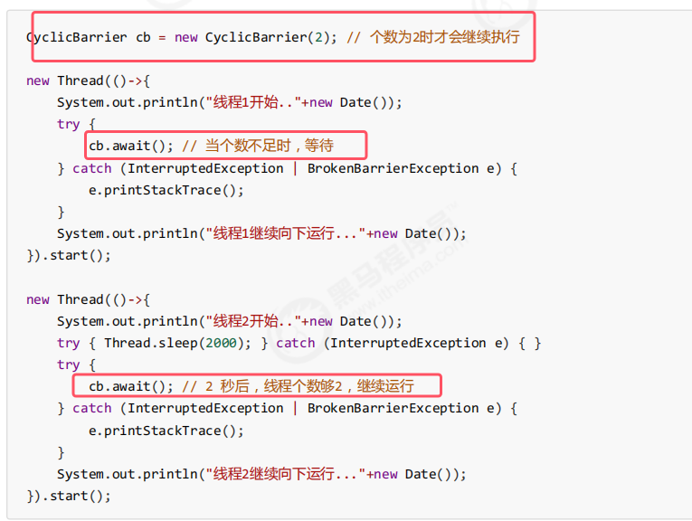

* **用来进行线程协作，等待线程满足某个计数。构造时设置『计数个数』，每个线程执行到某个需要“同步”的时刻调用 await() 方法进行等待，当等待的线程数满足『计数个数』时，继续执行**
* **CyclicBarrier 与 CountDownLatch 的主要区别在于 CyclicBarrier 是可以重用的。即下次再次调用await时，计数又会被重置为2。CyclicBarrier 可以被比喻为『人满发车』
