### 1.定义和用法
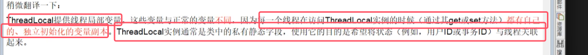
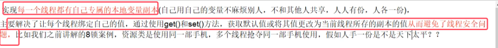
* ThreadLocal变量成为线程局部变量。  

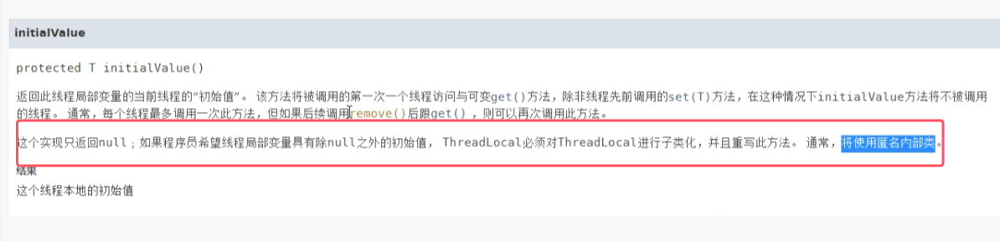
* initialValue()相当于用于给当前线程的线程局部变量赋初始值的。一般使用匿名内部类来创建并手动重写该方法设置每个线程局部变量的初始值。**但现实使用时不再用该方法，都是使用withInitial来替代**
* **如果不设置初始值，那么默认是返回null**
###### 使用案例

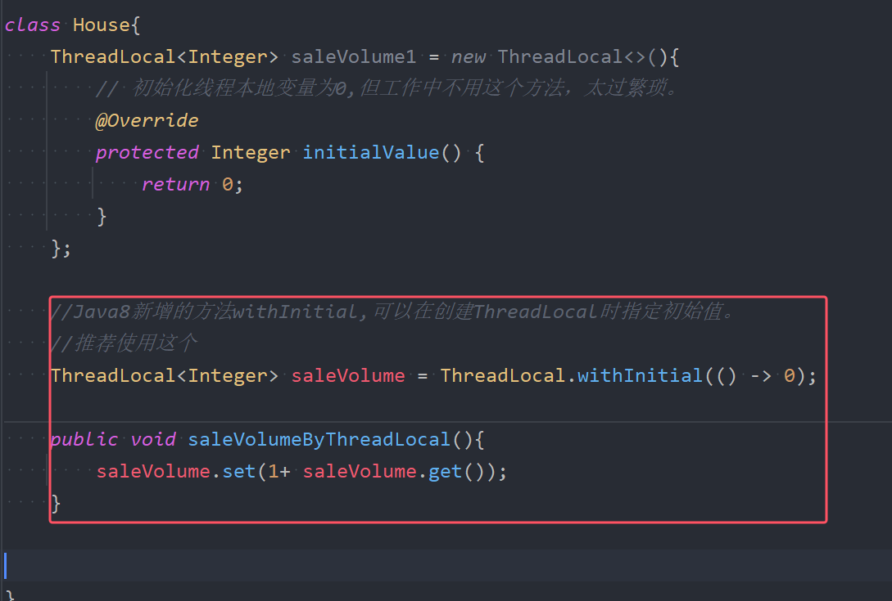
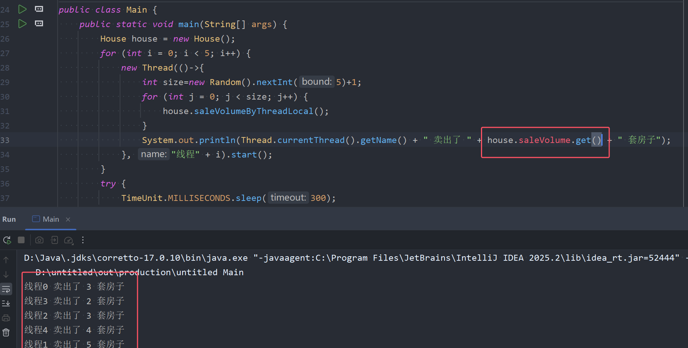

###### 使用要点
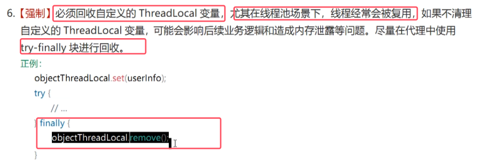
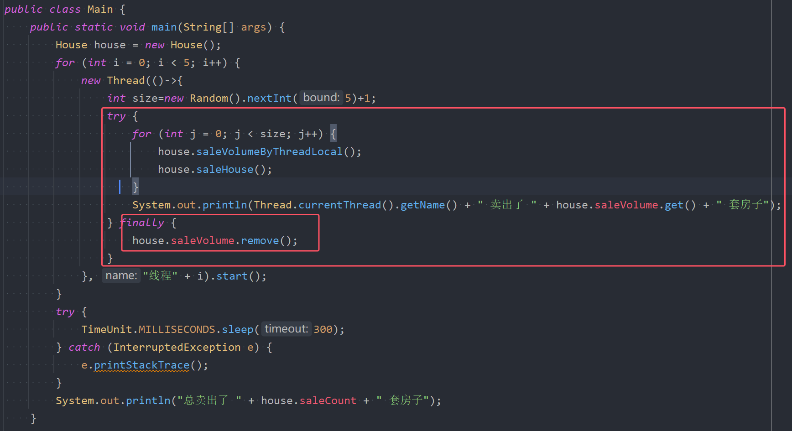
* **注意线程池场景下必须要使用remove()删除当前线程的线程局部变量，因为线程池涉及线程的复用，会导致内存泄漏或影响后续业务逻辑**    
	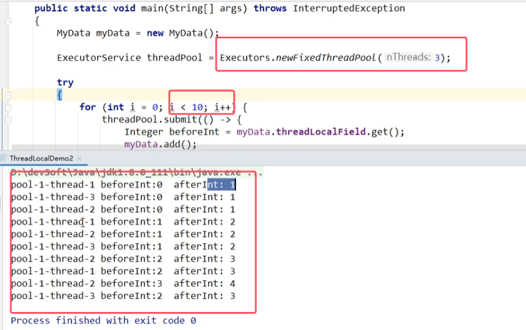

###### 总结
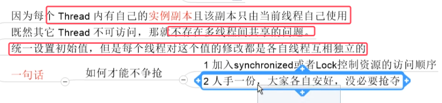

### 2.ThreadLocal底层源码解析

#### 2.1Thread、ThreadLocal、ThreadLocalMap三者的关系
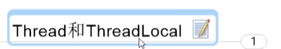
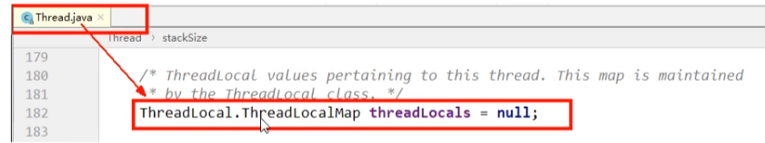
* **当每new出来一个线程的时候，Thread对象中都会有一个ThreadLocal的实例对象作为其成员变量**。所以**每个线程在访问ThreadLocal变量实例的时候都会有自己的副本**

 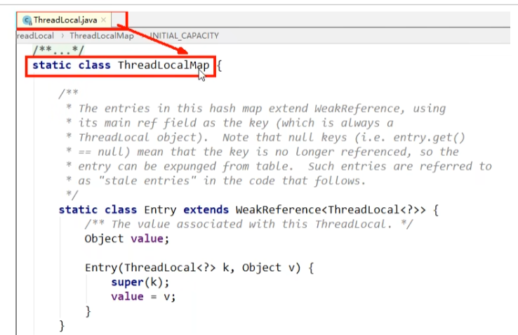
 * **ThreadLocalMap是ThreadLocal的静态内部类**。
 * **Map中的每个节点Entry是继承了弱引用WeakReference**()。并且key为ThreadLocal变量实例，Value是对应的值。   
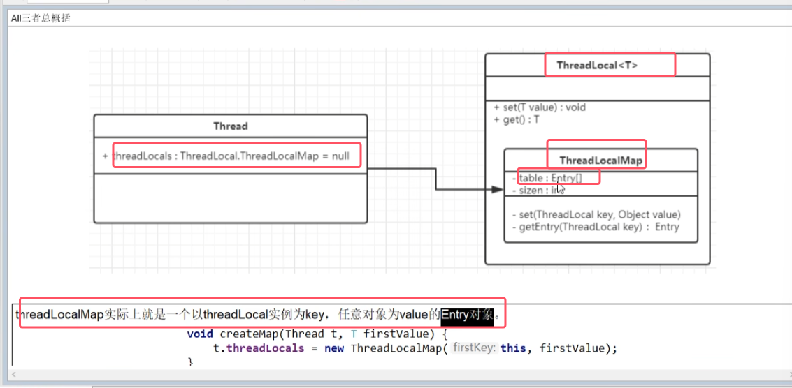
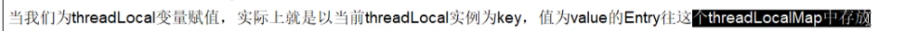
#### 2.2源码分析

###### get()方法源码
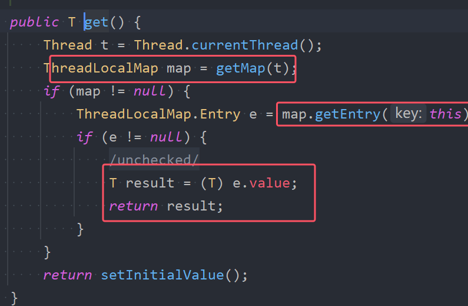
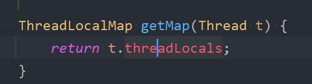
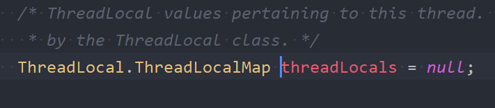
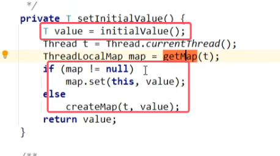
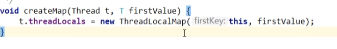
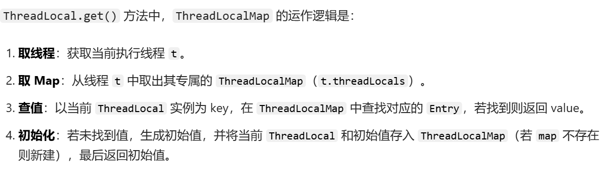

###### set()底层源码
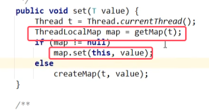

###### 底层结构总结
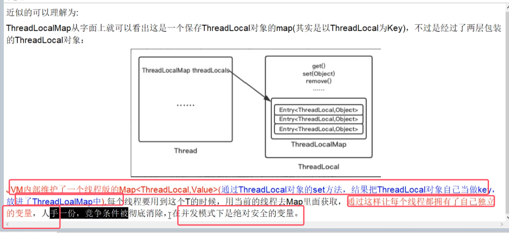

### 3.ThreadLocal的内存泄漏问题
 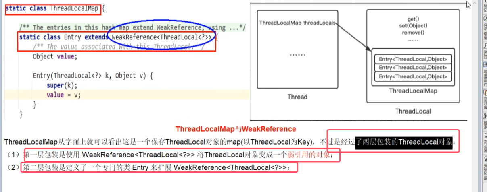
 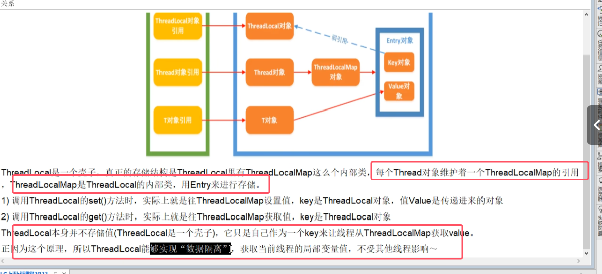
###### 为什么Entry要继承弱引用
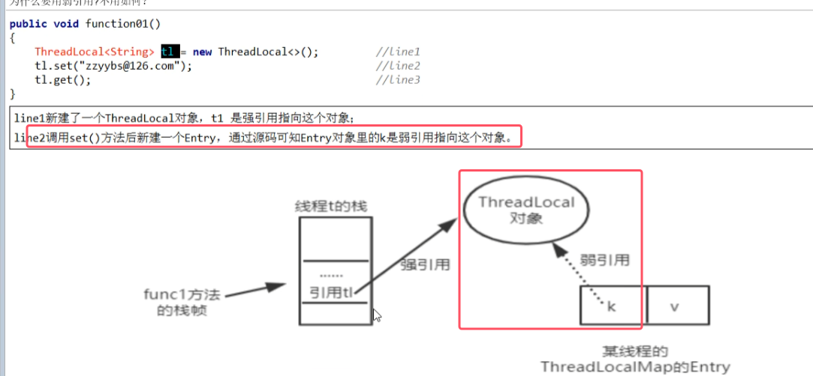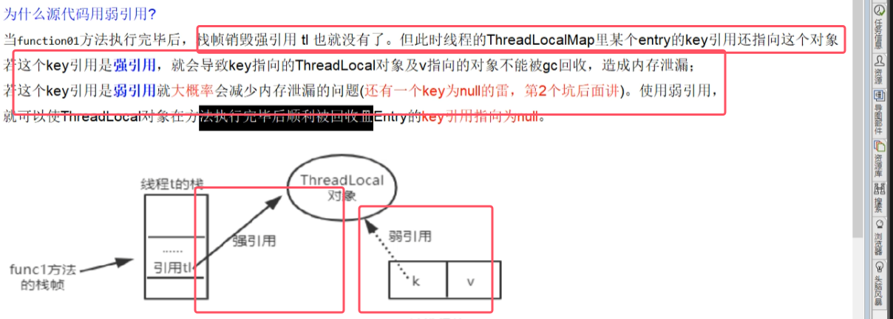
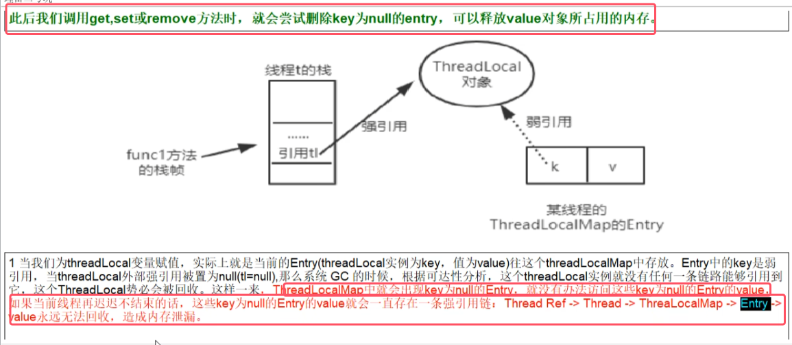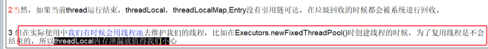
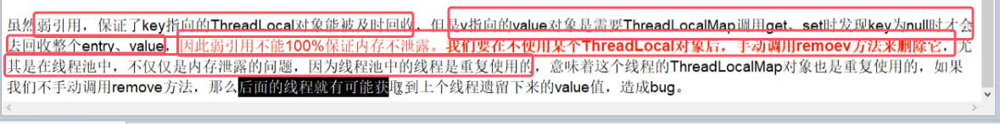
###### 源码分析
get()、set()和remove()会主动清理key为null的entry

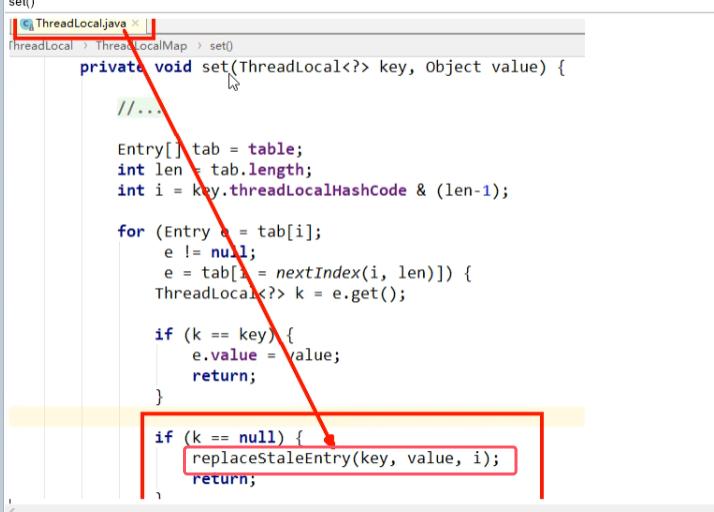
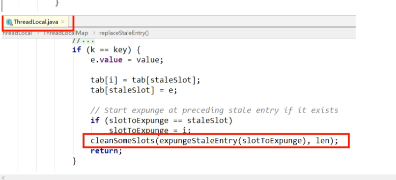

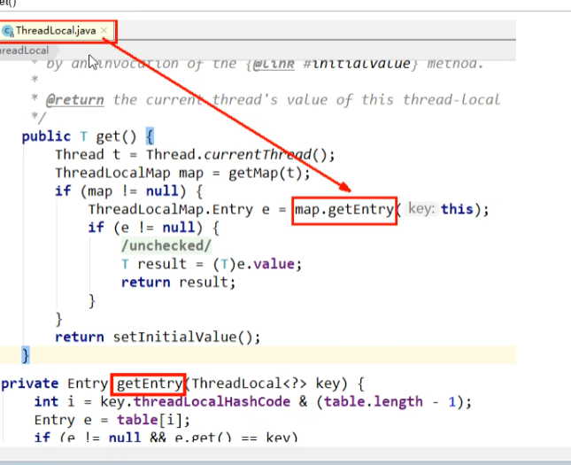
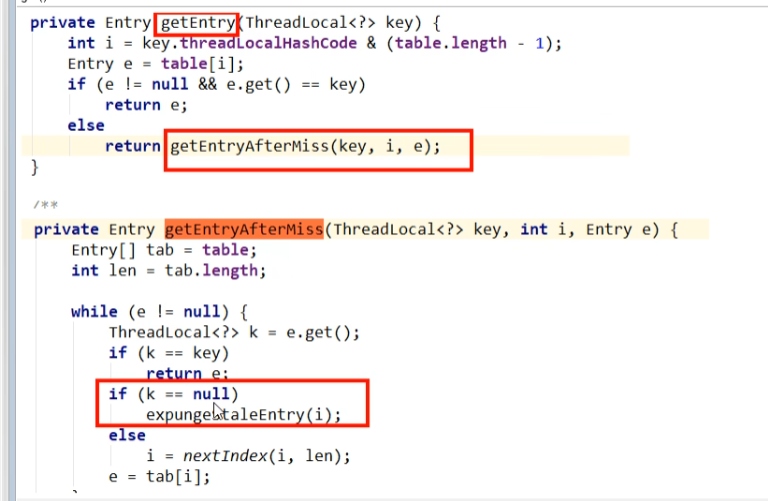

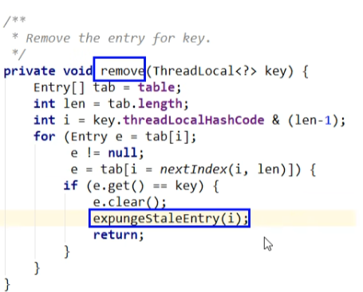

### 4.总结
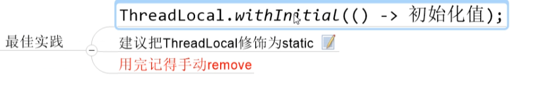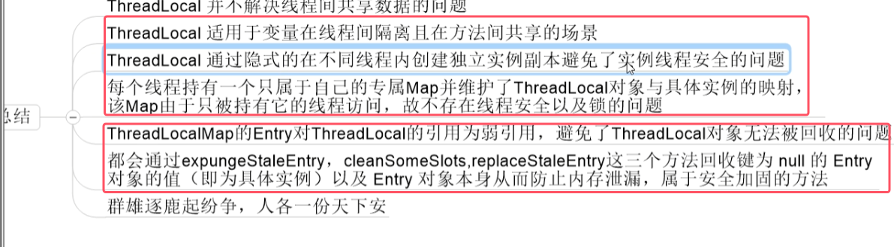