注：该类的api与HashMap的API是基本一样的只是内部实现不同。

* **但是ConcurrentHashMap虽然是线程安全类，能够保证每一个方法都是原子操作。但是这些线程安全方法的组合并不是线程安全的。**
* **ConcurrentHashMap还有一个computeIfAbsent( `K key, Function<? super K, ? extends V> mappingFunction`)，代表key存在时则直接返回value；如果缺少一个值，则计算生成一个value，然后将key-val放入map，最后返回计算出的 value。
* Function用于写有一个参数一个返回结果的函数式接口  

大总结：  
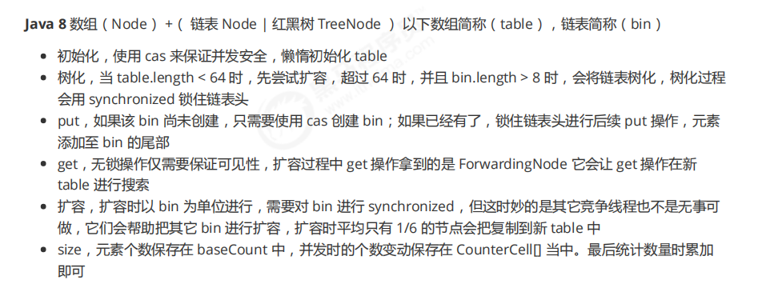
### 1.JDK7 HashMap并发死链

注：j**dk7中hashmap是由数组+链表**的数据结构组成。使用拉链法解决哈希冲突时，**是将新节点加入链表头部；JDK8是放在链表尾部（可以避免四联问题，但是会有其他的问题（比如扩容丢数据））**。

**并发死链：在多线程下JDK7 HashMap进行扩容时，会造成并发死链的问题。使得程序直接卡死，直接内存OutofMemory**

###### 测试代码
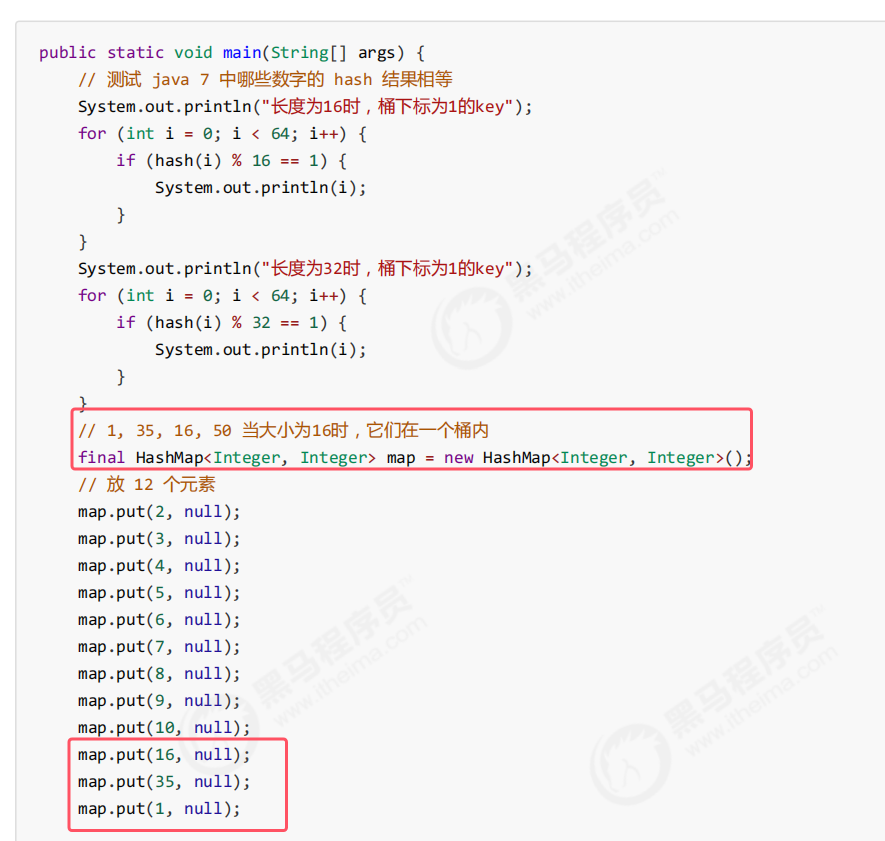
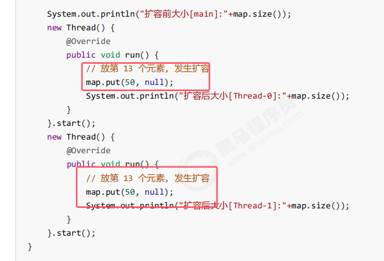

###### 死链复现

在HashMap第590行源码加断点，具体如图所示。该方法用于扩容时调用完成从旧table到新table元素的迁移

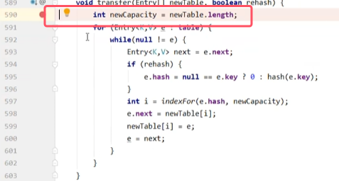
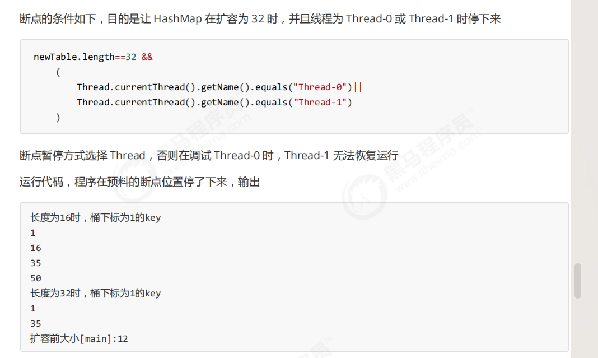

此时下标为1的数组的链表入下图所示，新加进来的节点放在链表头    

* 这是为了让thread1去完成扩容  

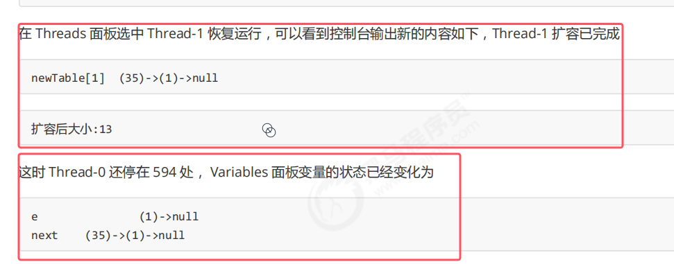

* 为什么thread1执行完链表变成这样了呢，因为 Thread-1 扩容时链表也是后加入的元素放入链表头，因此链表就倒过来了

此时让thread0来执行，他还是停在594行，并且e和next引用的对象仍然时1和35  

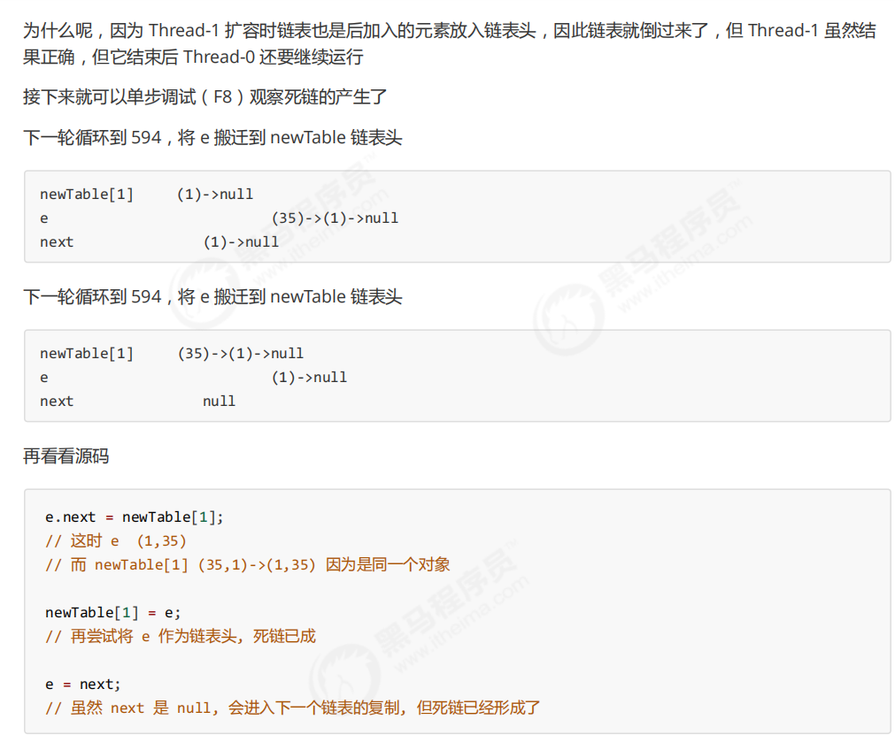

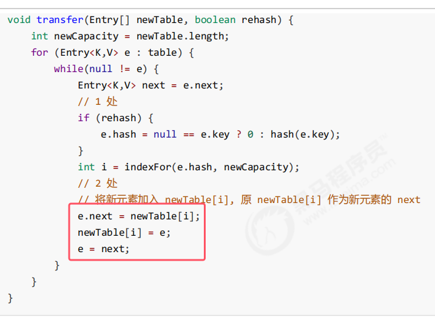
* 相当于1和35变成了一个环，程序就会在这里一直循环。形成死链

### 2.JDK8ConcurrentHashMap原理

**JDK8ConcurrentHashMap底层依然是链表+数组+红黑树，链表转红黑树的阈值依然是8（前提是扩容到64），红黑树转链表节点依然为6**
#### 2.1重要属性、内部类和内部方法

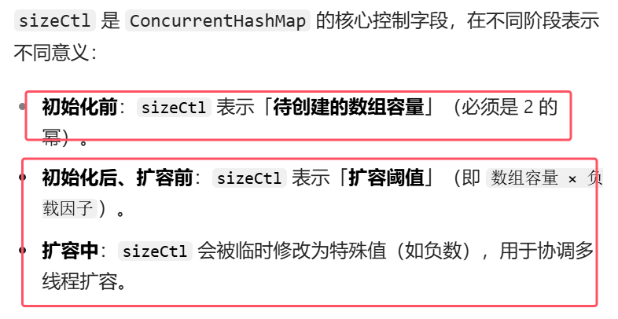
* 这里的初始化指的是桶数组的初始化
* 初始化或者扩容完成后，就变为下一次扩容阈值大小，即容量的四分之三（默认情况下）
* **默认情况下如果是无参构造sizeCtl才会为默认0，其他构造器在初始化前都是待创建数组的容量**

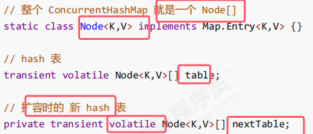

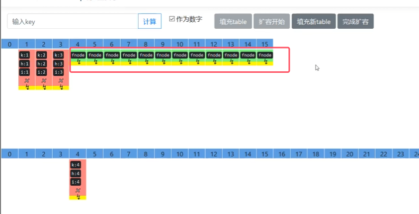
* 还有一个用户是在扩容时调用get()时，程序如果遇到ForwardingNode，程序旧知道应该去新的table获取数据

* TreeBin是红黑树的头节点，TreeNode是红黑树的其他节点

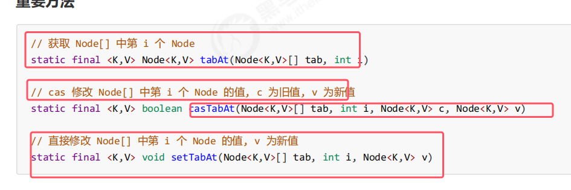

#### 2.2构造器分析

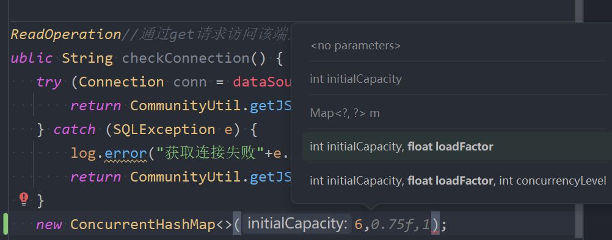
* ConcurrentHashMap的构造器主要由上图所示。挑一个三个参数的来讲解。

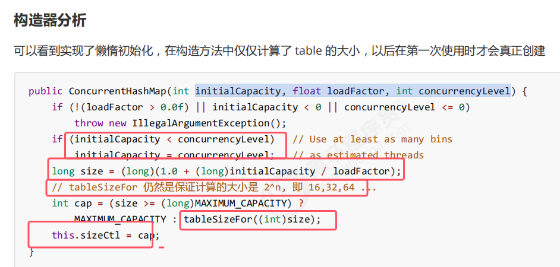
*  int initialCapacity, float loadFactor, int concurrencyLevel分别为初始容量、负载因子（扩容因子）和并发度。
* **JDK8中的ConcurrentHashMap使用了懒惰初始化，并不是在创建对象时旧创建出桶数组，会在将来第一次用到的时候才会去第一次创建**
* sizeCtl是将2的n次幂复制给sizeCtl

#### 2.3get流程

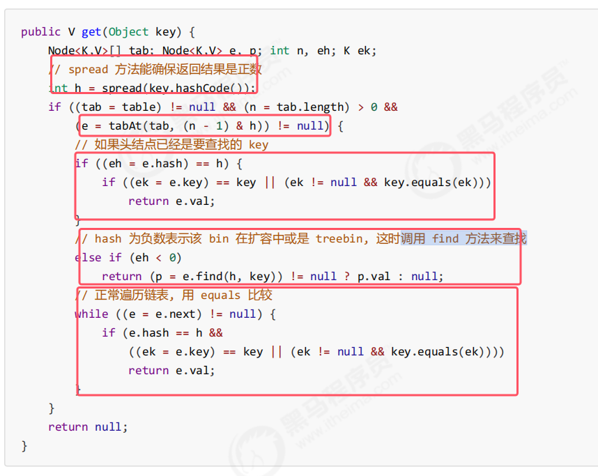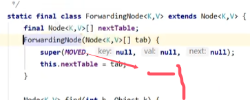

* spread 方法能确保key的hashcode返回结果是正数。因为负数用于做一些其他的用处
* ForwardingNode和TreeBin的hash()下来的值就是负数。其中扩容中的ForwardingNode恒为-1，树TreeBin恒为-2
* 调用 find 方法会根据是正在扩容中还是该节点是一棵树来分情况查找节点。

#### 2.4put流程
以下数组简称（table），链表简称（bin）

###### 总体流程

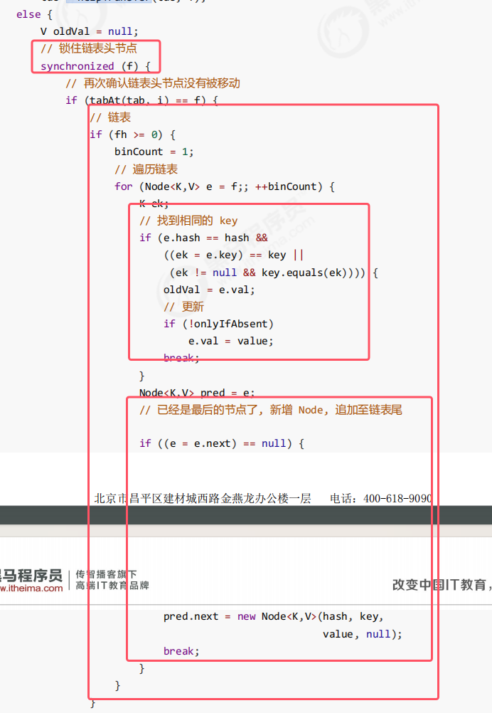

* onlyIfAbsent为真表示只有第一次put该键值的时候才会把该kv放入map，如果以后put相同的key，则不会做任何的操作，即不会新值覆盖旧值。默认为false。
* 从上图中可以看出，**ConcurrentHashMap不允许有空的键和值，而HashMap是允许的**
* **helpTransfer()会去锁住当前的旧链表，然后去帮忙扩容**
* else块当中代表肯定是发生了桶数组下标的冲突，此时由两种情况，要么是链表要么所示红黑树
* 增加size计数是通过类似于LongAdder累加器的机制来统计sieze计数并提高效率（后面会细讲）。并且还会进行扩容

###### initTable()

* **initTable()初始化内部 table 使用了 cas, 无需 synchronized**

###### addCount()

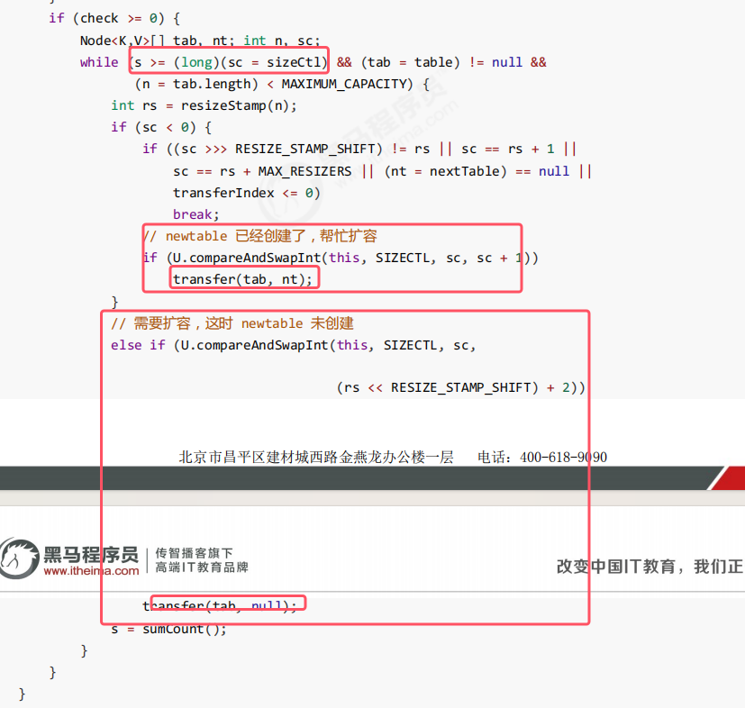
* **addCount()用于增加Map中的元素个数的计数**
* rs << RESIZE_STAMP_SHIFT) + 2)如果复制成功肯定是一个负数

#### 2.5size流程
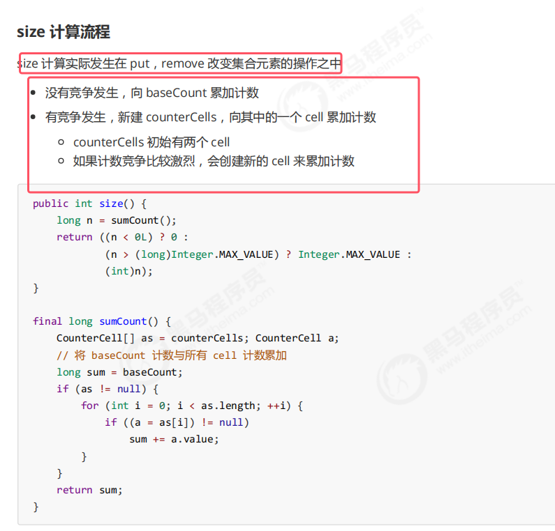
* **ConcurrentHashMap中size()的计数是有一定误差，是弱一致的。（高并发场景）**

###### 2.6Transfer流程
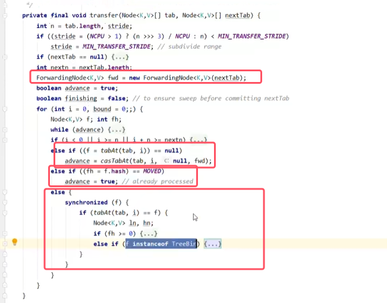
* nextTable如果为空会去创建。
* 如果该链表处理完，就会替换成ForwardingNode。
* 如果发现该头节点以及是ForwardingNode，就会去下一轮循环处理下一个节点。
* 如果节点是普通节点，那么旧做普通节点的移动工作，如果是树，那么旧走树节点的搬迁逻辑。
