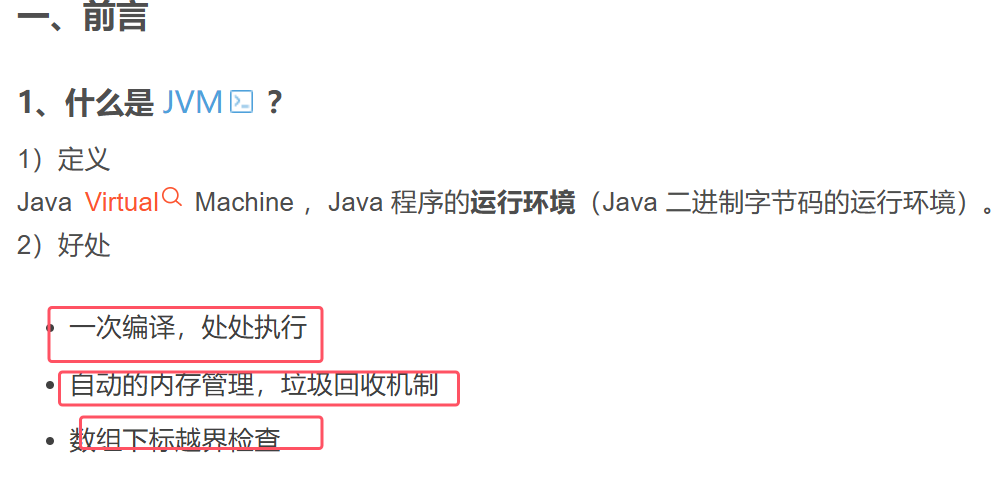
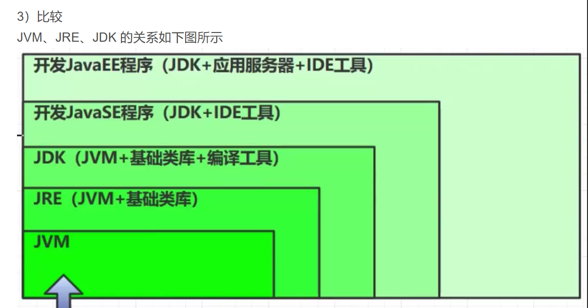
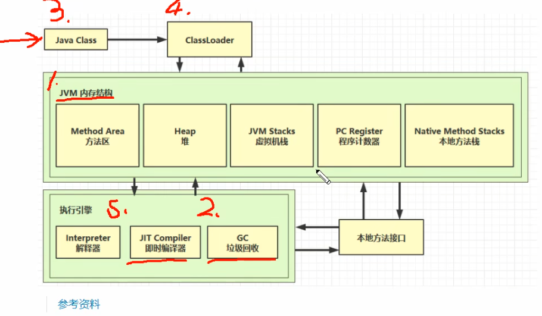

### 学习路线

* **ClassLoader：Java 代码编译成二进制字节码后，会经过类加载器，这样才能加载到 JVM 中运行。**
* 内存结构：  
	1. **Method Area：类是放在方法区中**。
	2. **Heap：存放类的实例对象**。
	3. **当类调用方法时，会用到 JVM Stack、PC Register、本地方法栈**。
* 执行引擎：
	1. **方法执行时的每行代码是由执行引擎中的解释器逐行执行**，
	2. **方法中的热点代码也就是频繁调用的方法，由 JIT 编译器优化后执行**
	3. **GC 会对堆中不用的对象进行回收**。
* 需要和操作系统打交道就需要使用到本地方法接口。
