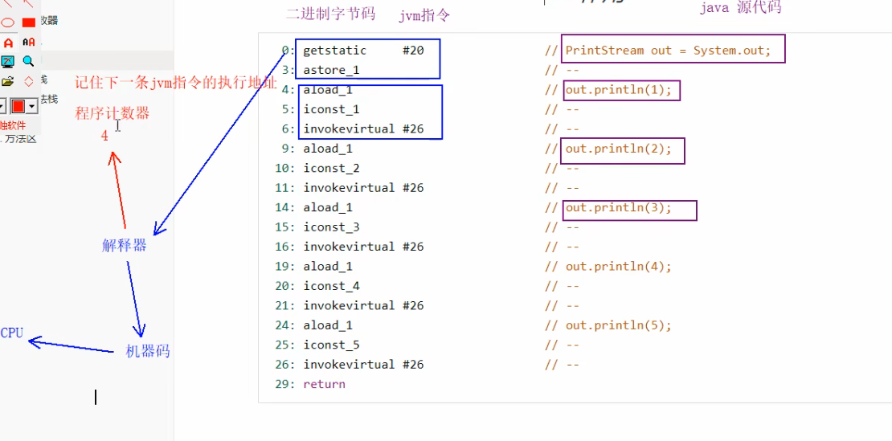

程序计数器在JVM中的位置如下：  

### 程序计数器定义和作用
* **定义：Program Counter Register 程序计数器（是一个寄存器)**
* **作用：是记录下一条 jvm 指令的执行地址行号**。  
* 特点：
	- **是线程私有的**
	- **不会存在内存溢出**

- 解释器会解释指令为机器码交给 cpu 执行，**程序计数器会记录下一条指令的地址行号，这样下一次解释器会从程序计数器拿到指令然后进行解释执行**。
- **多线程的环境下，如果两个线程发生了上下文切换，由于程序计数器记录的是该线程下一行指令的地址行号，此时会进行保存。以便于接着往下执行**。