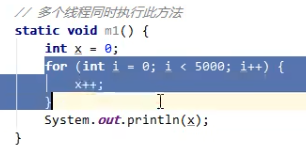

## 1.栈的定义

- **每个线程运行需要的内存空间，称为虚拟机栈**
- **即一个线程对应一个栈**
- **每个栈由多个栈帧（Frame）组成，对应着每次调用方法时所占用的内存**
- 每个线程只能有一个活动栈帧（栈顶的栈帧），对应着当前正在执行的方法

### 2.栈的问题辨析

*  **方法调用结束后栈帧会自动弹出栈，也就是会自动被回收掉，也就是说不需要来垃圾回收(GC)来管理**
* 对于第三点的例子如下  
	1. 对于下图的局部变量x，它没有逃离方法的作用访问，每个线程都会创建属于自己的m1栈帧，其中存放着各自的局部变量x，相当于是线程私有的。  
		
		
	2. 对于下面的两个方法就都不是线程安全的。因为无论是通过参数传递进来还是作为返回值返回，就意味着有可能有其他的线程能够访问到他。（第二个方法的局部变量逃离了方法的作用范围）  
		

### 3.栈溢出问题

## 4.线程诊断
