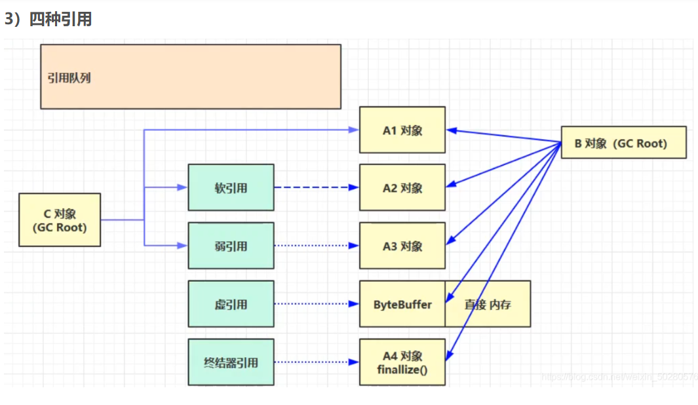
* 说明：图中的实线都是强引用，虚线代表软弱虚引用
* 图中的方块软引用、弱引用，这四个绿方块自身都是对象，c对象也就是gcroot 通过软引用对象间接引用A2 对象

### 1.强引用
**我们直接new 出来的对象赋值给了一个变量，那么该变量就强引用了这个对象**

**平时在用的所有引用都是强引用**

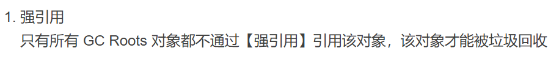
### 2.软引用

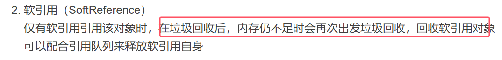

###### 软引用的应用场景例子：适用于对内存空间有限的情景
```java
/**
 * 演示 软引用
 * -Xmx20m -XX:+PrintGCDetails -verbose:gc
 */
public class Code_08_SoftReferenceTest {

    public static int _4MB = 4 * 1024 * 1024;

    public static void main(String[] args) throws IOException {
        method2();
    }

    // 设置 -Xmx20m , 演示堆内存不足,
    public static void method1() throws IOException {
        ArrayList<byte[]> list = new ArrayList<>();

        for(int i = 0; i < 5; i++) {
            list.add(new byte[_4MB]);
        }
        System.in.read();
    }

    // 演示 软引用
    public static void method2() throws IOException {
        ArrayList<SoftReference<byte[]>> list = new ArrayList<>();
        for(int i = 0; i < 5; i++) {
            SoftReference<byte[]> ref = new SoftReference<>(new byte[_4MB]);
            System.out.println(ref.get());
            list.add(ref);
            System.out.println(list.size());
        }
        System.out.println("循环结束：" + list.size());
        for(SoftReference<byte[]> ref : list) {
            System.out.println(ref.get());
        }
    }
}
```
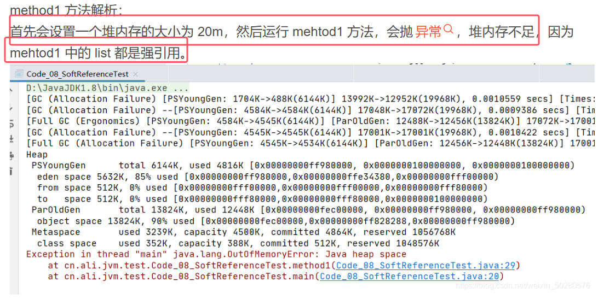
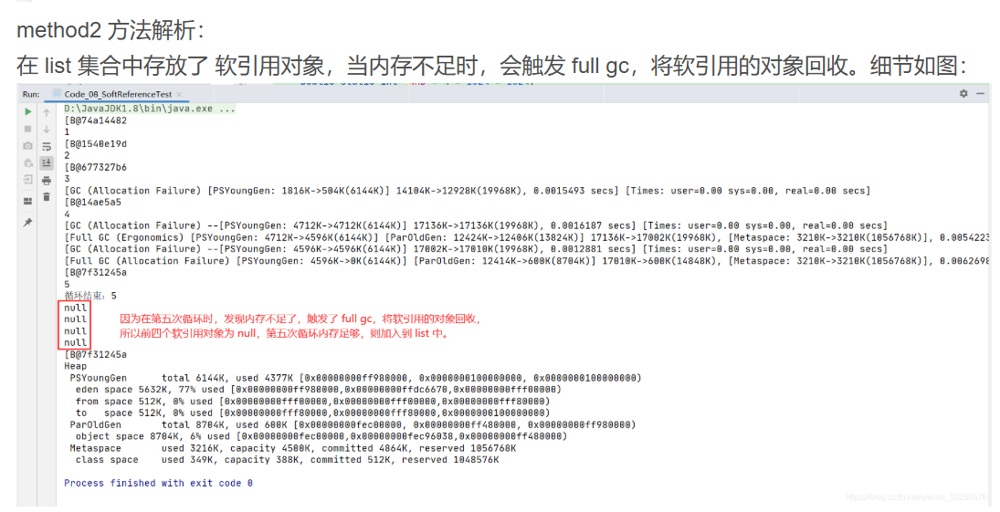
* 不是通过List直接引用byte数组，而是在中间加了一个`SofrReference`,也就是List先引用了软应用对象`SoftrReference`，然后由软应用对象`SofrReference`间接的引用byte数组
* **此时List和`SoftrReference`之间是强引用，而`SoftrReference`与byte\[]之间就是软引用**


**上面的代码中，当软引用引用的对象被回收了，但是软引用对象还存在，也占内存，所以，一般软引用需要搭配一个引用队列一起使用**

例子如下：

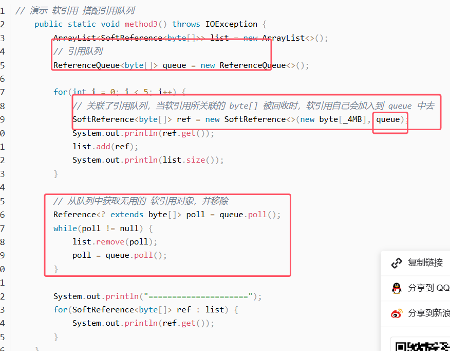

得到的打印结果如下：直接将软引用对象也清理掉了，打印结果没有null了

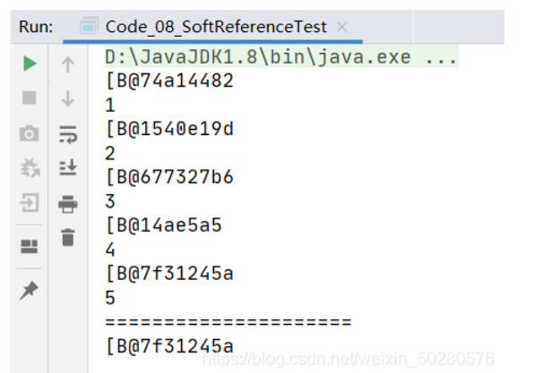


### 3.弱引用
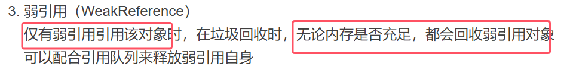


**软引用和弱引用的区别：在垃圾回收时，无论内存是否充足，都会回收弱引用对象所引用的对象，而只有当垃圾回收之后发现内存还是不足的时候，才会回收软引用对象所引用的对象**

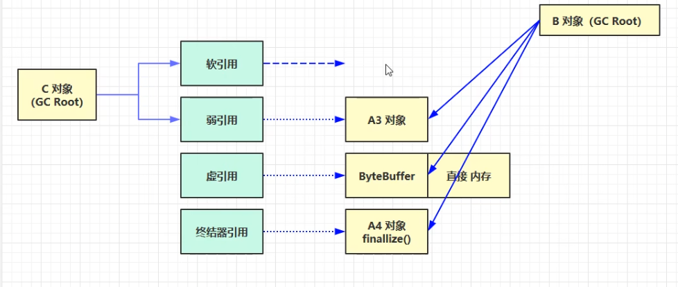

弱引用的适用场景例子：

```java
public class Code_09_WeakReferenceTest {

    public static void main(String[] args) {
//        method1();
        method2();
    }

    public static int _4MB = 4 * 1024 *1024;

    // 演示 弱引用
    public static void method1() {
        List<WeakReference<byte[]>> list = new ArrayList<>();
        for(int i = 0; i < 10; i++) {
            WeakReference<byte[]> weakReference = new WeakReference<>(new byte[_4MB]);
            list.add(weakReference);

            for(WeakReference<byte[]> wake : list) {
                System.out.print(wake.get() + ",");
            }
            System.out.println();
        }
    }

    // 演示 弱引用搭配 引用队列
    public static void method2() {
        List<WeakReference<byte[]>> list = new ArrayList<>();
        ReferenceQueue<byte[]> queue = new ReferenceQueue<>();

        for(int i = 0; i < 9; i++) {
            WeakReference<byte[]> weakReference = new WeakReference<>(new byte[_4MB], queue);
            list.add(weakReference);
            for(WeakReference<byte[]> wake : list) {
                System.out.print(wake.get() + ",");
            }
            System.out.println();
        }
        System.out.println("===========================================");
        Reference<? extends byte[]> poll = queue.poll();
        while (poll != null) {
            list.remove(poll);
            poll = queue.poll();
        }
        for(WeakReference<byte[]> wake : list) {
            System.out.print(wake.get() + ",");
        }
    }

}


```
* 不是通过List直接引用byte数组，而是在中间加了一个`WeakReference`,也就是List先引用了弱应用对象`WeakReference`，然后由软应用对象`SofrReference`间接的引用byte数组
* **此时List和`WeakReference`之间是强引用，而`WeakReference`与byte\[]之间就是弱引用**
### 4.虚引用
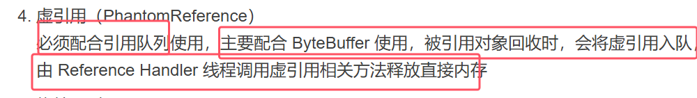

下面是直接内存被释放时的图解

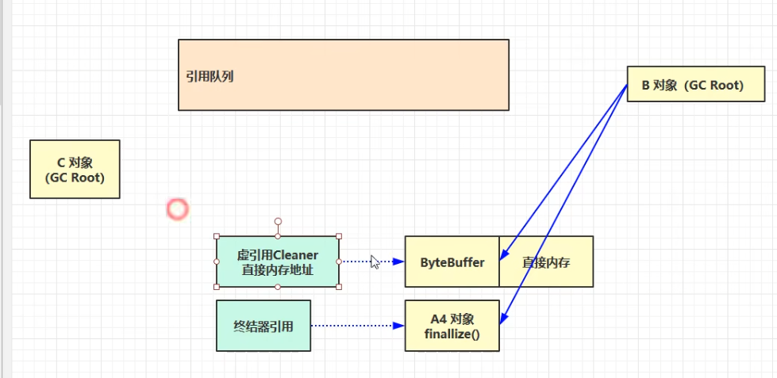
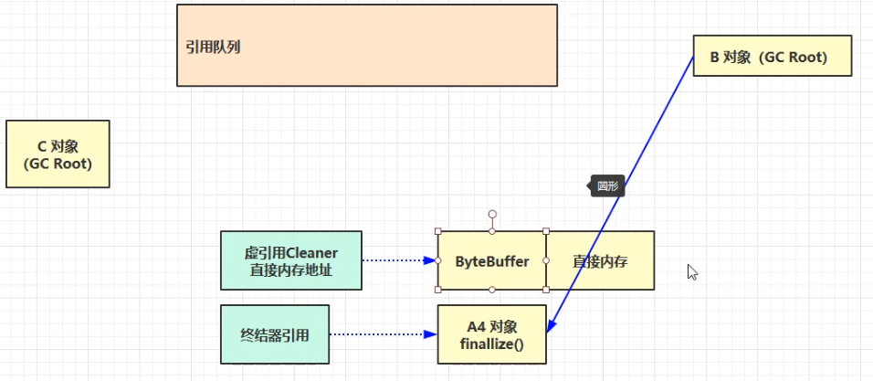
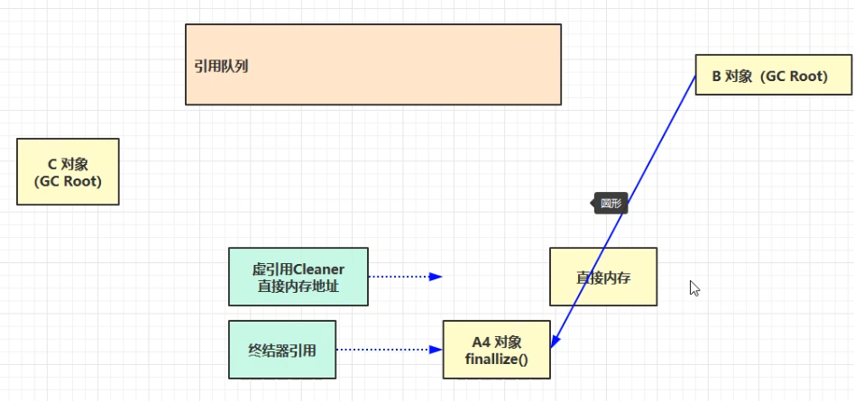
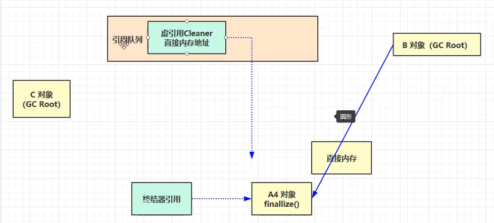
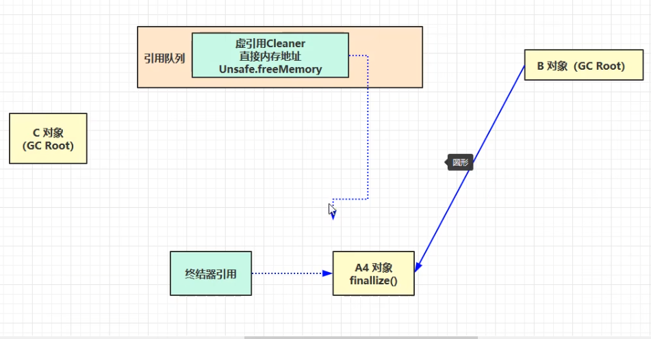


### 5.终结器引用

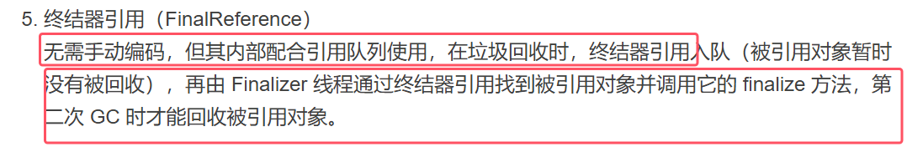

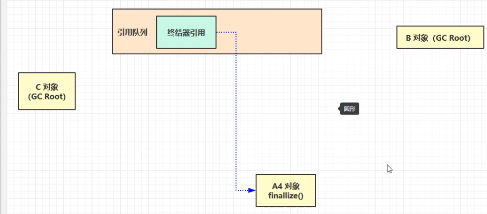

总结：    
* **软引用和弱引用都是**可以配合**引用队列来释放自身对象，当然也可以不配合；虚引用和终结器引用**必须要**配合引用队列使用**


	