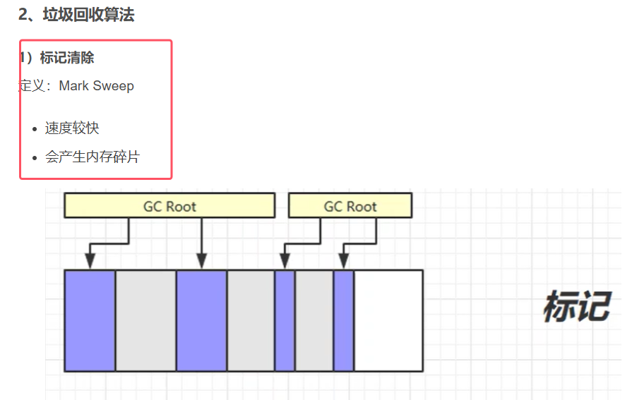
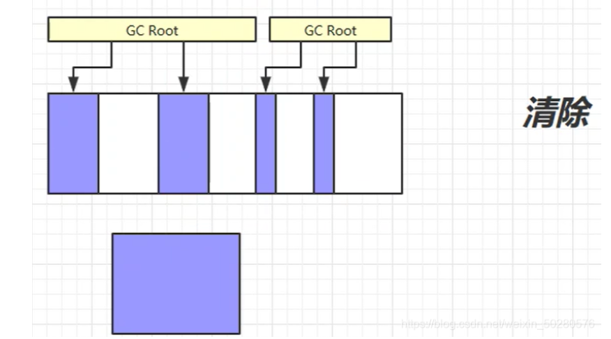
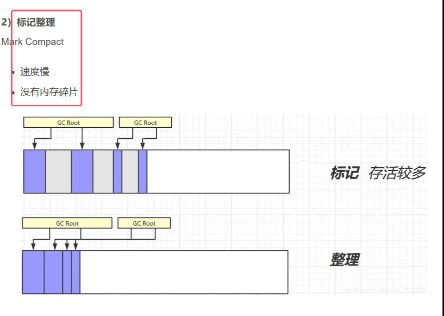
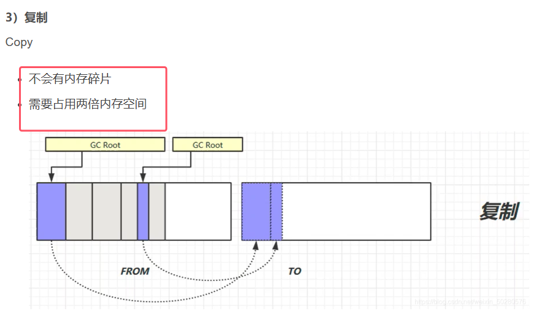
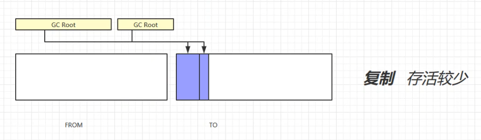
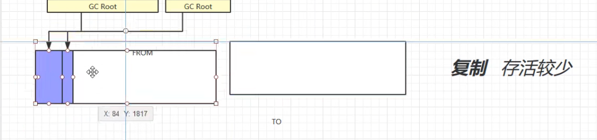

### 1.标记清除算法

* 造成空间不连续，产生内存碎片
* 这里的标记具体用的方法就是判断对象可以回收的可达性分析算法

### 2.标记整理算法

* **整理步骤：在清理垃圾的同时，将可用的内存区块拷贝移动，使得内存更加紧凑**

### 3.复制算法

* 图3**为交换from和to区域（具体为交换幸存区from和幸存区to的一个指向，并不是交换空间）**，**to区域是一直空的**

注：**这三种垃圾回收算法在JVM的垃圾回收机制中，都会根据不同的情况来进行采用**
