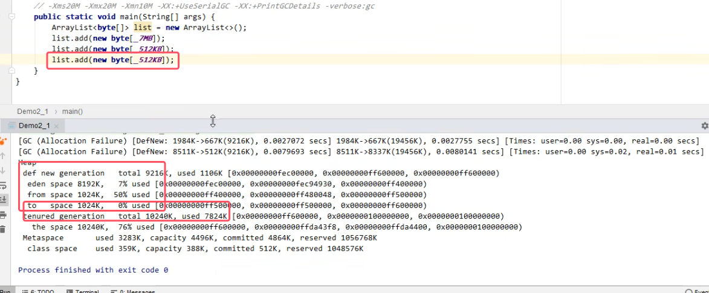

## 1.分代回收

* **jVM虚拟机中的堆空间，划分成了两块区域：新生代和老年代**
* **新生代有划分为三个区域：伊甸园（eden区）、幸存区from和幸存区to**
* **长时间使用的对象存放在老年代当中；使用完就丢弃的对象存放在新生代当中**
* 针对不同的区域，采用不同的垃圾回收算法，可以有更有效的垃圾回收效率

## 2.工作原理

### 1）minor  GC和Full GC

*  **minor gc 会引发 stop the world，暂停其他用户线程，等垃圾回收线程结束后，恢复用户线程运行**

1. **新创建的对象内存分配在eden区**

	

2. **当新生代（eden区）空间不足时，触发 minor gc ，eden 区 和 from 区存活的对象使用复制算法到 to 中，存活的对象年龄加一，然后交换 from和to**

	1）下图为第一次垃圾回收
	
	
	
	

   2）下图为第二次垃圾回收

	
	
	

3. **当幸存区对象的寿命超过阈值时，会晋升到老年代，默认最大的寿命是 15（4bit）（实际情况可能不同）**

	
	

4. **当老年代空间不足时，会先触发 minor gc，如果空间仍然不足，那么就触发 full fc ，停止的时间更长！**

	

5. 如果full GC之后，新生代和老年代还是没有空间来装入该对象，那么就会触发OutOfMemeory Error。

	 

## 3. 具体的分代垃圾回收案例

具体案例如下：

* -XX:UseSerialGC代表使用该垃圾回收器

* **GC代表minor gc，FULL GC代表full gc**

 

当朝堆中加一个占用内存空间比较大的对象时，**新生代装不下，老年代空间足够会直接晋升到老年代**，该种情况不会触发垃圾回收

* 一个线程内的OutOfMemory Error不会导致整个Java进程的结束