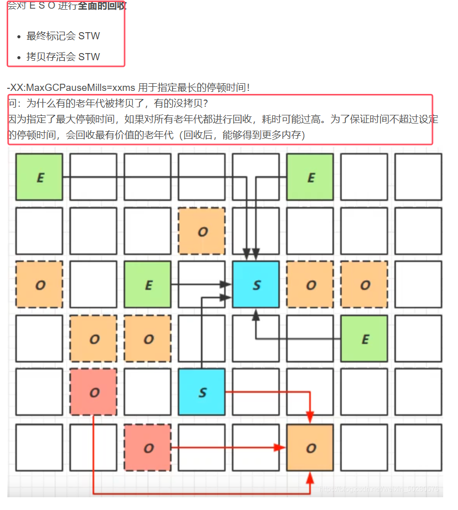
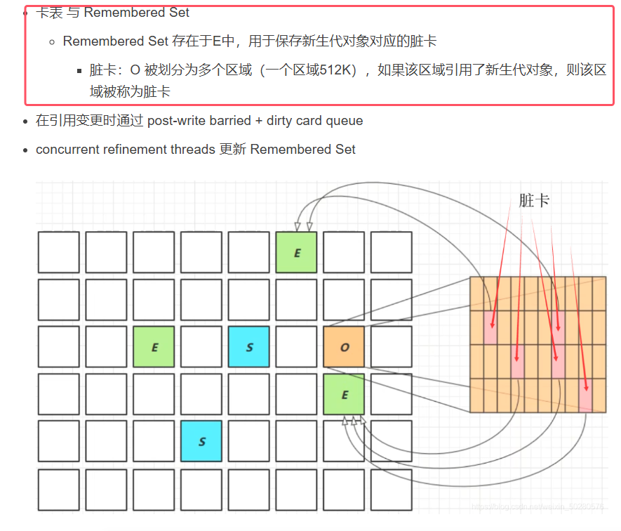

垃圾回收器可以分为以下几类：
1. 串行
2. 吞吐量优先
3. 响应时间优先

 
## 1.串行垃圾回收器

* **新生代老年代使用不同的垃圾回收器，Serial是工作在新生代的回收器（采用复制算法），SerialOld是工作在老年代的回收器（采用标记整理算法）**

## 2.吞吐量优先垃圾回收器
**JDK1.8默认使用的就是ParallelGC这个垃圾回收器，Parallel是并行的**

* 到达安全点后，垃圾回收器会开多个线程来进行垃圾回收，尽快把垃圾回收。具体开启的线程个数与CPU核数相关
* **说明：-XX:ParallelGCThreads=n是控制垃圾回收时的垃圾回收线程的数量**

* **-XX:+UseAdaptiveSizePolicy是采用自适应的大小调节策略（调整新生代的大小以及Eden区和幸存区的比例**）    
	

* 下面那设置的两个目标是相悖的，需要根据实际情况取一个折中的值

	  

## 3.响应时间优先的垃圾回收器

* -XX:+UseConcMarkSweepGC ~ -XX:+UseParNewGC ~ SerialOld：**代表concurrent的标记清除算法的垃圾回收器，即CMS回收器，是一款工作在老年代的回收器。UseParNewGC是工作在新生代的基于复制算法的垃圾回收器**
* **CMS回收器会有并发失败的情况发生，在这种情况下会采取补救措施：让老年代回收器CMS退化成SerialOld(基于标记整理算法的单线程回收器)**    
	
* CMS回收器的工作流程如下图所示：  
	

* -XX:ParallelGCThreads=n :代表并行的垃圾回收线程数
* -XX:ConcGCThreads=threads：代表并发的垃圾回收线程数
* -XX:CMSInitiatingOccupancyFraction=percent：代表执行CMS垃圾回收的内存占比，即只要老年代的内存占用到达这个比例的时候，就执行一次垃圾回收。这是为了预留空间来存储那些浮动垃圾
* -XX:+CMSScavengeBeforeRemark：其作用是在 CMS 的 **Remark 阶段**之前，先触发一次 **Minor GC**（新生代垃圾回收）。具体原理如下图所示  
	

## 4.G1垃圾回收器

* 是一种并发收集的垃圾回收器
* -XX:G1HeapRegionSize=size：用于设置划分的区域的大小，必须是2的次幂的大小，单位为MB
* -XX:MaxGCPauseMillis=time：该参数用于设置 G1 收集器的目标最大停顿时间，单位是毫秒
* **会把堆内存划分成多个大小相等的区域，每个区域都可以独立作为eden区，幸存区，老年代。**

* **G1的垃圾回收的三个阶段如上图所示，三个阶段循环执行**
* **Young Collection：对新生代垃圾收集**
* **Young Collection + Concurrent Mark：如果老年代内存到达一定的阈值了，新生代垃圾收集的同时会执行一些并发的标记。**
* **Mixed Collection：会对Eden区 + 老年代 + 幸存区等进行混合收集，然后收集结束，会重新进入新生代收集。**

###### Young Collection

* **并且在该阶段执行时，就会进行GC Root的初始标记（所以会产生stw）**

新生代的垃圾回收步骤如下图所示：

* z注：图中的箭头代表是采用了复制算法

###### Young Collection+Concurrent Mark

* 这里的并发标记的效果和CMS中并发标记的效果类似

###### Mixed Collection

* 为什么叫该垃圾回收器为Garbage First：因为在第三个阶段，对于老年代来说它会优先收集那些垃圾最多的区域，得到更多内存。
* 这里的最终标记的目的和CMS中重新标记的目的相同

###### Full GC概念辨析

* 图中4个垃圾回收器在新生代内存不足时出发的垃圾收集，都可以称之为minor GC
* 串行和并行垃圾回收器在老年代内存不足时发生的垃圾收集，因为会回收整个堆，可以称之为full gc
* CMS在老年代内存不足时（老年代所占内存超过阈值）还需要分两种情况：
	* 如果垃圾产生速度慢于垃圾回收速度，不会触发 Full GC，还是并发地进行清理此时只会清理整个老年代，因为CMS是老年代的垃圾回收器，
	* **如果垃圾产生速度快于垃圾回收速度，便会触发 Full GC，然后退化成 serial Old 收集器串行的收集，就会导致停顿的时候长，此时就是直接full gc**。
		
* 对于G1来说   
	
###### Young Collection跨代引用问题

跨代引用：由于在会需要判断该对象是否可以回收，所以需要判断对象是否在gc root对象的引用链上。**如果根对象有一部分来自老年代，而老年代存活对象十分多，如果去逐个遍历效率很低。所以采用卡表的技术**

###### Remark重新标记

在并发标记时，所处的状态如下图，箭头为gc root引用链 

* 但是在并发标记过程中，有可能 C在被处理（标记）的时候认为没有其他对象引用 C ，但并发标记过程还未结束，在这之后其他用户线程又改变了c的引用地址，让A引用了c，此时并发标记并没有将c进行标记，这时就会用到 remark 。

注：下图的做法是在并发标记阶段做的    

* 只要对象引用发生了改变，写屏障的指令就会被执行，具体指令就是把c加入到一个队列当中，并把c标记为处理中状态

###### jdk8u20的字符串去重功能（不重要）

######  JDK8u40 并发标记类卸载（不重要）

###### JDK8u60回收巨型对象（不重要）

###### JDK并发标记起始时间的调整

··