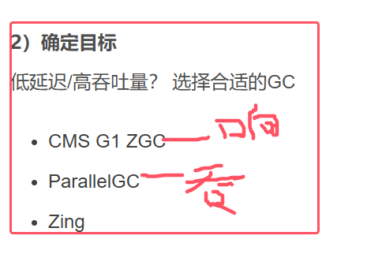

## 1.调优综述

## 2.新生代调优

* 红框中内容解释：新生代内存大小应该设置为一次请求和响应所产生的对象乘并发量
* 并发量（相对于服务端来说同一时刻有1000个用户来访问），可以简单理解为同一个时刻有1k个线程在并发执行

* 晋升阈值配置得当，指的是让活跃对象（存活时间短的对象）留在幸存区，以便下一次minor gc就能够回收掉；让长时间存活的对象尽快晋升，避免占用新生代空间
* -XX:MaxTenuringThreshold=threshold用于设置最大的晋升阈值
* -XX:+PrintTenuringDistrubution用于打印晋升的详细信息

## 3.老年代调优

* -XX:CMSInitiatingOccupancyFraction=percent：代表执行CMS垃圾回收的内存占比，即只要老年代的内存占用到达这个比例的时候，就执行一次垃圾回收。这是为了预留空间来存储那些浮动垃圾

## 4.案例

* 案例1做法：一般先调优新生代。适当增大新生代大小以及适当提高晋升阈值
* 案例2做法：一般都是在重新标记阶段的时间较长。在重新标记前先做一次新生代的垃圾回收（具体原因见cms讲解）
	
*   案例3在1.7之前的版本中，方法区是存放在永久代，永久代实际上存储在堆中的，那么其内存不足也会引发full gc。（1.8以后方法区是存储在元空间，其内存回收不归JVM来管理）。解决方法就是增大元空间的最大值和初始值。