## 1.类加载阶段
**类加载分为3个阶段：加载，链接和初始化**

### 1.1加载
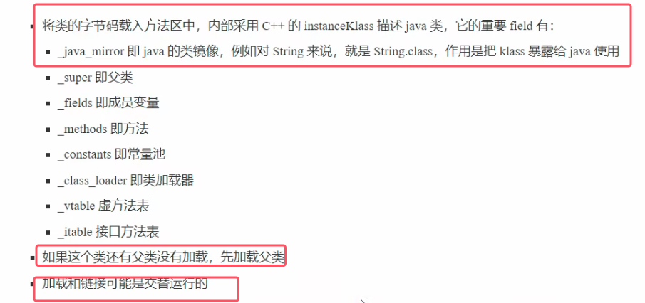
* java_mirror其实就是我们平常反射机制用到的运行时对象，也就是xxx.class。当方法区中成功加载该类的字节码后，虚拟机会在**堆内存**中创建一个对应的`java.lang.Class`对象

具体的理解如下图所示：

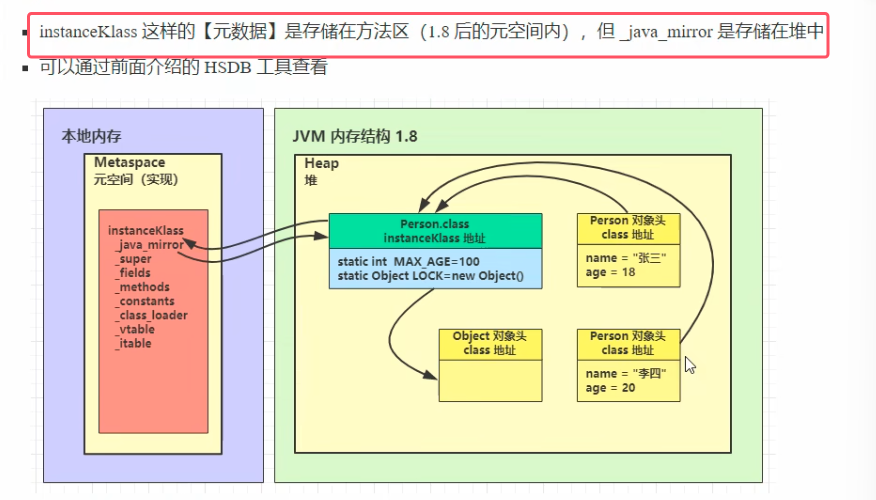
* **instanceKlass保存在方法区。JDK 8以后，方法区位于元空间中，而元空间又位于本地内存中。_java_mirror则是保存在堆内存中**
* InstanceKlass和*.class(JAVA镜像类)互相保存了对方的地址
* 类的对象在对象头中保存了*.class的地址。让对象可以通过其找到方法区中的instanceKlass，从而获取类的各种信息

### 1.2链接
链接分为三步：验证、准备和解析

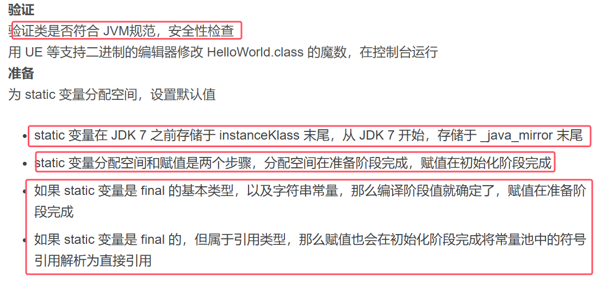
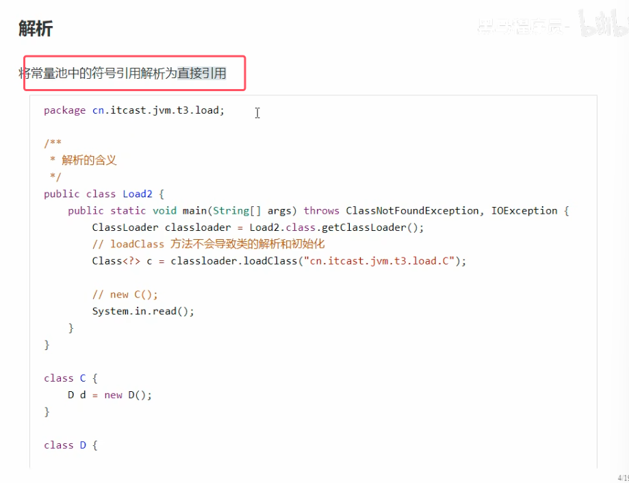
* 图中的符号引用，仅仅是一个符号并不知道其内存位置；直接引用指的是其内存的位置
* **调用类加载器的loadclass方法不会导致类的解析和初始化。而直接new该对象会导致类的解析和初始化**

### 1.3初始化阶段
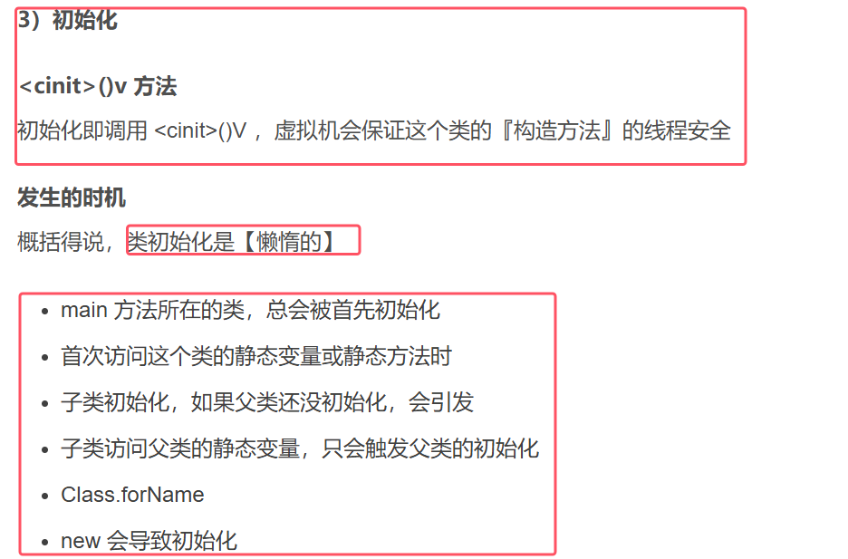
* 父类的初始化在子类之前

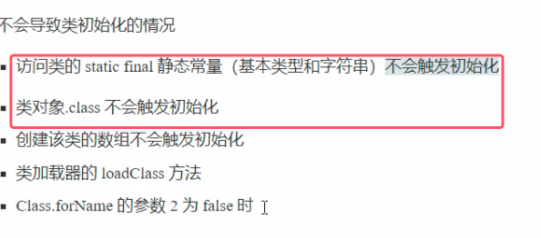
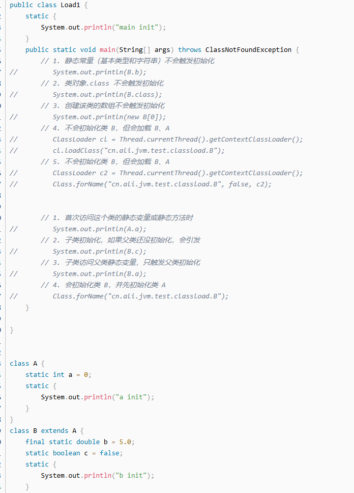
* 静态初始化块在类加载的初始化阶段才会被执行
* 类对象.class不会触发初始化是因为该对象是在加载阶段就生成了该对象
### 练习

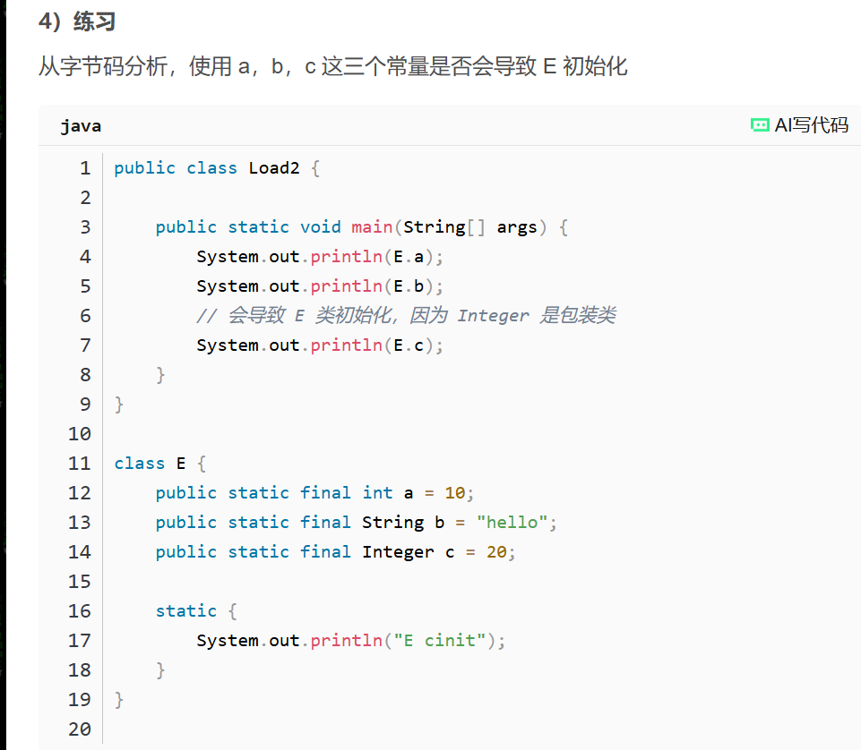 

## 2.类加载器
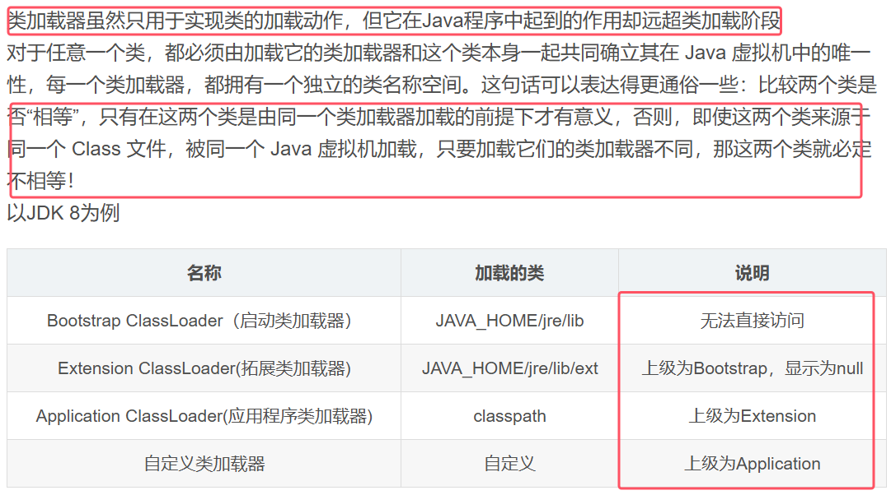
* 启动类加载器是由c++代码所写，所以无法直接访问，拓展类加载器再去getParent()的时候也只会返回null。
* 如果get该类的类加载器返回时null的话，那么其实就代表该类是由启动类加载器的来加载的

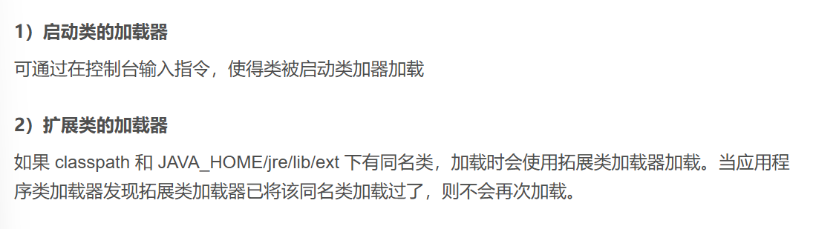
* 图中第二条的原因就是双亲委派模型的原因。所以接下来会详细讲解双亲委派模式的源码

### 2.2双亲委派模型
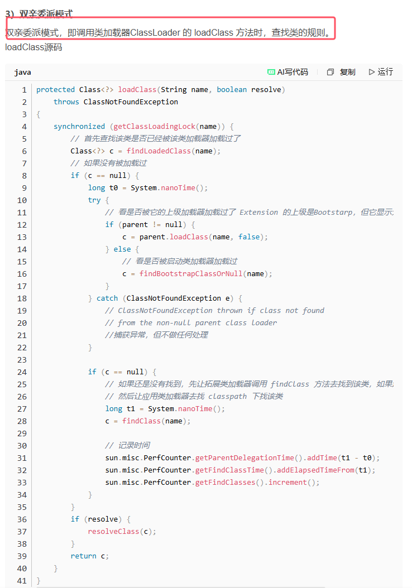

### 2.3自定义类加载器
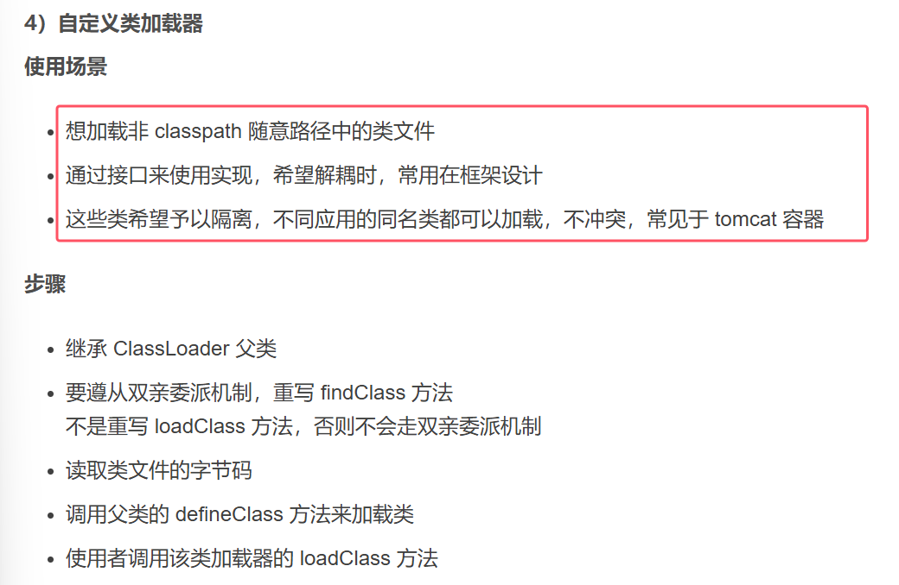
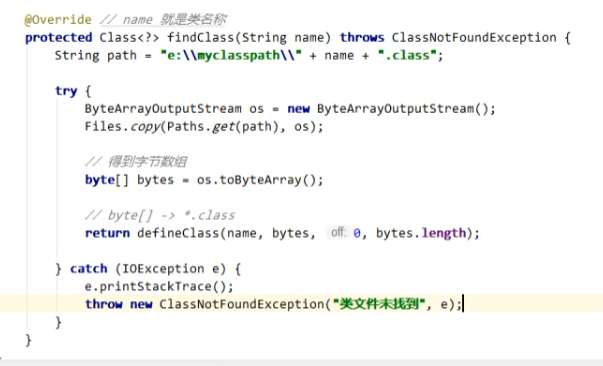
