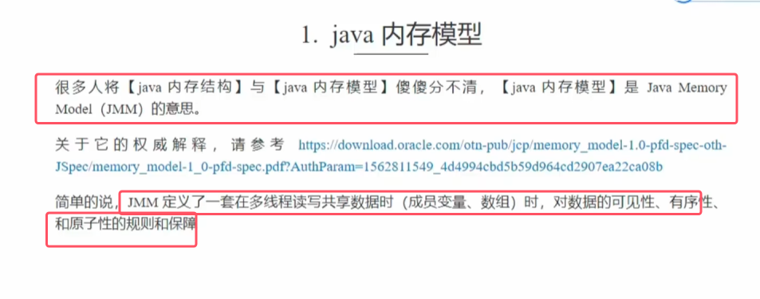

### 1.1原子性
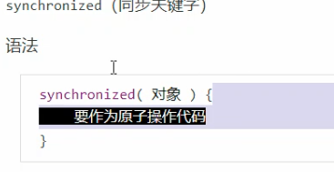
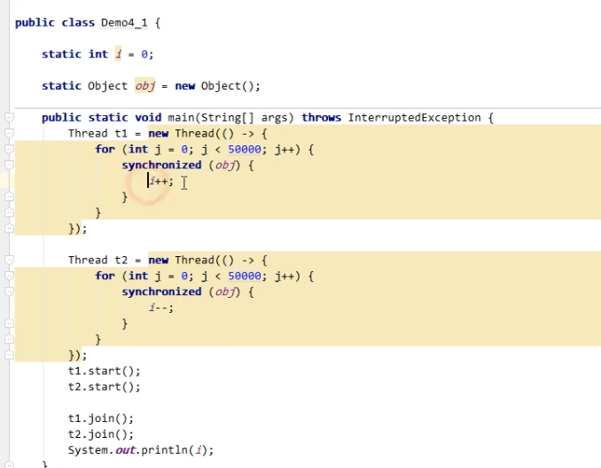

系统级理解如下图所示

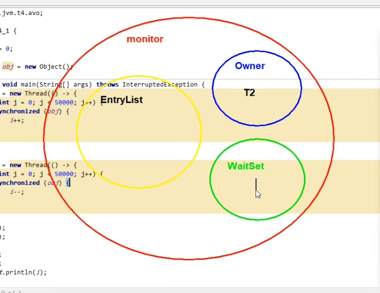
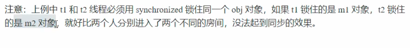

### 1.2可见性

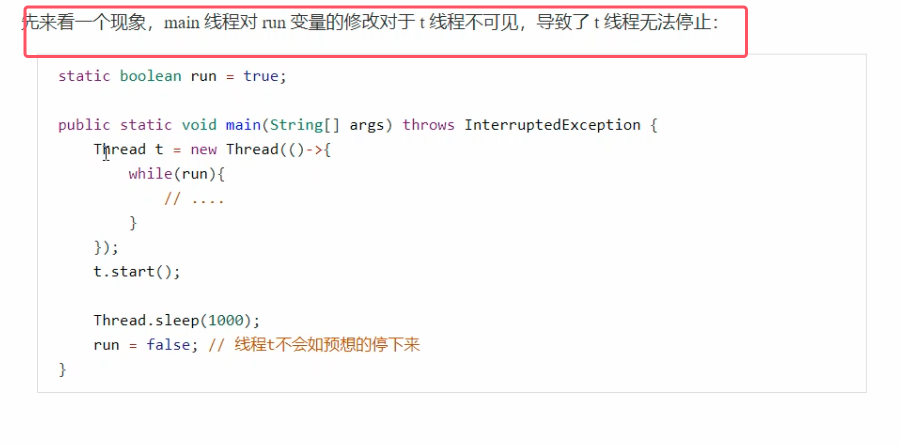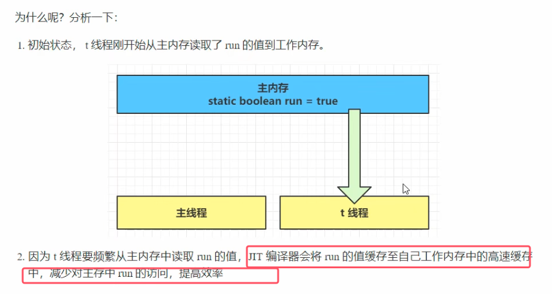
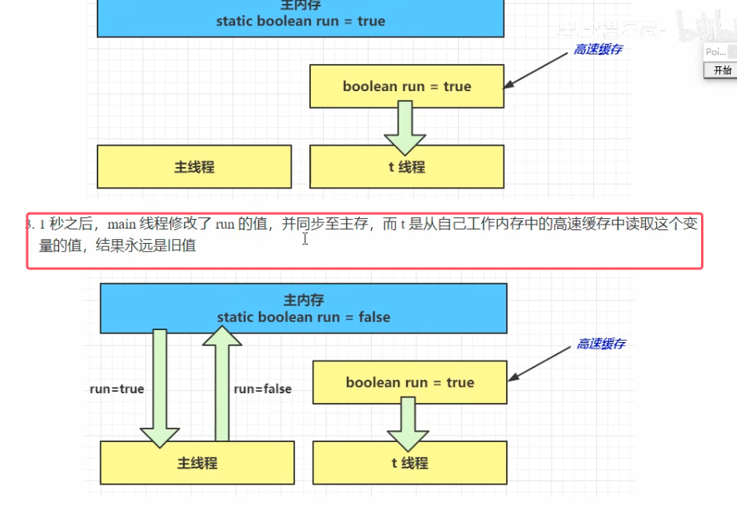

**解决方法：volatile关键字**

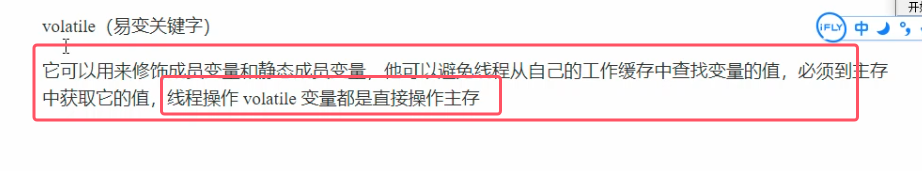

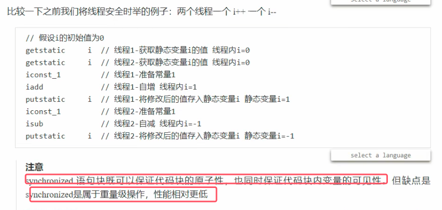

### 1.3有序性
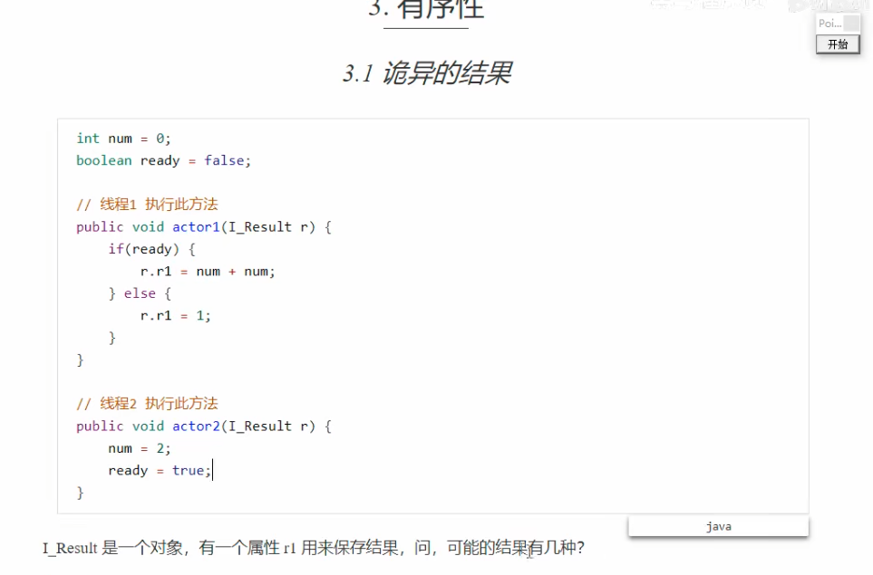
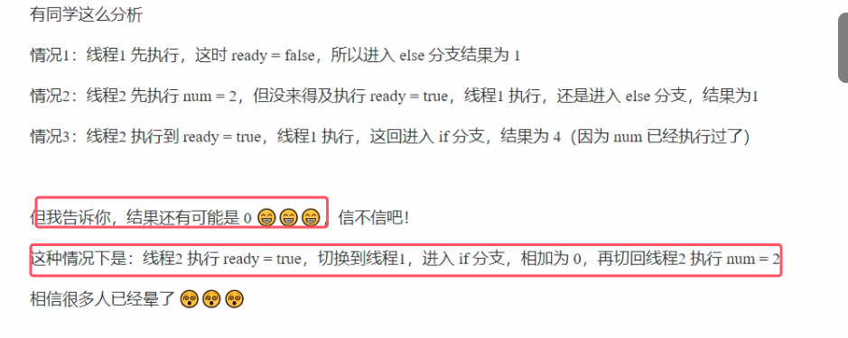
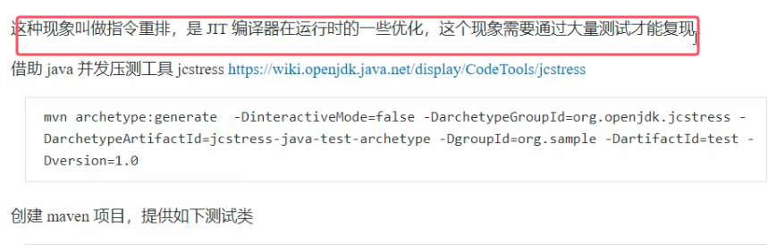

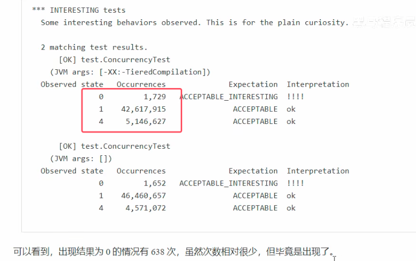

**解决方案：试图用volatile来修饰，从而禁用指令重排**

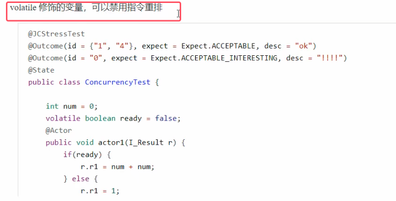

##### 有序性理解

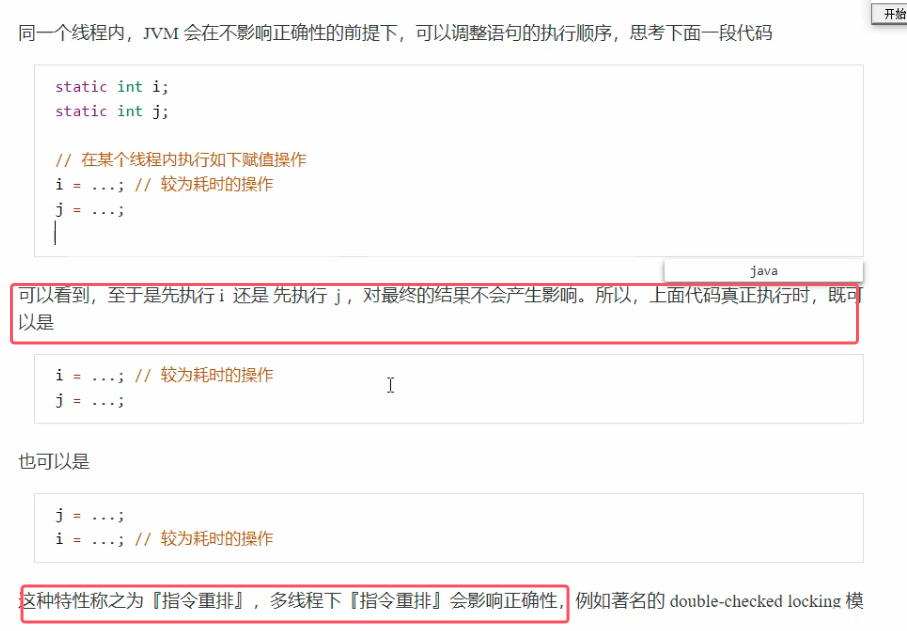

**多线程模式下的懒汉式单例模式的创建。这样写锁粒度较小，并发性较高**。即标准的双检加锁策略

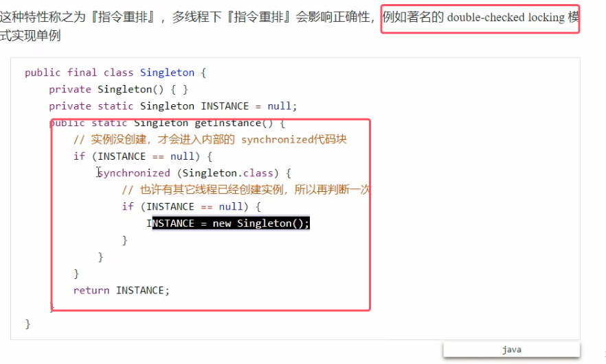

* **上面的方法也是有问题，正确做法还需要给INSTANCE方法加volatile关键字**。具体原因如下

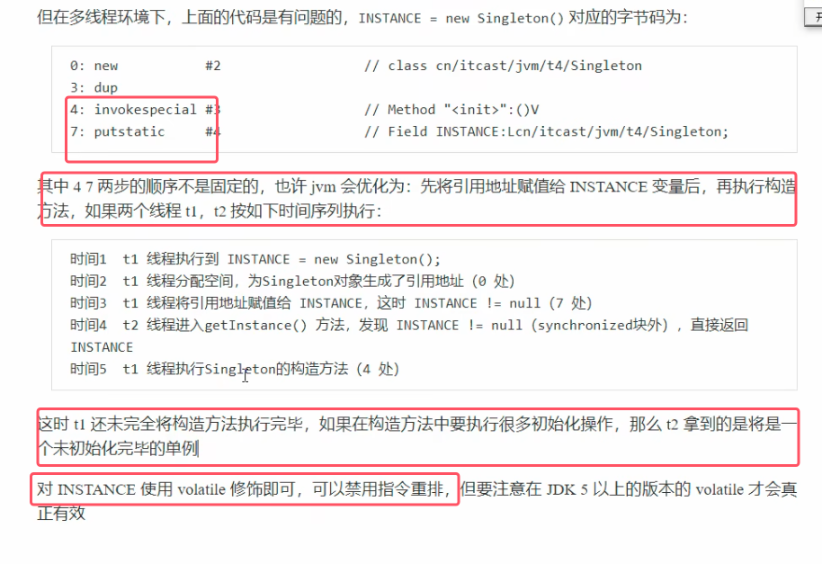
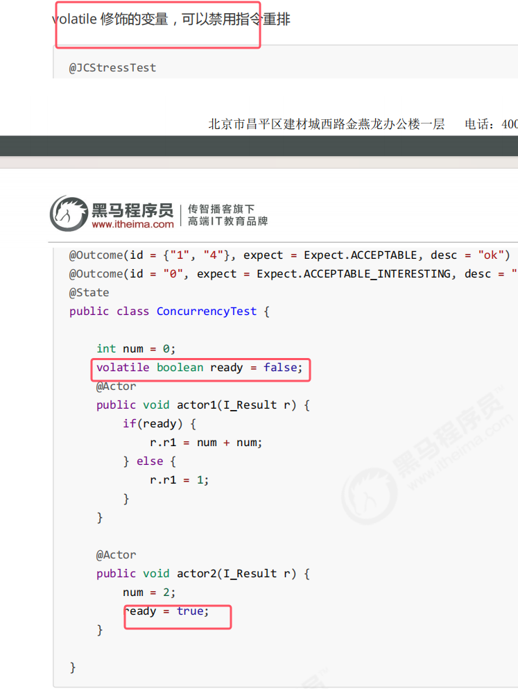

