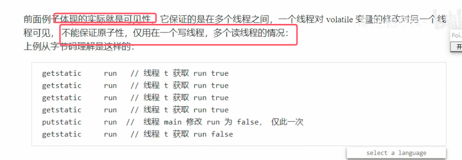

### 1.1原子性

系统级理解如下图所示

### 1.2可见性

**解决方法：volatile关键字**

### 1.3有序性

**解决方案：试图用volatile来修饰，从而禁用指令重排**

##### 有序性理解

**多线程模式下的懒汉式单例模式的创建。这样写锁粒度较小，并发性较高**。即标准的双检加锁策略

* **上面的方法也是有问题，正确做法还需要给INSTANCE方法加volatile关键字**。具体原因如下

