### 1.对象头
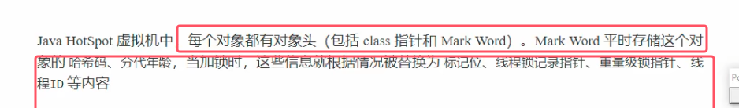
* mark word占8个字节

### 2.轻量级锁
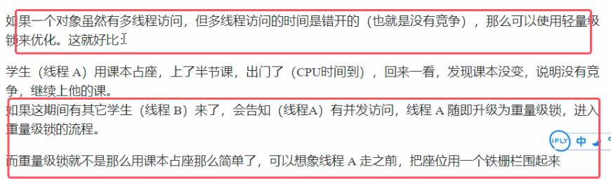
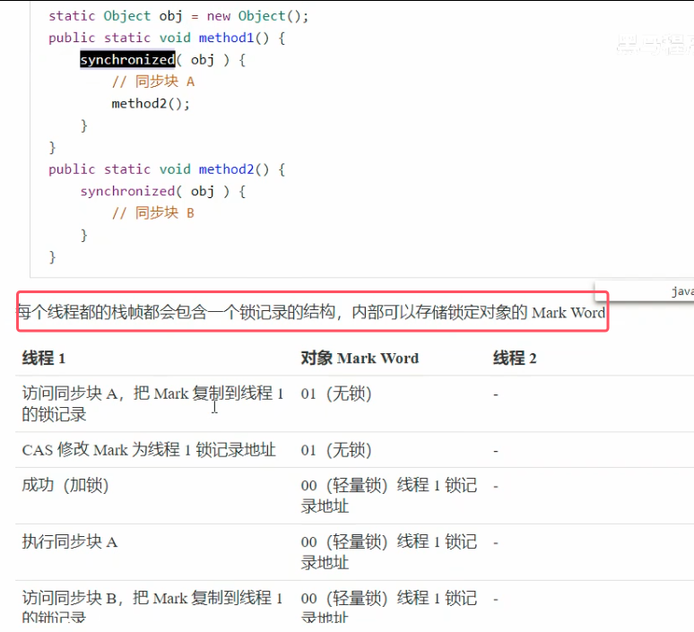
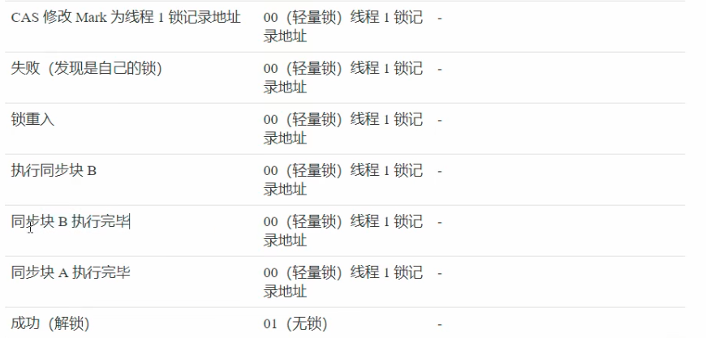
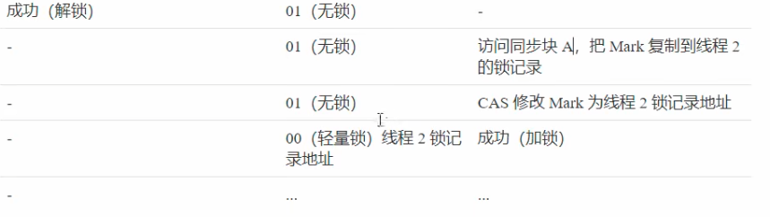
* 因为二者无竞争，所以可以加synchronized后轻量级锁即可保证线程安全
* **栈帧中锁记录的是对象未加锁前mark word中保存的内容。当释放锁时该对象会从所记录中再把这些内容读取回来**
* **默认先使用轻量级锁，所以当使用synchronized关键字时，底层用cas来作为轻量级锁**
* **锁重入（Reentrant Lock）** 是指**一个已经持有某个锁的线程，再次请求获取该锁时不会被阻塞，而是可以直接成功获取**的机制。简单说就是 “线程可以重复获取同一把锁”，避免了线程在递归调用或多层同步场景下的自我阻塞（死锁）问题。

### 3.锁膨胀
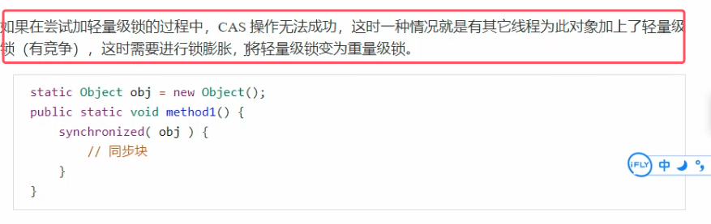

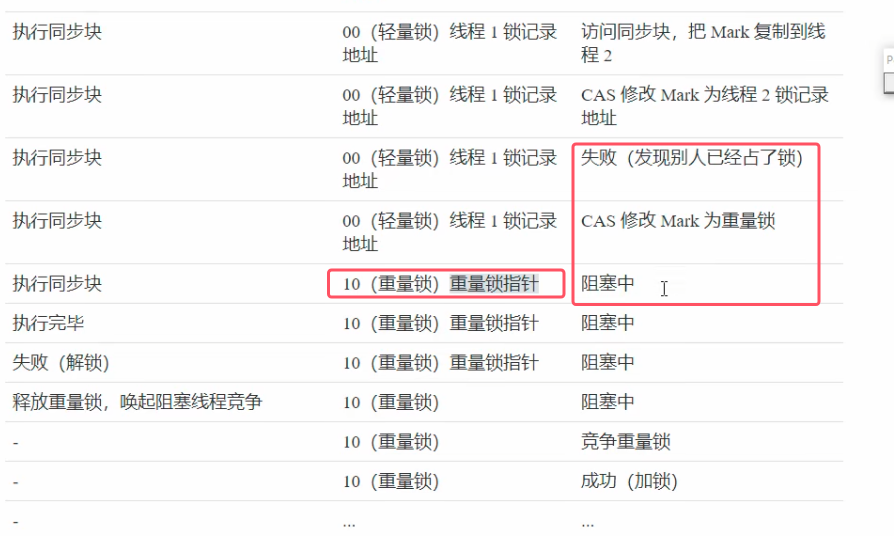
* mark word中重量级锁加重量级锁指针，也就是指向的是底层的monitor

### 4.重量级锁的优化——自旋

首先要知道：重量级锁的底层实现是monitor，monitor来实现加锁和解锁操作

在多核cpu的情况下，自旋带来的性能开销要比直接阻塞来得更低

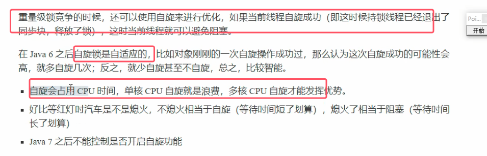
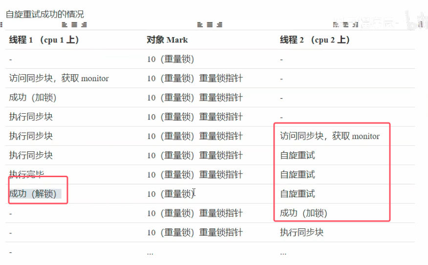
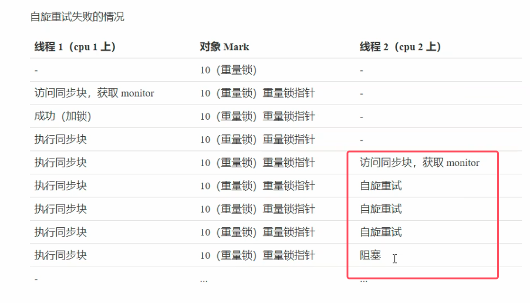

### 5.偏向锁
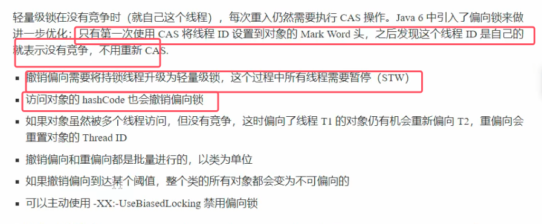
* 偏向锁带来的优化和他造成的开销差不多，底层非常复杂，所以此处不做过多介绍

  
