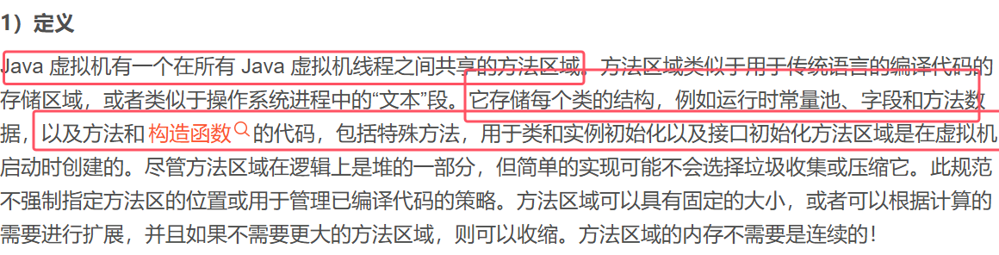

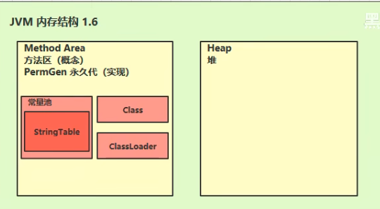
* class是类的信息，ClassLoader是类加载器，常量池包括字符串表和常量的存储

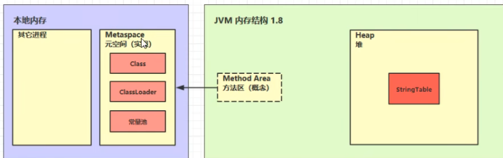
* 方法区是概念上的东西，在1.6中的具体实现是永久代；在1.8中的具体实现是元空间
* 在1.6中方法区是在堆中，在1.8之后是在本地内存（操作系统内存）

### 方法区内存溢出

1.8之后的方法区内存溢出实例：

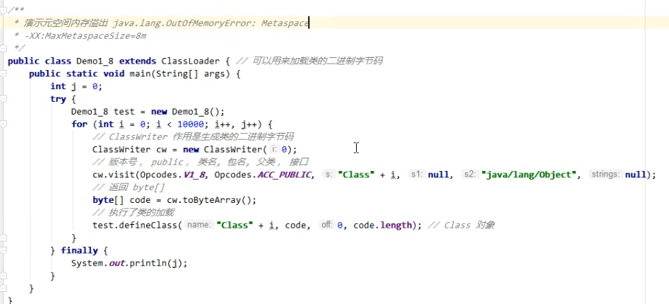

1.8之前的方法区内存溢出实例：

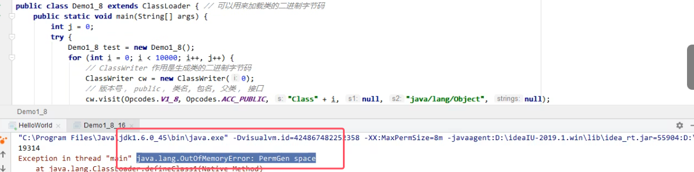

## 1.（运行时）常量池
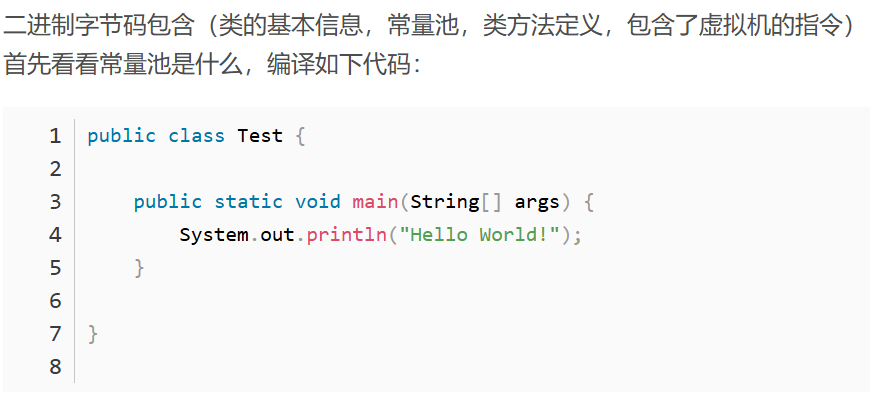
* 一个类的二进制字节码内容如上图所示
* 类的方法定义中包含了虚拟机的指令（这些指令也就是方法内容，只不过转变成了虚拟机指令）

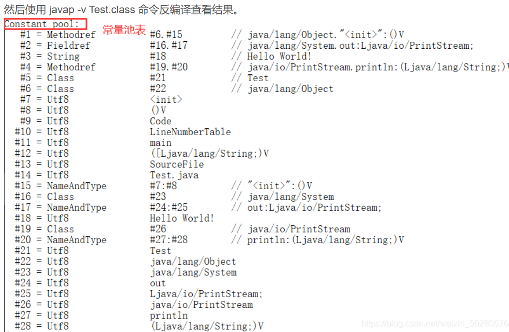
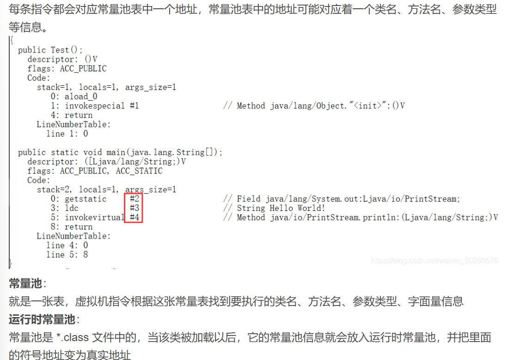

## 2.StringTable串池

例子1：

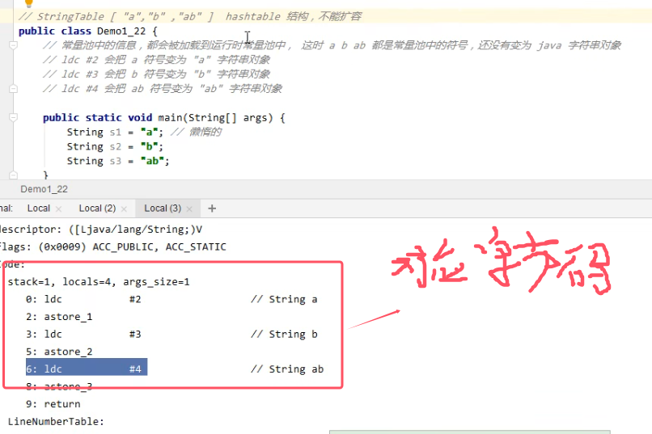
* **等到具体执行到引用它的那一行代码时，a，b这些符号才会变为java字符串对象**
* **变为java对象的过程也就是放入串池，先在串池中找串池中没有，就把他放入串池；如果串池中已经有了，那么就使用串池中的对象**
* StringTable是HashTable结构，也就是key-value结构，不能扩容
* 对于上面两条的具体例子如下图所示

	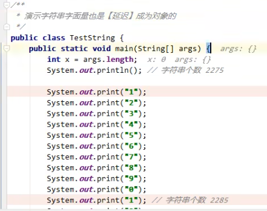
	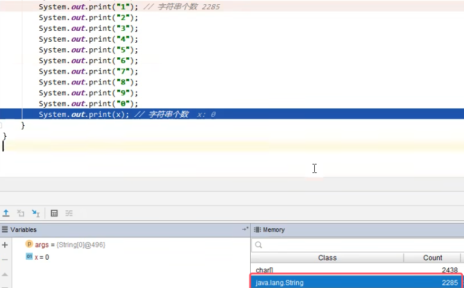

例子2：

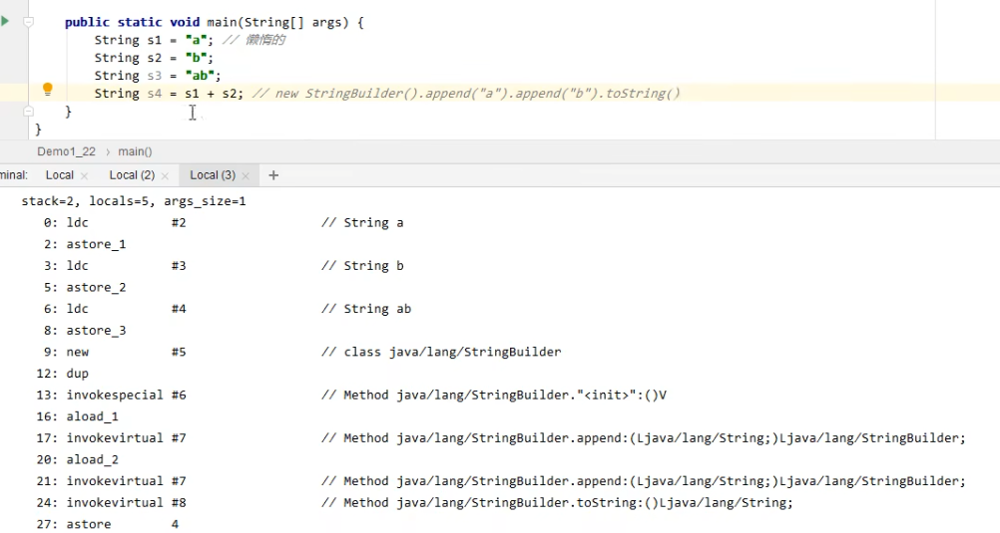
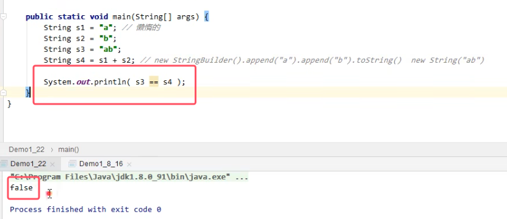

例子3：编译期优化

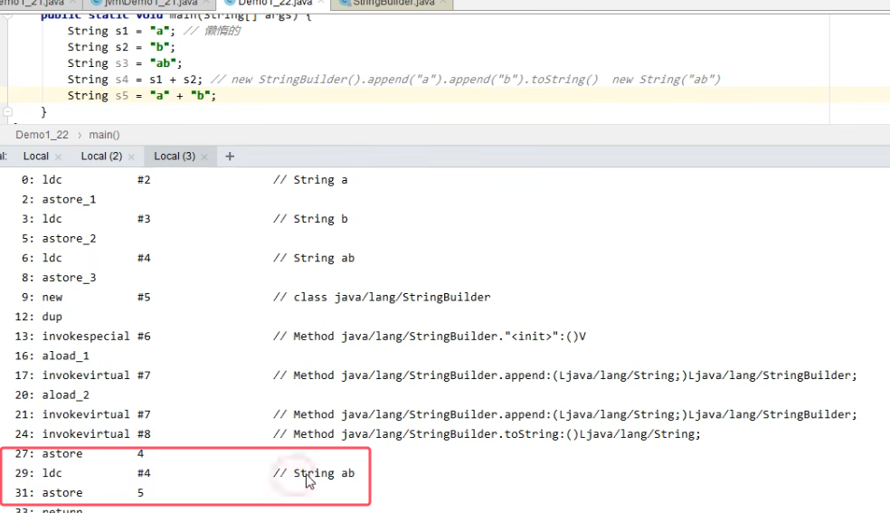
* ldc  \#4就是去常量池中找编号为4的符号
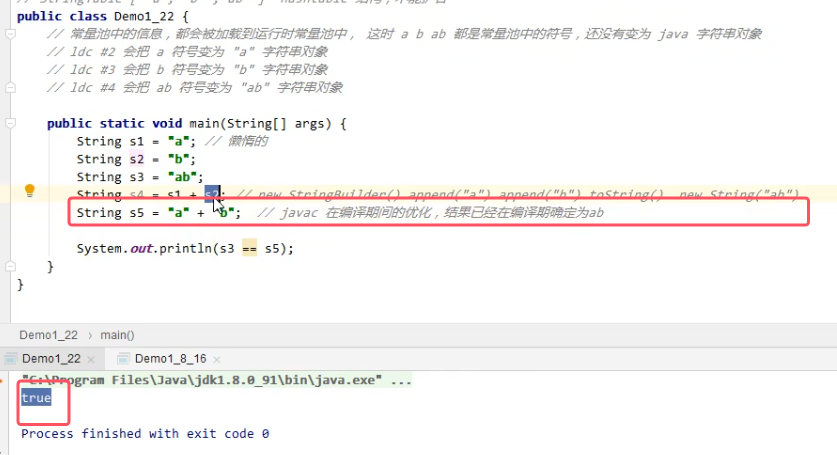

#### 1. StringTable特性总结（难点）
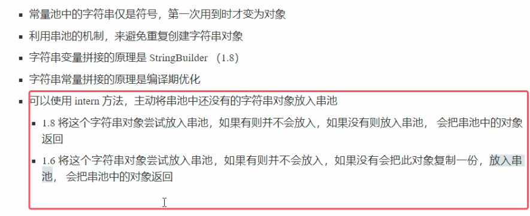

##### 字符串池入池规则
1. ​**​字面量自动入池​**​：  
    直接通过字面量（如 `"ab"`）声明字符串时，JVM 会检查常量池是否存在该字符串：
    - 若存在，直接引用池中对象；
    - 若不存在，创建新对象并放入池中。
2. **因拼接生成的字符串不会自动入池**。**`new String("a") + new String("b")` 生成的 "ab" 不会触发自动入池​**​。  只有通过字面量（如 `"ab"`）或显式调用 `intern()` 时，才会操作常量池
##### intern方法
之前的intern方法的讲解有误，那么最精确的如下所示：

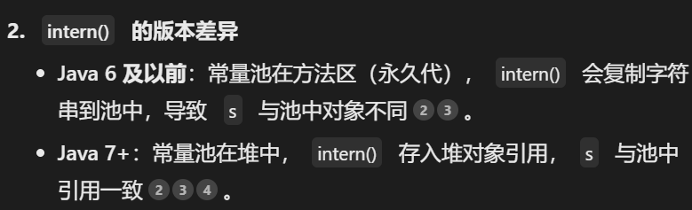
* **所以intern方法具体事项是根据jdk而有所区别的
* **并且注意图片中的常量池指的是StringTable，而不是常量池，常量池在8之后时在元空间中**
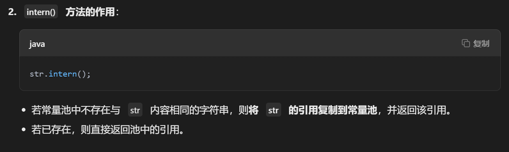
* **注意如果StringTable串池中不存在与str内容相同的字符串，jdk1.8之后是将str的引用赋值到常量池中（也就是常量池中的引用指向的是堆中的对象），jdk1.6将字符串内容在池中生成一个"ab"，然后让str中存储字符串内容的字符数组来指向池子中的内容**

###### 1.8 intern例题
例1

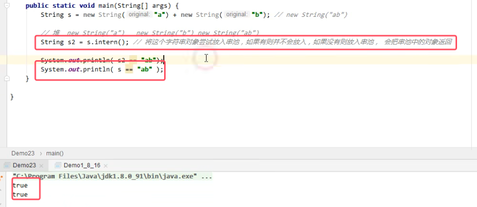
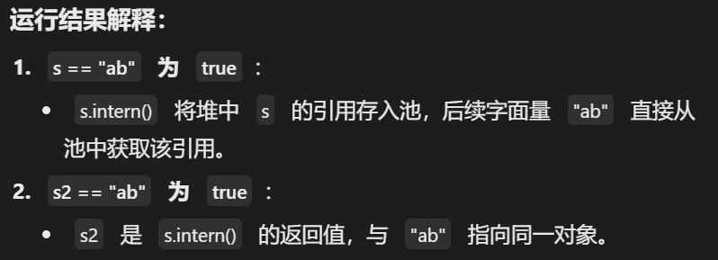
* **`s.intern()` 前​**​：常量池无 `"ab"`，`s` 是堆中的独立对象
* 调用intern以后，池中 `"ab"` 的引用​**​指向堆中的 `s` 对象​**​

例2

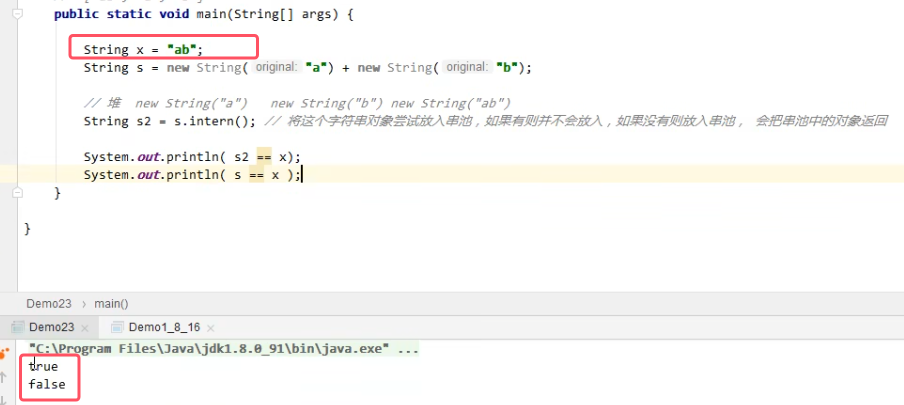
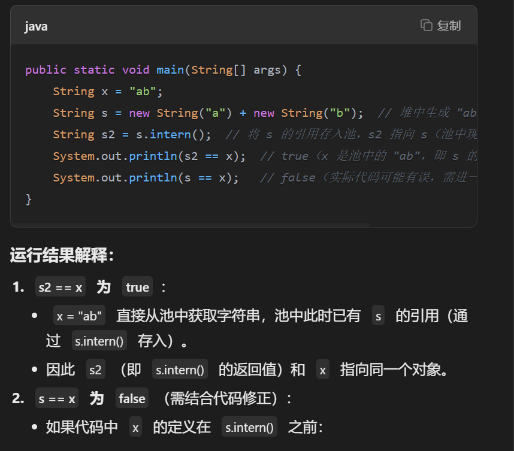
######  1.6integer例题
此时图中的代码并不是两个true，而是一个true一个false

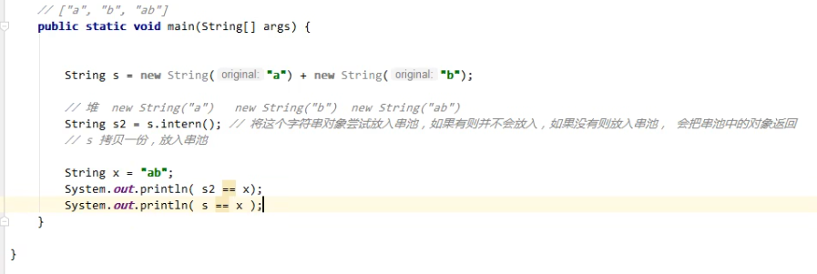

#### 2.StringTable位置
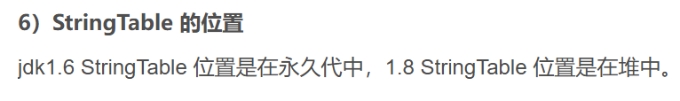

#### 3.StringTable的垃圾回收
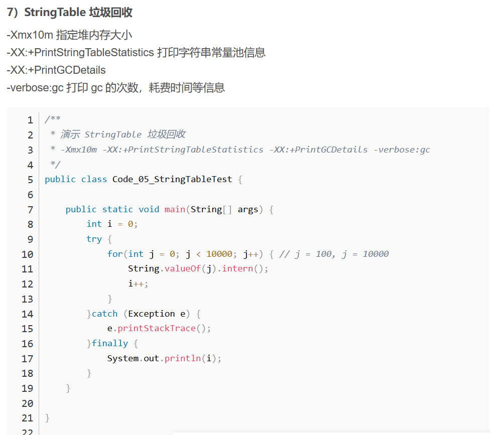
* **StringTable也会发生垃圾回收，不是只有堆中的对象会发生垃圾回收*

#### StringTable的性能调优

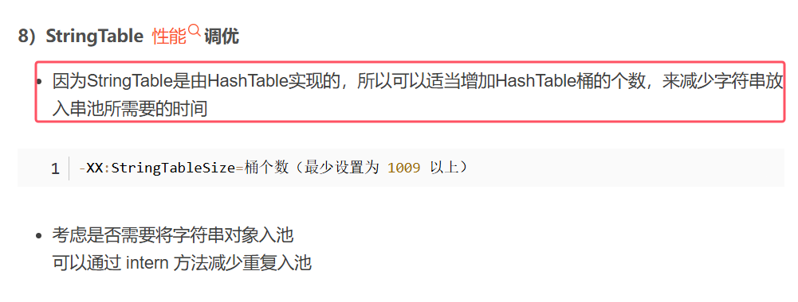
