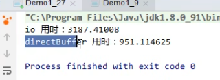
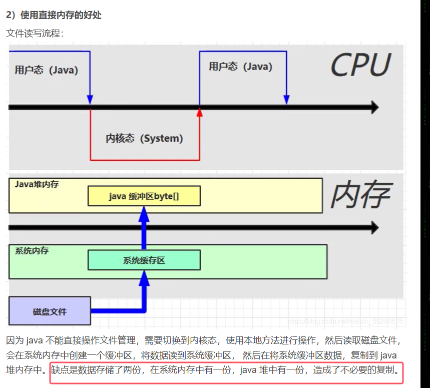
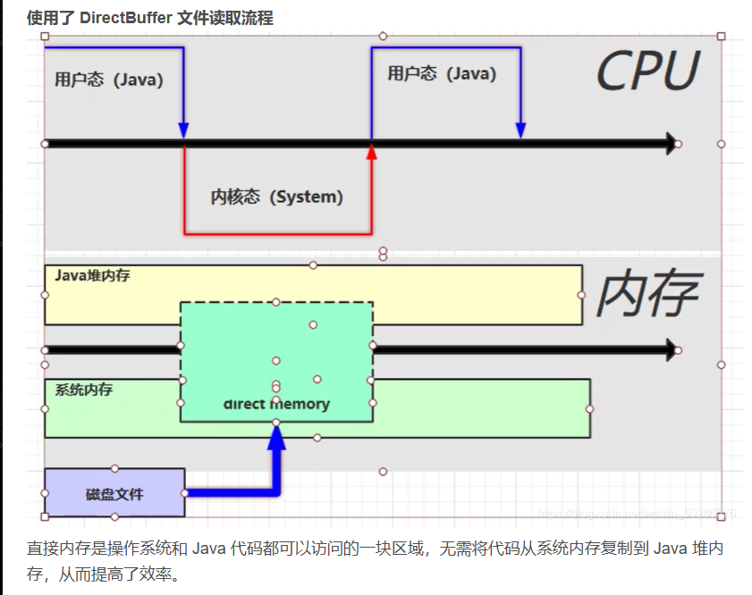
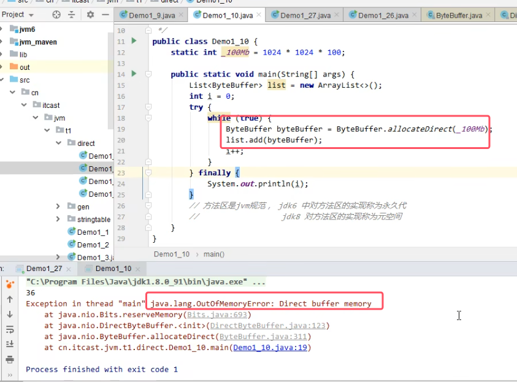
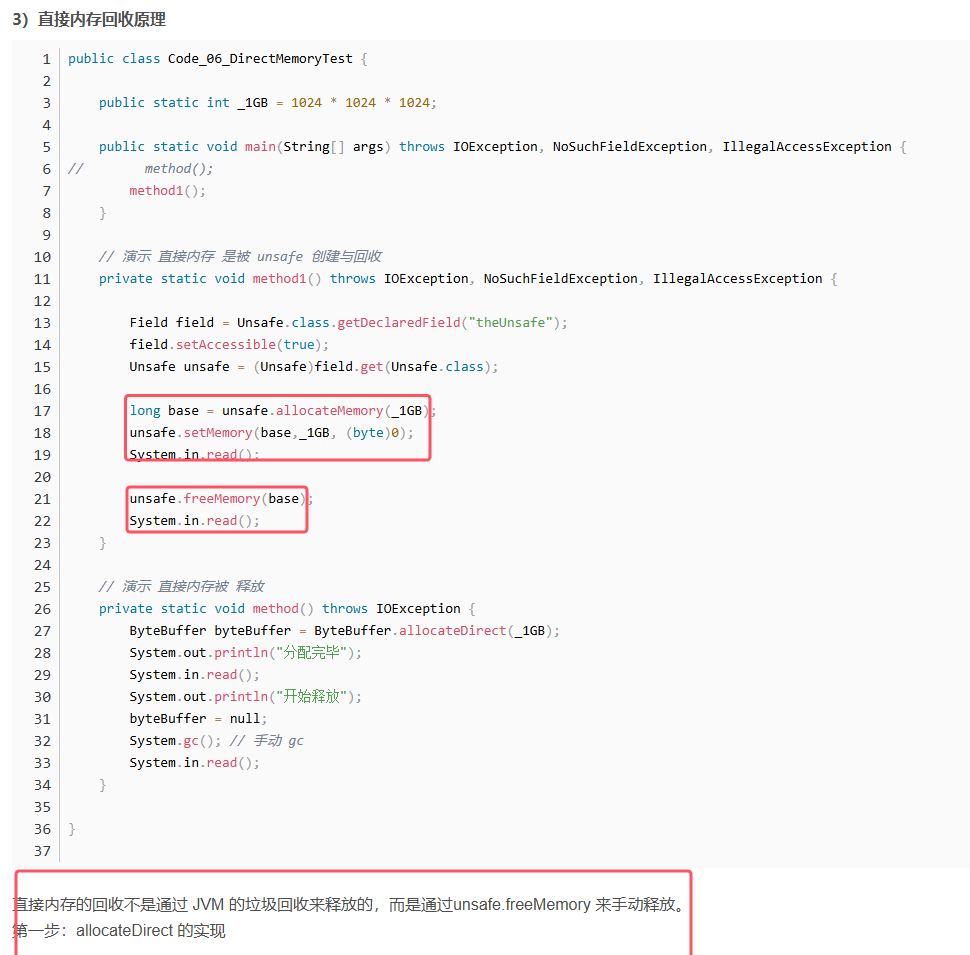
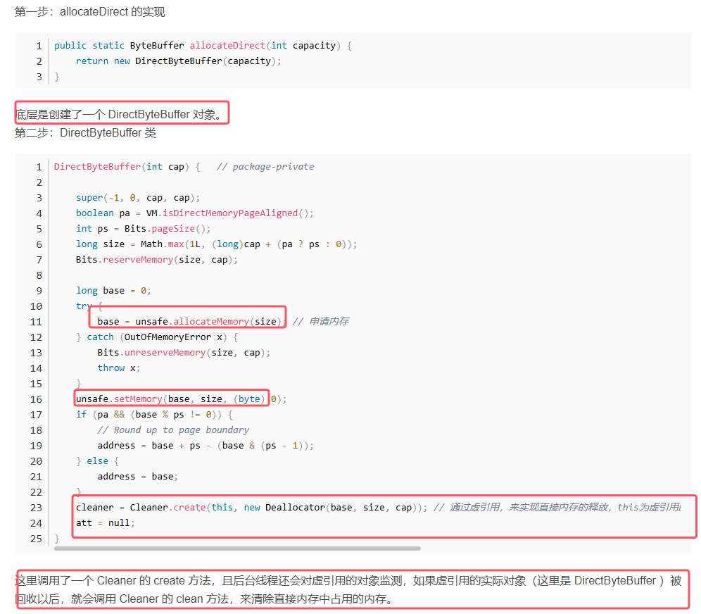
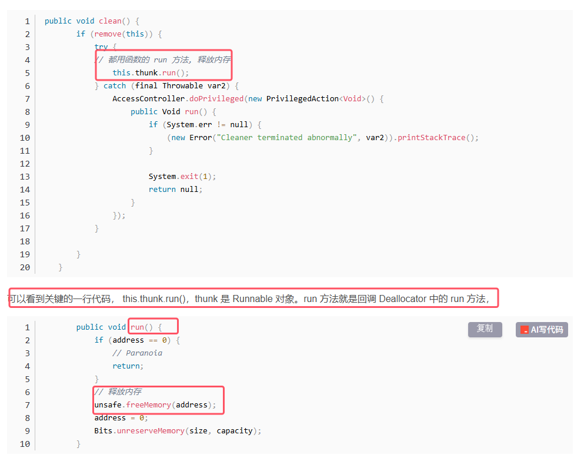
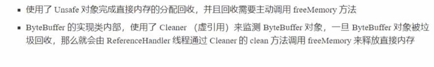
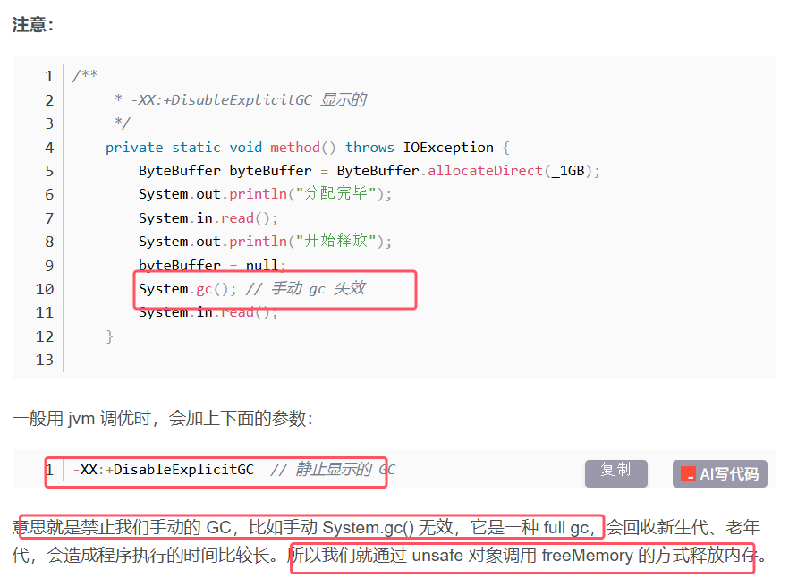

**定义：它并不属于Java虚拟机的内存管理，而是属于操作系统内存（本地内存）**

使用普通的io也就是BIO和使用直接内存的NIO（NON-BLOCKING IO）进行拷贝文件操作的效率对比如下图所示：

#### 1.直接内存的原理

普通BIO的原理如下图所示

使用直接内存的原理如下图所示：

* 少了一次缓冲区的复制操作，所以会对效率有成倍的提升

#### 2.直接内存的内存溢出和释放原理

**直接内存不受JVM虚拟机的内存回收管理**

* `ByteBuffer` 是 Java NIO（New I/O）中的一个核心类 ，用于处理字节数据的缓冲区
* allocateDirect适用于分配直接内存的函数。

##### 释放原理

直接内存的分配和回收是由一个unsafe对象来管理的，具体如下：

* 如果虚引用的实际对象（这里是 DirectByteBuffer ，该对象还是java对象，所以是被java虚拟机回收）

* ReferenceHandler是一个守护线程

* jvm调优需要禁止显式调用gc，但是如果在内存充裕的情况下，就算给bytebuffer置为null，也不一定会进行垃圾回收，所以根据上面的原理，Cleaner的clean方法也不会被调用，直接内存也不会被释放。
* 那么在此种情况下，我们可以通过反射获得Unsafe对象来自己调用freememory的方式释放内存