垃圾回收期可以分为以下几类：
1. 串行
2. 吞吐量优先
3. 响应时间优先

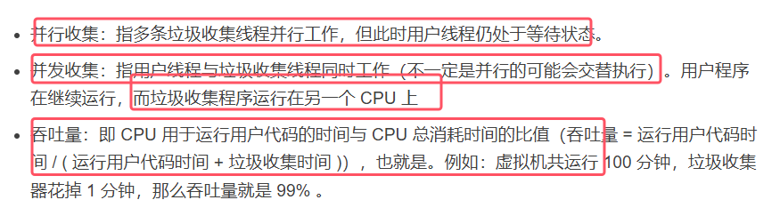
 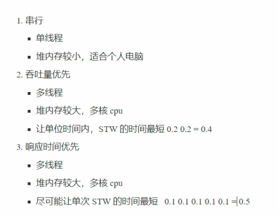
## 1.串行垃圾回收器

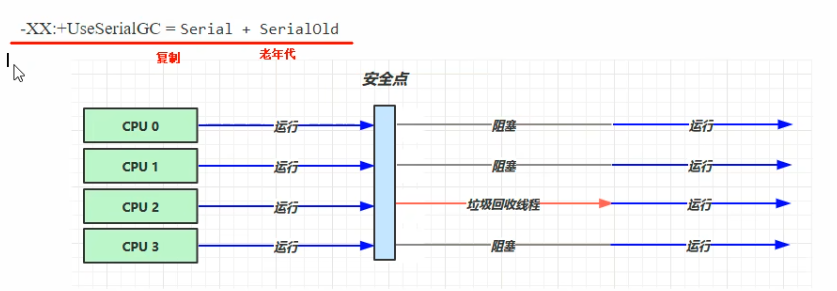
* 新生代老年代使用不同的垃圾回收器

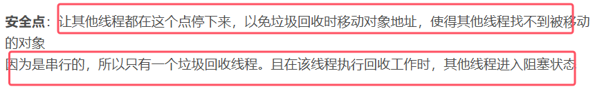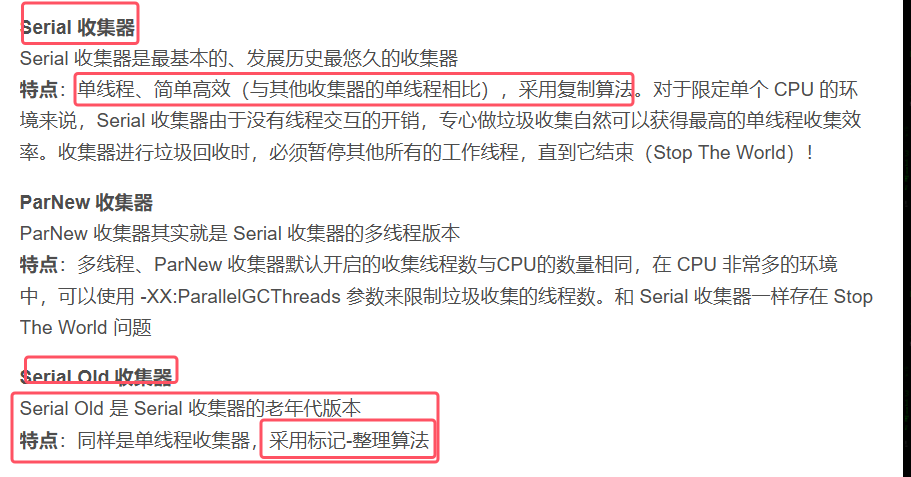

## 2.吞吐量优先垃圾回收器
JDK1.8默认使用的就是ParallelGC这个垃圾回收器，Paralle是并行的

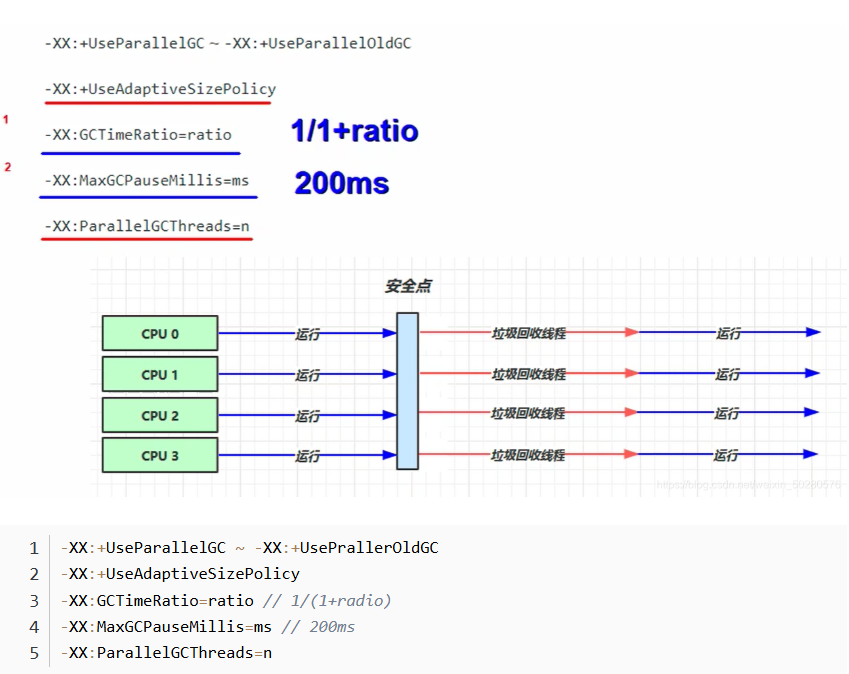
* 到达安全点后，垃圾回收器会开多个线程来进行垃圾回收，尽快把垃圾回收。具体开启的线程个数与CPU核数相关
* 说明：-XX:ParallelGCThreads=n是控制垃圾回收时的垃圾回收线程的数量；
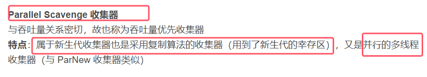
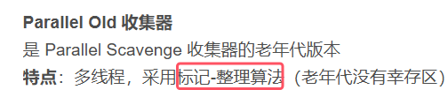
* -XX:+UseAdaptiveSizePolicy是采用自适应的大小调节策略
	
	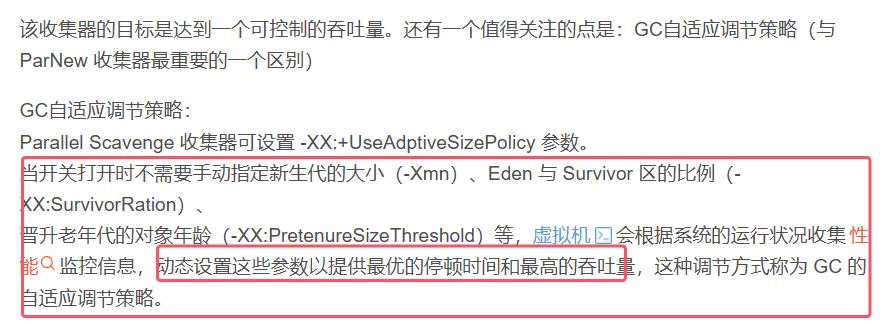

* 虾米那设置的两个目标是相悖的，需要根据实际情况取一个折中的值

	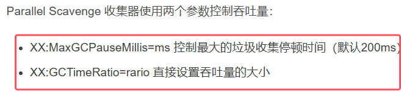  

## 3.相应时间有限的垃圾回收器
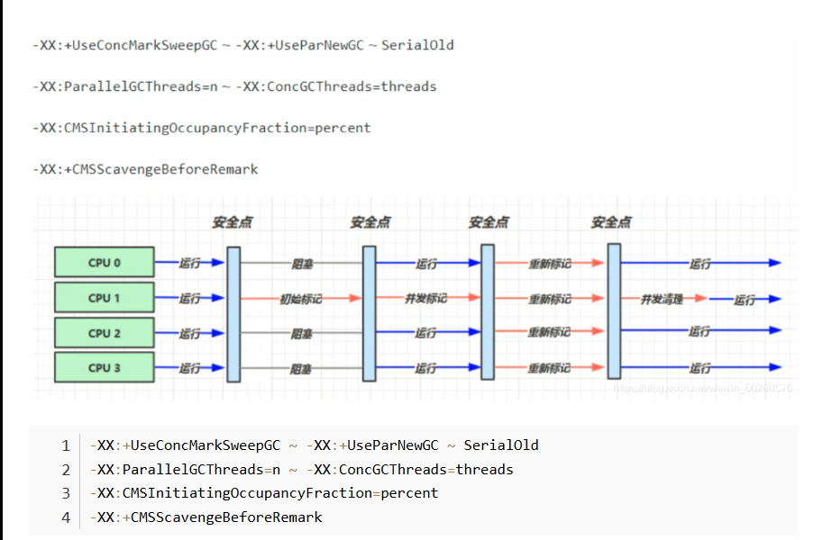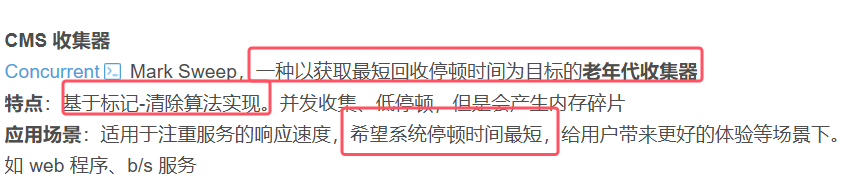
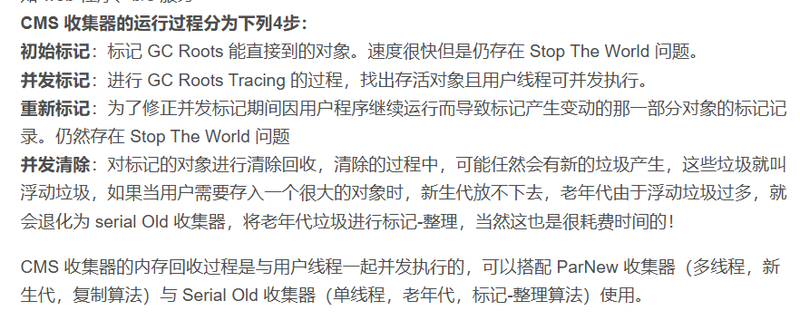